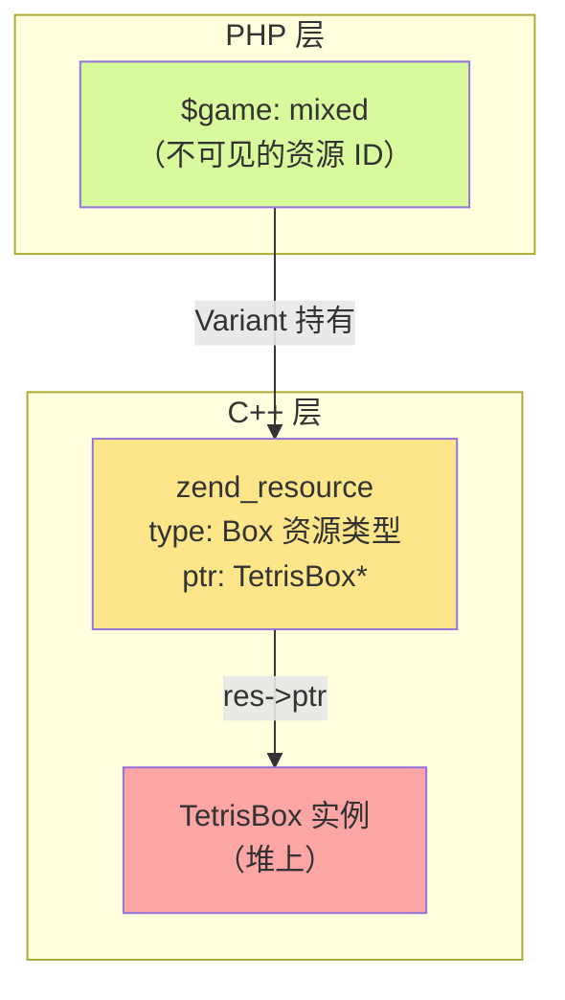
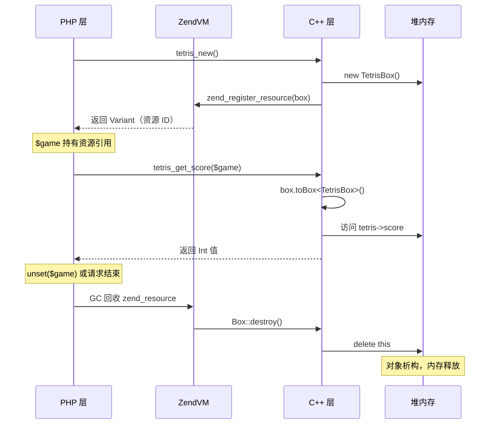

## php::Box — C++ 对象封装机制

`php::Box` 是 PHPX 运行时提供的基础类，允许将 C++ 对象封装为 PHP 资源（Resource），在 PHP 与 C++ 之间安全地传递和操作原生 C++ 对象。它是实现 C++ 互操作的重要基础——编译器的 `BigInt`、`Decimal`、`BigFloat` 类型均基于 `Box` 实现。

### 为什么需要 Box

PHP 调用 C++ 函数时，普通的 PHP 类型（`php::Int`、`php::Str`、`php::Array`）可以直接作为参数和返回值传递。但当你需要在 C++ 中维护一个**有状态的、生命周期需要跨越多次调用的对象**时，就需要一种机制将 C++ 对象的指针安全地保存在 PHP 变量中——这就是 `Box` 的作用。

典型场景：
- 游戏状态对象（如俄罗斯方块的棋盘、分数）
- 数据库连接句柄
- GPU 渲染上下文
- 任何需要在多次 PHP→C++ 调用之间保持状态的复杂 C++ 对象

### Box 的底层机制



- **创建**：`return {new MyBox()}` 调用 `Variant(Box*)` 构造函数，将 C++ 指针注册为 Zend 资源，分配资源 ID
- **传递**：PHP 层持有的 `mixed` 变量内部是一个 `zend_resource`，指针指向 C++ 堆对象
- **提取**：`box.toBox<MyBox>()` 验证资源类型后，将 `res->ptr` 安全地 static_cast 回 C++ 类型
- **销毁**：PHP GC 回收 `zend_resource` 时自动调用 `Box::destroy()` → `delete this`

源代码参考：
- `Box` 基类定义：`phpx.h:1724`
- `Variant(Box*)` 构造函数：`phpx.h:661`
- `toBox<T>()` 模板方法：`phpx.h:876`

### 使用三步曲

#### 1. 定义类 — 继承自 `Box`

```cpp
#include <phpx.h>
using namespace php;

class TetrisBox : public Box {
public:
    int board[20][10];
    int score;
    bool gameOver;

    TetrisBox() : score(0), gameOver(false) {
        memset(board, 0, sizeof(board));
    }

    void reset() {
        score = 0;
        gameOver = false;
        memset(board, 0, sizeof(board));
    }
};
```

关键点：
- **必须继承** `public Box`
- 基类提供 `type_info`、`extra_info` 两个 `uint32_t` 字段用于可选元数据
- 析构函数为 `virtual ~Box()`，确保子类正确析构

#### 2. 创建并返回 — `{new MyBox()}` 语法

```cpp
var php_tetris_new() {
    return {new TetrisBox()};   // ✅ 花括号初始化 Variant
}
```

> **语法解释**：`return {new TetrisBox()}` 等价于 `return Variant(new TetrisBox())`，使用 C++ 大括号初始化语法触发 `Variant(Box*)` 构造函数，将裸指针注册为 Zend 资源。

常见错误：

```cpp
// ❌ 缺少花括号——new 返回裸指针，不会触发 Variant(Box*) 构造函数
var php_tetris_new() {
    return new TetrisBox();
}

// ❌ 手动 Var()-包装——走的是 Void* 路径，不会注册为 Box 资源
var php_tetris_new() {
    auto* state = new TetrisBox();
    return var(state);
}
```

#### 3. 提取使用 — `toBox<T>()`

```cpp
Int php_tetris_get_score(var box) {
    auto tetris = box.toBox<TetrisBox>();   // ✅ 类型安全转换
    return tetris->score;
}

void php_tetris_reset(var box) {
    auto tetris = box.toBox<TetrisBox>();
    tetris->reset();
}
```

`toBox<T>()` 内部执行两步校验：
1. 检查 Variant 是否持有 Resource 类型
2. 检查资源的 `type` 是否为 Box 资源 ID

任一校验失败，抛出 PHP 异常。

常见错误：

```cpp
// ❌ 直接 ptr() + C 风格强转——不验证资源类型，不安全
void php_tetris_reset(var box) {
    auto* state = (TetrisBox*)box.ptr();
    state->reset();
}
```

### Stub 文件声明

Box 对象在 stub 文件中使用 **`mixed`** 类型声明（对应 C++ 的 `var`/`Variant`）：

```php
<?php

// 返回 Box 对象的函数
function tetris_new(): mixed {}

// 接收 Box 对象的函数
function tetris_reset(mixed $game): void {}
function tetris_get_score(mixed $game): int {}
function tetris_is_game_over(mixed $game): bool {}
```

> **重要**：不能使用 `object` 或其他具体类型。`mixed` 是唯一正确的 stub 类型，因为 Box 在 PHP 层表现为 Resource 类型。

### PHP 层使用

```php
declare(strict_types=1);
use native_types;

class TetrisGame
{
    private mixed $game;

    public function __construct()
    {
        $this->game = tetris_new();
    }

    public function getScore(): int
    {
        return tetris_get_score($this->game);
    }

    public function reset(): void
    {
        tetris_reset($this->game);
    }
}

function main(): void {
    $game = new TetrisGame();
    echo "初始分数: " . $game->getScore() . "\n";
    // 游戏逻辑...
    $game->reset();
}
```

### 类型映射规则

| C++ 类型 | Stub 声明 | PHP 声明 | 说明 |
|---------|----------|---------|------|
| `var` | `mixed` | `mixed` | Box 对象或任意 Variant 值 |
| `Variant` | `mixed` | `mixed` | 同上（`var` 是 `Variant` 的别名） |
| `Int` | `int` | `int` | 整数 |
| `Bool` | `bool` | `bool` | 布尔值 |
| `Str` / `String` | `string` | `string` | 字符串 |
| `Array` | `array` | `array` | 数组 |
| `Float` | `float` | `float` | 浮点数 |
| `void` | `void` | `void` | 无返回值 |

### Box 的生命周期



关键点：
- Box 对象在堆上分配，生命周期由 PHP 的引用计数/GC 管理
- PHP 变量被 `unset` 或超出作用域时，`Box::destroy()` 自动调用 `delete this`
- 不需要手动 `delete`，避免了悬空指针和内存泄漏

### 完整示例：俄罗斯方块

以下是从 `examples/tetris-sdl` 和 `examples/tetris-win32` 中提取的 Box 使用模式。

#### C++ 层（tetris.cc）

```cpp
#include <phpx.h>
#include <cstring>

using namespace php;

// 1. 定义 Box 子类
class TetrisBox : public Box {
public:
    int board[20][10];
    int score;
    bool gameOver;

    TetrisBox() : score(0), gameOver(false) {
        memset(board, 0, sizeof(board));
    }

    void reset() {
        score = 0;
        gameOver = false;
        memset(board, 0, sizeof(board));
    }
};

// 2. 创建 Box 并返回
var php_tetris_new() {
    return {new TetrisBox()};
}

// 3. 从 Variant 提取 Box 操作
void php_tetris_reset(var box) {
    auto tetris = box.toBox<TetrisBox>();
    tetris->reset();
}

Int php_tetris_get_score(var box) {
    auto tetris = box.toBox<TetrisBox>();
    return tetris->score;
}

Bool php_tetris_is_game_over(var box) {
    auto tetris = box.toBox<TetrisBox>();
    return tetris->gameOver;
}
```

#### Stub 文件（tetris.stub.php）

```php
<?php

function tetris_new(): mixed {}
function tetris_reset(mixed $game): void {}
function tetris_get_score(mixed $game): int {}
function tetris_is_game_over(mixed $game): bool {}
```

#### project.yml

```yaml
name: tetris
build-mode: bin
sources:
  - main.php
  - php-src/
  - cpp-src/
```

#### 编译运行

```shell
./tpc examples/tetris-sdl/project.yml -O2 -o tetris
./tetris
```

### 可选：空指针安全检查

```cpp
void php_tetris_reset(var box) {
    if (!box.isResource()) {
        throw Exception("Invalid game object");
    }
    auto tetris = box.toBox<TetrisBox>();
    tetris->reset();
}
```

### 常见错误

**错误 1：忘记继承 Box**

```cpp
// ❌ 缺少继承
class TetrisBox {
    int score;
};

// ✅ 正确
class TetrisBox : public Box {
    int score;
};
```

**错误 2：返回语法错误**

```cpp
// ❌ 少花括号
var php_tetris_new() {
    return new TetrisBox();
}

// ✅ 正确
var php_tetris_new() {
    return {new TetrisBox()};
}
```

**错误 3：Stub 类型错误**

```php
// ❌ 不能用 object
function tetris_new(): object {}
function tetris_reset(object $game): void {}

// ✅ 正确
function tetris_new(): mixed {}
function tetris_reset(mixed $game): void {}
```

**错误 4：使用 ptr() 替代 toBox()**

```cpp
// ❌ 不安全
void php_tetris_reset(var box) {
    auto* tetris = (TetrisBox*)box.ptr();
    tetris->reset();
}

// ✅ 类型安全
void php_tetris_reset(var box) {
    auto tetris = box.toBox<TetrisBox>();
    tetris->reset();
}
```

### 原理：Box 的内部实现

`Box` 本身是极简的基类：

```cpp
class Box {
protected:
    uint32_t type_info = 0;   // 子类可自定义类型标记
    uint32_t extra_info = 0;  // 子类可自定义附加信息
    virtual ~Box() = default; // 虚析构保证子类正确析构
};
```

`Variant(Box*)` 构造函数将 Box 指针转为 Zend 资源：

```cpp
Variant(Box *v) {
    zend_resource *res = zend_register_resource(v, getBoxResourceId());
    ZVAL_RES(&val, res);
}
```

`toBox<T>()` 模板方法安全提取：

```cpp
template <class T>
T *toBox() {
    if (UNEXPECTED(!isResource())) {
        throwError("This variant is not a resource type.");
        return nullptr;
    }
    auto res = Z_RES_P(unwrap_ptr());
    if (UNEXPECTED(res->type != getBoxResourceId())) {
        throwError("This resource is not type of `%s`.", box_res_name);
        return nullptr;
    }
    return static_cast<T *>(res->ptr);
}
```

> 编译器内置的 `BigInt`、`Decimal`、`BigFloat` 类型均继承自 `Box`，使用完全相同的资源封装机制。用户自定义的 Box 子类与内置类型在 PHP 层表现一致——都是持有 `zend_resource` 的 `mixed` 变量。
