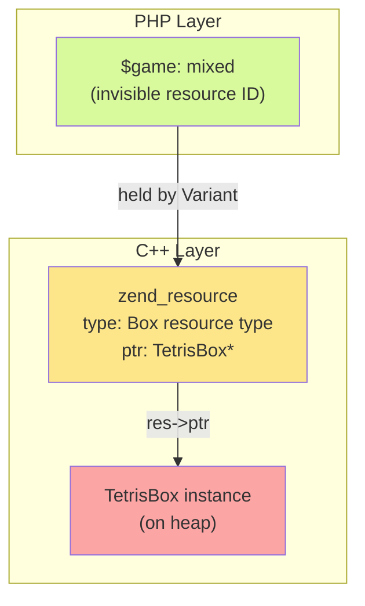
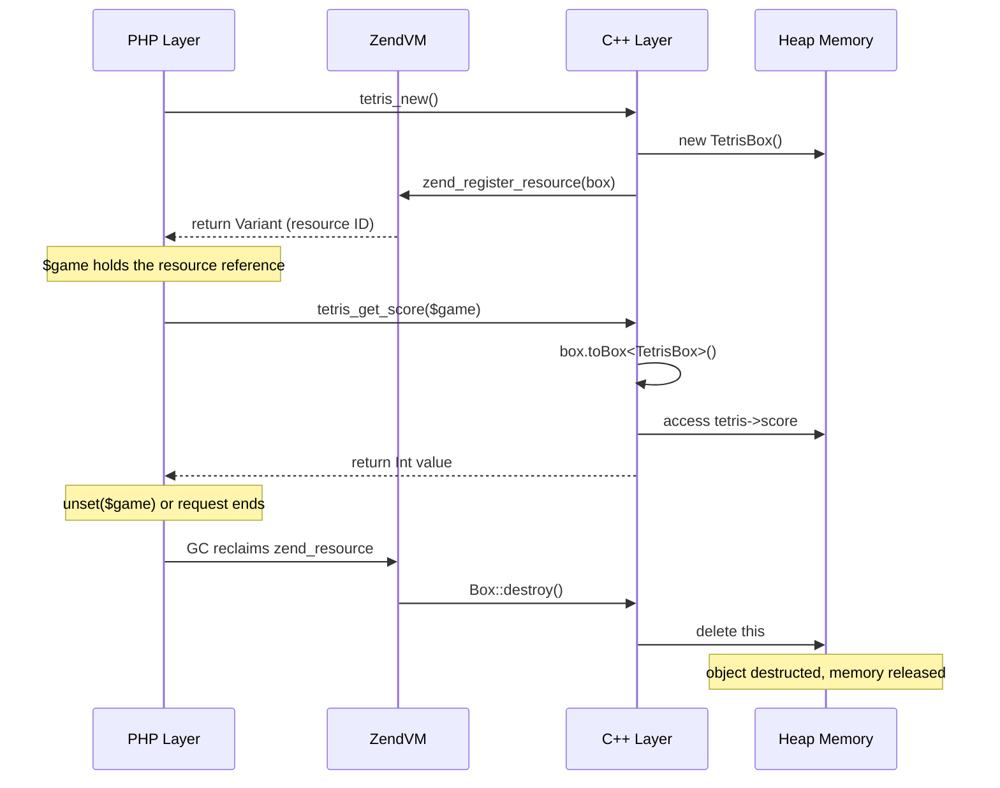

## php::Box — C++ Object Wrapping Mechanism

`php::Box` is a base class provided by the PHPX runtime that allows C++ objects to be wrapped as PHP resources (Resource), safely passing and operating on native C++ objects between PHP and C++. It is an important foundation for C++ interoperability — the compiler's `BigInt`, `Decimal`, and `BigFloat` types are all built on `Box`.

### Why Box Is Needed

When PHP calls C++ functions, ordinary PHP types (`php::Int`, `php::Str`, `php::Array`) can be passed directly as arguments and return values. But when you need to maintain a **stateful object whose lifetime spans multiple calls** in C++, you need a mechanism to safely store the C++ object's pointer in a PHP variable — that is what `Box` does.

Typical scenarios:
- Game state objects (such as a Tetris board and score)
- Database connection handles
- GPU rendering contexts
- Any complex C++ object that needs to retain state across multiple PHP→C++ calls

### Box's Underlying Mechanism



- **Creation**: `return {new MyBox()}` calls the `Variant(Box*)` constructor, registering the C++ pointer as a Zend resource and allocating a resource ID
- **Passing**: the `mixed` variable held by the PHP layer is internally a `zend_resource`, whose pointer points to the C++ heap object
- **Extraction**: `box.toBox<MyBox>()` verifies the resource type, then safely `static_cast`s `res->ptr` back to the C++ type
- **Destruction**: when PHP GC reclaims the `zend_resource`, it automatically calls `Box::destroy()` → `delete this`

Source code reference:
- `Box` base class definition: `phpx.h:1724`
- `Variant(Box*)` constructor: `phpx.h:661`
- `toBox<T>()` template method: `phpx.h:876`

### The Three-Step Usage

#### 1. Define a Class — Inherit from `Box`

```cpp
#include <phpx.h>
using namespace php;

class TetrisBox : public Box {
public:
    int board[20][10];
    int score;
    bool gameOver;

    TetrisBox() : score(0), gameOver(false) {
        memset(board, 0, sizeof(board));
    }

    void reset() {
        score = 0;
        gameOver = false;
        memset(board, 0, sizeof(board));
    }
};
```

Key points:
- **Must inherit** `public Box`
- The base class provides the `type_info` and `extra_info` `uint32_t` fields for optional metadata
- The destructor is `virtual ~Box()`, ensuring subclasses are destructed correctly

#### 2. Create and Return — the `{new MyBox()}` Syntax

```cpp
var php_tetris_new() {
    return {new TetrisBox()};   // ✅ brace initialization of Variant
}
```

> **Syntax explanation**: `return {new TetrisBox()}` is equivalent to `return Variant(new TetrisBox())`. It uses C++ brace-initialization syntax to trigger the `Variant(Box*)` constructor, registering the raw pointer as a Zend resource.

Common mistakes:

```cpp
// ❌ Missing braces — `new` returns a raw pointer and does not trigger the Variant(Box*) constructor
var php_tetris_new() {
    return new TetrisBox();
}

// ❌ Manual var() wrapping — this takes the Void* path and is not registered as a Box resource
var php_tetris_new() {
    auto* state = new TetrisBox();
    return var(state);
}
```

#### 3. Extract and Use — `toBox<T>()`

```cpp
Int php_tetris_get_score(var box) {
    auto tetris = box.toBox<TetrisBox>();   // ✅ type-safe conversion
    return tetris->score;
}

void php_tetris_reset(var box) {
    auto tetris = box.toBox<TetrisBox>();
    tetris->reset();
}
```

`toBox<T>()` performs two-step validation internally:
1. Checks whether the Variant holds a Resource type
2. Checks whether the resource's `type` is the Box resource ID

If either validation fails, a PHP exception is thrown.

Common mistakes:

```cpp
// ❌ Direct ptr() + C-style cast — does not validate the resource type, unsafe
void php_tetris_reset(var box) {
    auto* state = (TetrisBox*)box.ptr();
    state->reset();
}
```

### Stub File Declaration

Box objects are declared with the **`mixed`** type in the stub file (corresponding to C++'s `var`/`Variant`):

```php
<?php

// Function returning a Box object
function tetris_new(): mixed {}

// Functions accepting a Box object
function tetris_reset(mixed $game): void {}
function tetris_get_score(mixed $game): int {}
function tetris_is_game_over(mixed $game): bool {}
```

> **Important**: do not use `object` or other concrete types. `mixed` is the only correct stub type, because Box appears as a Resource type in the PHP layer.

### Using from PHP

```php
declare(strict_types=1);

class TetrisGame
{
    private mixed $game;

    public function __construct()
    {
        $this->game = tetris_new();
    }

    public function getScore(): int
    {
        return tetris_get_score($this->game);
    }

    public function reset(): void
    {
        tetris_reset($this->game);
    }
}

function main(): void {
    $game = new TetrisGame();
    echo "Initial score: " . $game->getScore() . "\n";
    // Game logic...
    $game->reset();
}
```

### Type Mapping Rules

| C++ type | Stub declaration | PHP declaration | Description |
|---------|----------|---------|------|
| `var` | `mixed` | `mixed` | Box object or any Variant value |
| `Variant` | `mixed` | `mixed` | Same as above (`var` is an alias of `Variant`) |
| `Int` | `int` | `int` | Integer |
| `Bool` | `bool` | `bool` | Boolean |
| `Str` / `String` | `string` | `string` | String |
| `Array` | `array` | `array` | Array |
| `Float` | `float` | `float` | Floating-point number |
| `void` | `void` | `void` | No return value |

### Box's Lifetime



Key points:
- Box objects are allocated on the heap, and their lifetime is managed by PHP's reference counting/GC
- When a PHP variable is `unset` or goes out of scope, `Box::destroy()` automatically calls `delete this`
- No manual `delete` is needed, avoiding dangling pointers and memory leaks

### Complete Example: Tetris

The following Box usage patterns are extracted from `examples/tetris-sdl` and `examples/tetris-win32`.

#### C++ Layer (tetris.cc)

```cpp
#include <phpx.h>
#include <cstring>

using namespace php;

// 1. Define the Box subclass
class TetrisBox : public Box {
public:
    int board[20][10];
    int score;
    bool gameOver;

    TetrisBox() : score(0), gameOver(false) {
        memset(board, 0, sizeof(board));
    }

    void reset() {
        score = 0;
        gameOver = false;
        memset(board, 0, sizeof(board));
    }
};

// 2. Create and return a Box
var php_tetris_new() {
    return {new TetrisBox()};
}

// 3. Extract the Box from a Variant to operate on it
void php_tetris_reset(var box) {
    auto tetris = box.toBox<TetrisBox>();
    tetris->reset();
}

Int php_tetris_get_score(var box) {
    auto tetris = box.toBox<TetrisBox>();
    return tetris->score;
}

Bool php_tetris_is_game_over(var box) {
    auto tetris = box.toBox<TetrisBox>();
    return tetris->gameOver;
}
```

#### Stub File (tetris.stub.php)

```php
<?php

function tetris_new(): mixed {}
function tetris_reset(mixed $game): void {}
function tetris_get_score(mixed $game): int {}
function tetris_is_game_over(mixed $game): bool {}
```

#### project.yml

```yaml
name: tetris
build-mode: bin
sources:
  - main.php
  - php-src/
  - cpp-src/
```

#### Compile and Run

```shell
./tpc examples/tetris-sdl/project.yml -O2 -o tetris
./tetris
```

### Optional: Null-Pointer Safety Check

```cpp
void php_tetris_reset(var box) {
    if (!box.isResource()) {
        throw Exception("Invalid game object");
    }
    auto tetris = box.toBox<TetrisBox>();
    tetris->reset();
}
```

### Common Mistakes

**Mistake 1: Forgetting to inherit Box**

```cpp
// ❌ missing inheritance
class TetrisBox {
    int score;
};

// ✅ correct
class TetrisBox : public Box {
    int score;
};
```

**Mistake 2: Wrong return syntax**

```cpp
// ❌ missing braces
var php_tetris_new() {
    return new TetrisBox();
}

// ✅ correct
var php_tetris_new() {
    return {new TetrisBox()};
}
```

**Mistake 3: Wrong stub type**

```php
// ❌ cannot use object
function tetris_new(): object {}
function tetris_reset(object $game): void {}

// ✅ correct
function tetris_new(): mixed {}
function tetris_reset(mixed $game): void {}
```

**Mistake 4: Using ptr() instead of toBox()**

```cpp
// ❌ unsafe
void php_tetris_reset(var box) {
    auto* tetris = (TetrisBox*)box.ptr();
    tetris->reset();
}

// ✅ type-safe
void php_tetris_reset(var box) {
    auto tetris = box.toBox<TetrisBox>();
    tetris->reset();
}
```

### Under the Hood: Box's Internal Implementation

`Box` itself is an extremely minimal base class:

```cpp
class Box {
protected:
    uint32_t type_info = 0;   // subclasses can define a custom type tag
    uint32_t extra_info = 0;  // subclasses can define custom additional info
    virtual ~Box() = default; // virtual destructor ensures subclasses are destructed correctly
};
```

The `Variant(Box*)` constructor converts the Box pointer into a Zend resource:

```cpp
Variant(Box *v) {
    zend_resource *res = zend_register_resource(v, getBoxResourceId());
    ZVAL_RES(&val, res);
}
```

The `toBox<T>()` template method extracts safely:

```cpp
template <class T>
T *toBox() {
    if (UNEXPECTED(!isResource())) {
        throwError("This variant is not a resource type.");
        return nullptr;
    }
    auto res = Z_RES_P(unwrap_ptr());
    if (UNEXPECTED(res->type != getBoxResourceId())) {
        throwError("This resource is not type of `%s`.", box_res_name);
        return nullptr;
    }
    return static_cast<T *>(res->ptr);
}
```

> The compiler's built-in `BigInt`, `Decimal`, and `BigFloat` types all inherit from `Box` and use the exact same resource-wrapping mechanism. User-defined Box subclasses behave identically to built-in types in the PHP layer — both are `mixed` variables holding a `zend_resource`.
