## Execution Overview

`AOT` compilation **translates `PHP` code offline into `C++` source code**, which is then compiled into native machine code by `gcc`/`clang`/`msvc`. The runtime execution of the compiled artifact is fundamentally different from traditional PHP (per-request parsing → compilation → interpretation) — machine code executes directly on the CPU without going through ZendVM's Opcode interpretation loop.

In actual execution, an `AOT`-compiled program runs in a **hybrid execution environment**.
Statically compiled user code executes as native machine instructions, but deep interaction with the PHP ecosystem (built-in functions, extensions, dynamic loading) still relies on the `Zend Engine` runtime.
Therefore, the execution of a TypePHP program is not "fully static"; it is the result of three execution modes working together:

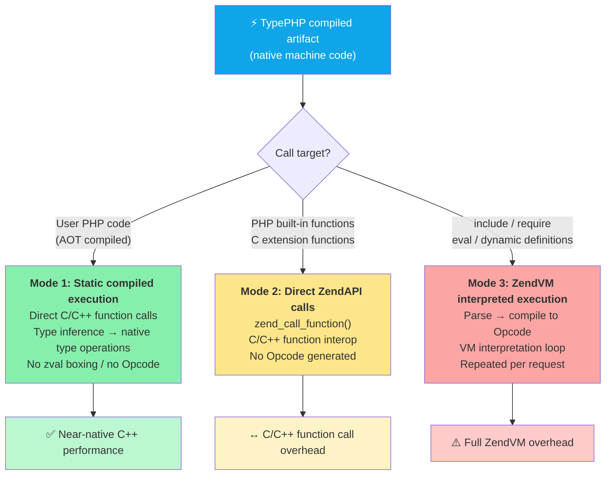

> **Core idea**: the TypePHP compiler promotes PHP code to **Mode 1** (native machine code) as much as possible to achieve the maximum performance gain. Features that cannot be statically compiled (such as `eval()` and dynamic class definitions) fall back to **Mode 3** (ZendVM interpretation), but such fallbacks should be avoided as much as possible in real projects.

### 1. Statically Compiled User Code

This is where the core value of `AOT` compilation lies. Functions, methods, and classes in `PHP` source code are translated by the compiler into equivalent `C++` functions.
At runtime they execute directly as machine instructions, **completely bypassing `ZendVM`'s `Opcode` compilation/interpretation pipeline**.

**Type handling** is divided into two levels:

| Type level | Enablement | C++ type | Example |
|---------|---------|---------|------|
| Native type | Default | `php::Int`, `php::Float`, `php::Bool` | `int64_t`, `double`, `bool` |
| Dynamic type | `std::any()` or an indeterminate type | `php::Var` (`zval` wrapper) | Dynamic PHP values |

Inferred `int`/`float`/`bool` values map directly to C++ native types (`int64_t`, `double`, `bool`) by default. Use `std::any()` for a dynamic value, or `use varint_types` when inferred integers across a file need Zend integer widening semantics.

```php

function calculate(int $a, int $b): int {
    return $a * $b + 10;   // → Direct C++ integer arithmetic, no zval overhead
}
```

**Calling convention**: calls between user functions are direct C++ function calls, with no function-pointer lookup or dynamic dispatch (unless there is subclass method overriding, in which case the compiler attempts devirtualization optimization).

### 2. PHP Built-in Functions and Extension Functions

The PHP standard library (such as `explode()`, `array_map()`, `preg_match()`) and third-party extensions (such as `json_decode()`, `curl_init()`) are written in C and compiled into `.so` / `.dll` extension files. Their implementations live inside the Zend Engine, and no AOT-statically-linkable versions exist.

When calling these functions, the TypePHP compiler generates code that directly invokes their underlying C function pointers through the **ZendAPI** `zend_call_function()`:

```
User code (AOT machine code)
  → zend_call_function(internal_function_handler)
    → C extension function body
      → returns zval result
```

This is equivalent to **inter-calling between C/C++ functions**; no Opcode bytecode needs to be generated and no VM interpretation loop needs to be started. The overhead consists only of:
- Function-pointer lookup and argument-stack setup in `zend_call_function()`
- `zval` wrapping of input/output arguments (if the caller uses native types, temporary boxing is required)

### 3. Dynamically Loaded Code

Some PHP features cannot be processed statically at compile time and must be dynamically compiled and executed at runtime:

- `include()` / `require()` — dynamically load PHP files
- `eval()` — execute PHP code in a string at runtime
- `create_function()` — dynamically create anonymous functions
- dynamic class definitions and dynamic method additions

This code is re-executed by ZendVM at **runtime** through the complete "parse → compile → interpret" pipeline, producing Opcode bytecode that is executed through the VM interpretation loop. Its execution efficiency is exactly the same as dynamic code in standard PHP.

TypePHP-defined Traits are an exception: a Trait only exists as a compile-time AST template and is not registered with ZendVM, so dynamic code cannot `use` a TypePHP Trait. See [Compatibility: Traits Are Only Visible at Compile Time](compatible.md#traits-are-only-visible-at-compile-time) for details.

> **Note**: over-reliance on `include`/`eval` dilutes the performance benefits of AOT compilation. Best practice is to place core business logic in statically compiled files and leave only necessary scenarios such as configuration loading and route dispatching to dynamic loading.

## How the TypePHP Compiler Executes

The TypePHP compiler compiles PHP to C++, then to native machine code, in `4` stages. The entire compilation flow is completed fully offline; at runtime there is no longer any need to parse, compile, or interpret PHP code.

### Overall Execution Flow

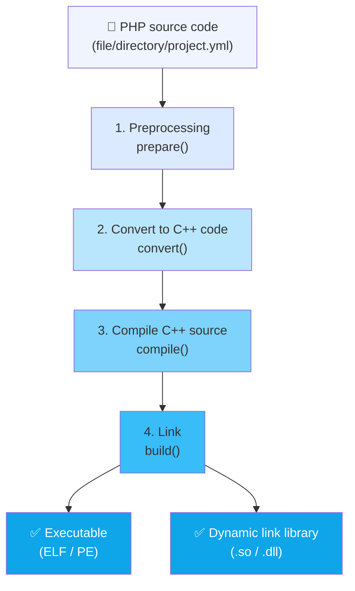

### 1. Preprocessing — `prepare()`

The preprocessing stage is responsible for scanning, collecting, and sorting all source files, and building the complete symbol table.

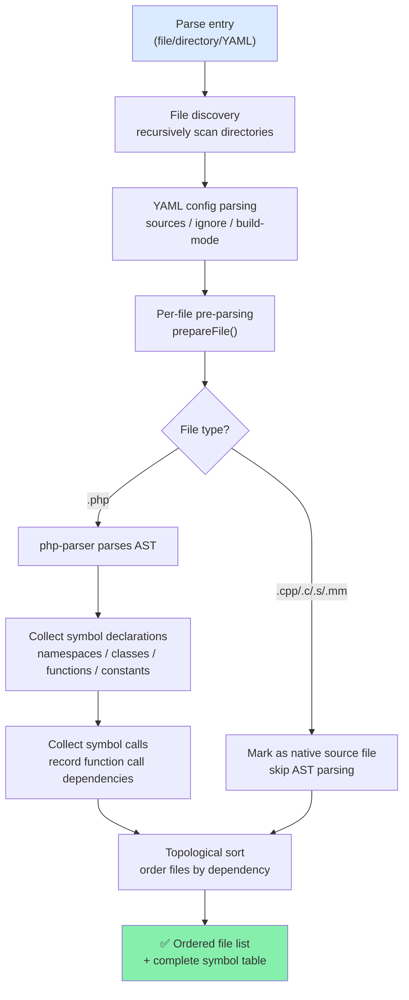

#### Detailed Steps

**1.1 Entry Parsing**

Three entry modes are supported:
- **Single file**: `./tpc app.php`
- **Directory**: `./tpc src/`, recursively discovers all source files
- **YAML config**: `./tpc project.yml`, loads project settings from the configuration file

**1.2 File Discovery**

Uses `FileScanner` to recursively scan directories, supporting the following extensions:
- **PHP**: `.php`
- **C++**: `.cpp`, `.cc`, `.cxx`
- **C**: `.c`
- **Assembly**: `.s`
- **Objective-C** (macOS): `.m`, `.mm`

**1.3 YAML Config Parsing**

Reads configuration items such as `sources`, `ignore`, `build-mode`, `cxx-flags`, `ld-flags`, `cpp-compiler`, and `resource` from `project.yml`. The configuration file path serves as the project root directory, and all relative paths are resolved against it.

**1.4 Pre-parsing (prepareFile)**

Performs AST parsing on each PHP file, but **does not generate code**; it only collects symbol information:

| Statement type | Collected content |
|----------|---------|
| `Stmt_Namespace` | Current namespace |
| `Stmt_Class` / `Stmt_Trait` / `Stmt_Enum` | Class name, parent class, properties, method signatures |
| `Stmt_Interface` | Interface name, method signatures |
| `Stmt_Function` | Function name, argument types, return type |
| `Stmt_Const` | Constant definitions |
| `Expr_FuncCall` | Global function calls (used for dependency analysis) |

**1.5 Dependency Analysis and Topological Sort**

The compiler records the function symbols called by each file and maps them to the file that declares the symbol. Topological sorting is used to determine the compilation order, ensuring that dependent files are compiled first. Files that do not participate in dependency management (no cross-references) are ordered last.

> Built-in functions do not participate in dependency management — they are provided by the phpx runtime library and are not declared in user files.

**1.6 Detecting the Platform Environment**

The runtime environment is detected synchronously during the preprocessing stage:
- Operating system: Linux / macOS / Windows
- C++ compiler: GCC / Clang / MSVC
- `clang-format` availability (used for code formatting)

### 2. Convert to C++ Code — `convert()`

The conversion stage translates each PHP file's AST into C++ source code, one by one.

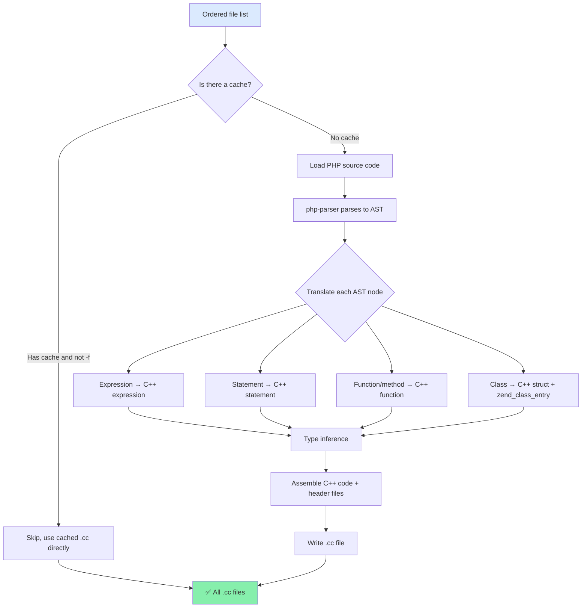

#### Detailed Steps

**2.1 Cache Check**

The compiler maintains a compilation cache for each PHP file. If the source file has not been modified and the corresponding `.cc` file already exists, the conversion is skipped and the cache is used directly. Use `-f` (`--force`) to force re-conversion.

**2.2 AST Parsing and Traversal**

Uses `nikic/php-parser` to parse PHP source code into an AST. The generated AST is traversed node by node, with each node type corresponding to a `parse*()` handler method. Some key mappings:

| PHP node | Translation method | C++ output |
|----------|---------|---------|
| `Expr_Assign` | `parseAssignExpr()` | `var = expr;` |
| `Expr_BinaryOp_Plus` | `parseBinaryOp()` | `php::BigInt::add(a, b)` or `a + b` |
| `Expr_FuncCall` | `parseFuncCall()` | `php::func_name(args)` |
| `Expr_MethodCall` | `parseMethodCall()` | `obj.method(args)` |
| `Stmt_If` | `parseIf()` | `if (cond) { ... }` |
| `Stmt_For` / `Stmt_Foreach` | `parseFor()` / `parseForeach()` | C++ for/for-each loops |
| `Stmt_Class` | `parseClass()` | struct + registration function |
| `Scalar_String` | `parseScalar()` | `php::String("...")` |

**2.3 Type Inference**

The compiler performs type inference (`detectTypeOfExpr()`) during translation, analyzing the C++ type of each expression. The inference result directly affects the generated code:
- If the type is clear (such as `php::Int`), native operations are generated
- If the type is `php::Var`, `zval` dynamic operations are generated

**2.4 Compilation Cache (Redo Mechanism)**

If an as-yet-undeclared symbol (such as an unresolved class constant) is encountered during translation, the translator throws a `Redo` exception and re-runs the conversion after the dependent files have been processed. This ensures that all symbol references are available when the code is generated.

**2.5 Generated Artifacts**

Each PHP file generates a corresponding `.cc` file placed in the `build/` directory, with the directory structure matching the source directory.

### 3. Compile C++ Source — `compile()`

The compilation stage invokes the platform C++ compiler (GCC / Clang / MSVC) to compile `.cc` source files into `.o` object files.

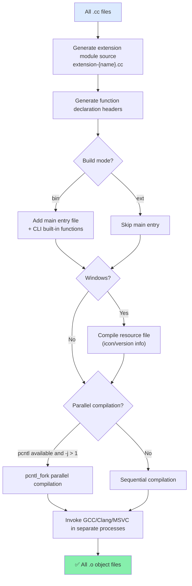

#### Detailed Steps

**3.1 Generate Extension Module Source**

The compiler automatically generates `extension-{name}.cc`, containing:
- `zend_class_entry` registration for all PHP classes
- C++ definitions of global variables
- Function/class entry mapping tables
- The `get_module()` function (extension mode)

**3.2 Generate Headers**

Generates two auxiliary header files:
- `php_{name}_func_decl.h`: C++ forward declarations of all functions
- `php_{name}_global_var_decl.h`: extern declarations of global variables

**3.3 Platform-specific Handling**

| Platform | Compiler | Special handling |
|------|--------|---------|
| Linux | GCC / Clang | `-fPIC` (extension mode), rpath setup |
| macOS | Clang / GCC | `-undefined dynamic_lookup`, rpath setup |
| Windows | MSVC / Clang-cl | Resource file compilation (`.rc` → `.res`), PDB debug info |

**3.4 Parallel Compilation**

Unix/Linux/macOS platforms support `pcntl_fork` multi-process parallel compilation, with the concurrency controlled by the `-j` argument. Compilation progress is displayed in real time in the terminal. If `pcntl` is unavailable or `-j 1` is used, it falls back to sequential compilation.

**3.5 Compilation Options**

Merges compilation options from CLI arguments and `project.yml`:
- Optimization level (`-O0` ~ `-O3`)
- Debug symbols (`-g`, debug mode)
- Sanitizer (`-fsanitize=address`, etc.)
- C++ standard version (`-std=c++17`)
- User-defined `cxx-flags`

### 4. Link — `build()`

The linking stage combines all object files into the final executable or dynamic library.

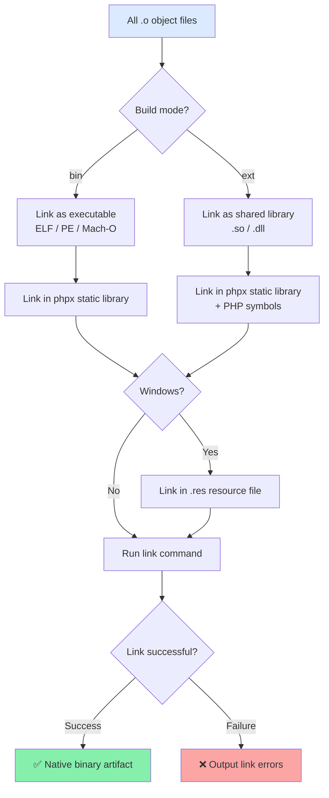

#### Detailed Steps

**4.1 Generate Link Command**

Based on the platform and build mode, the compilation backend (`CompilerBackend`) generates the corresponding link command:

| Platform | bin mode link arguments | ext mode link arguments |
|------|-----------------|-----------------|
| Linux | `-Wl,-rpath,...` | `-shared -fPIC` |
| macOS | `-Wl,-rpath,...` | `-dynamiclib -undefined dynamic_lookup` |
| Windows | `-Wl,/SUBSYSTEM:CONSOLE` | `-shared` |

**4.2 Final Artifacts**

| Build mode | Linux/macOS artifact | Windows artifact |
|---------|-----------------|-------------|
| `bin` | Executable (ELF/Mach-O) | `.exe` (PE) |
| `ext` | `.so` / `.dylib` | `.dll` |

## How ZendVM Executes

`ZendVM` is the official reference implementation of `PHP`, adopting the classic virtual machine architecture of "parse—compile—interpret". Every time a request arrives, `ZendVM` re-executes the complete compile-execute flow.

### Overall Execution Flow

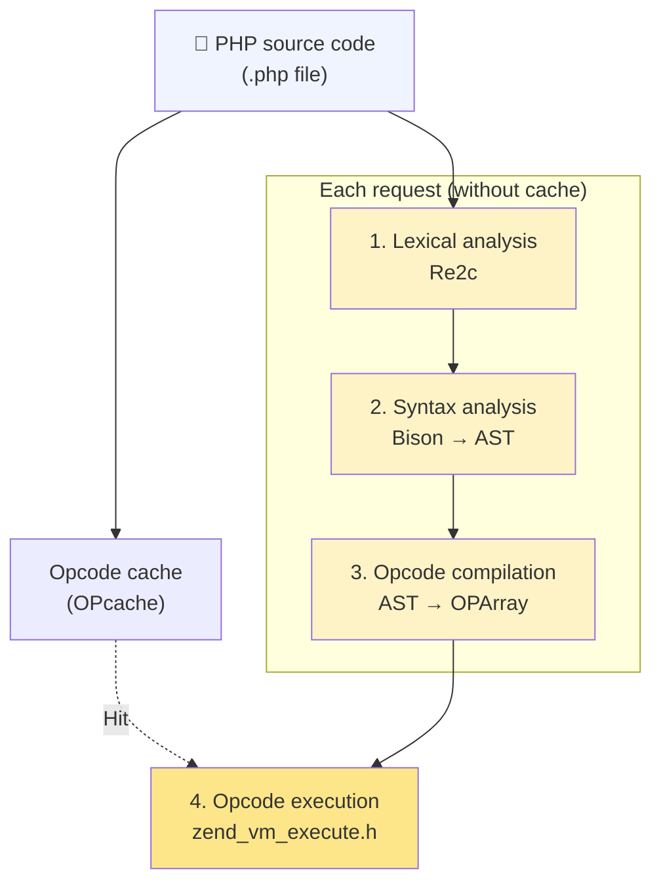

> OPcache can cache the artifacts of stages 1–3 (the Opcode array), avoiding repeated parsing and compilation. But even on a cache hit, stage 4's interpretation still occurs on every request.

### 1. Lexical Analysis

Splits the PHP source code character stream into a sequence of `Token`s (lexemes).

**Implementation**: uses the `Re2c` tool to generate the lexical analyzer's C code. `Re2c` compiles regular expression rules into a deterministic finite automaton (DFA); the output C code uses a `goto` jump table for efficient character matching. The generated scanner is located in `Zend/zend_language_scanner.c`.

**Token types**: include identifiers (`T_VARIABLE`, `T_STRING`), literals (`T_LNUMBER`, `T_DNUMBER`, `T_CONSTANT_ENCAPSED_STRING`), operators (`+`, `-`, `.`), keywords (`if`, `while`, `class`), etc.

On the user side, `token_get_all()` can be used to observe the result of lexical analysis:

```php
// Source code
$name = "World"; echo "Hello, " . $name;

// token_get_all() output:
[
    [T_OPEN_TAG, "<?php ", 1],
    [T_VARIABLE, "$name", 2],
    "=",
    [T_CONSTANT_ENCAPSED_STRING, '"World"', 2],
    ";",
    [T_ECHO, "echo", 3],
    [T_CONSTANT_ENCAPSED_STRING, '"Hello, "', 3],
    ".",
    [T_VARIABLE, "$name", 3],
    ";",
    [T_CLOSE_TAG, "?>", 4],
]
```

### 2. Syntax Analysis

Uses **Bison** (an LALR(1) parser generator) to convert the Token stream into an **abstract syntax tree (AST)**.

**Implementation**: PHP grammar rules are defined in `Zend/zend_language_parser.y`. Bison compiles them into a C-language LALR(1) parse table; the generated parser reduces the Token sequence into AST nodes via the shift-reduce algorithm. Each grammar rule corresponds to an AST node construction action.

**AST node structure** (`Zend/zend_ast.h`):

```c
struct _zend_ast {
    zend_ast_kind kind;       // Node type (e.g. ZEND_AST_ASSIGN)
    zend_ast_attr attr;       // Attributes (operators, modifiers, etc.)
    uint32_t lineno;          // Source line number
    zend_ast *children[1];    // Variable-length child node array
};
```

**AST example** — `$name = "World"; echo "Hello, " . $name;`:

```text
ZEND_AST_STMT_LIST
├── ZEND_AST_ASSIGN
│   ├── ZEND_AST_VAR (name: "name")
│   └── ZEND_AST_ZVAL (value: "World", type: IS_STRING)
└── ZEND_AST_ECHO
    └── ZEND_AST_BINARY_OP (op: CONCAT)
        ├── ZEND_AST_ZVAL (value: "Hello, ", type: IS_STRING)
        └── ZEND_AST_VAR (name: "name")
```

### 3. Opcode Compilation (AST → OPArray)

Traverses the AST to generate an **OPArray** — an opcode array and its associated runtime data.

**Implementation**: the compiler is located in `Zend/zend_compile.c`, traversing the AST via recursive descent, with each AST node type corresponding to a `zend_compile_*()` function. The generated Opcodes are ZendVM's "bytecode" — each Opcode contains an opcode and operands.

**OPArray structure** (`Zend/zend_compile.h`):

```c
struct _zend_op_array {
    zend_op *opcodes;              // Opcode sequence
    zval *literals;                // Literal array (strings, numbers, etc.)
    int last;                      // Number of opcodes
    // ... variable slots, temporary variables, exception table, etc.
};

struct _zend_op {
    const void *handler;           // Filled at execution time: the corresponding handler function pointer
    znode_op op1, op2, result;     // Operands and result (register/constant/jump offset)
    uint32_t lineno;               // Corresponding source line number
    uint8_t opcode;                // Opcode (e.g. ZEND_ASSIGN, ZEND_ECHO)
};
```

**Example** — `$a = 3 + $b;` compiles to:

```text
OPArray:
  [0] ZEND_ADD      CV($b)  CONST(3)  TMP_VAR($0)
  [1] ZEND_ASSIGN   CV($a)  TMP_VAR($0)
```

| Opcode | Description | op1 | op2 | result |
|--------|------|-----|-----|--------|
| `ZEND_ADD` | Addition | `CV($b)` — compiled variable | `CONST(3)` — constant 3 | `TMP_VAR` — temporary register |
| `ZEND_ASSIGN` | Assignment | `CV($a)` — target variable | `TMP_VAR` — source temporary value | — |

ZendVM uses a **virtual register** model: `CV` (Compiled Variable) maps to a variable slot in the call frame, `TMP_VAR` is a temporary register, and `CONST` references the literal pool.

**The role of OPcache**: OPcache caches the compiled OPArray into shared memory. On a cache hit, stages 1–3 are completely skipped — this is ZendVM's most important performance optimization. Note, however, that OPcache only caches the compilation result; the execution stage still occurs every time.

### 4. Opcode Execution (VM Interpretation Loop)

The ZendVM core executor loads the OPArray and executes the Opcodes one by one.

**Implementation**: the executor is located in `Zend/zend_vm_execute.h`. It is a giant `while` or `goto` dispatch loop, where each Opcode corresponds to a `C function` or inline `handler`. The CPU fetches from the OPArray, indirectly jumps through handler function pointers, decodes operands, executes semantics, writes results, advances the instruction pointer, and repeats.

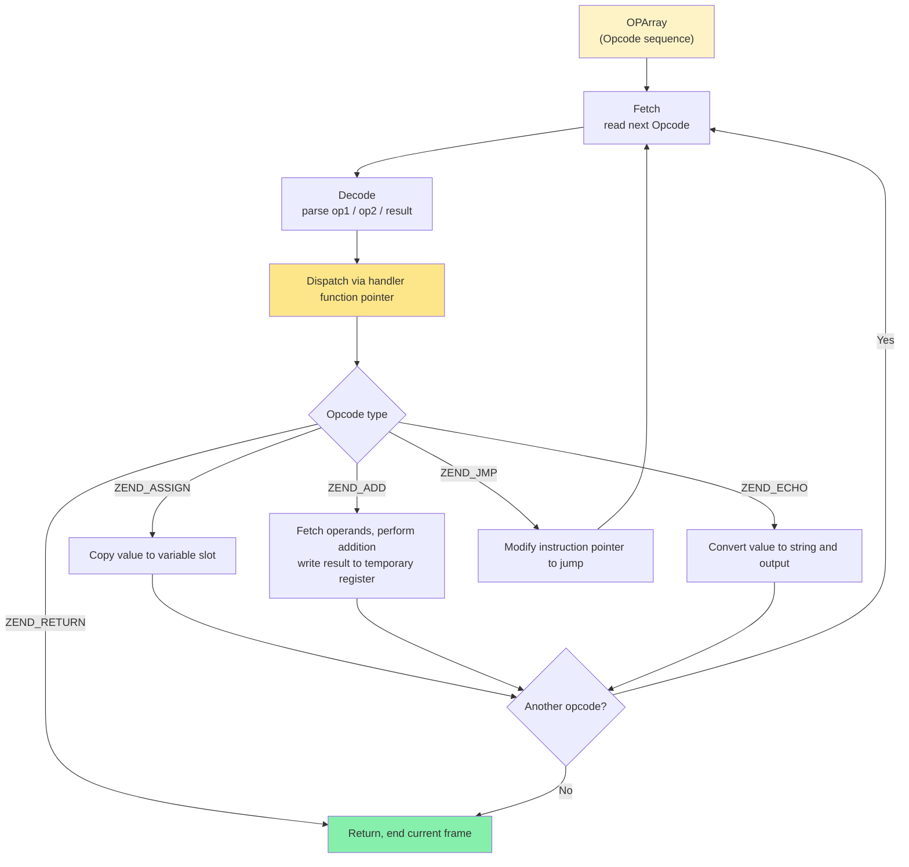

**Execution overhead analysis**: when each Opcode executes, the CPU must complete:
1. Indirect jump (handler function pointer call)
2. Operand decoding (distinguish CV / TMP / CONST types)
3. Type checking (`zval`'s type tag, determining the actual operation logic)
4. Reference counting management (`zval`'s `refcount` increments/decrements)
5. Operation execution
6. Fetching the next Opcode

`zval` boxing/unboxing and type-tag checking are the main sources of overhead. Even for the simplest `$a + $b`, ZendVM needs to check the types of both operands, handle type conversion, and allocate a temporary `zval` to store the result.

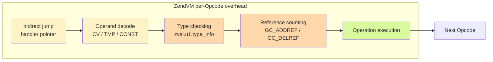

### ZendVM Complete Flow Summary

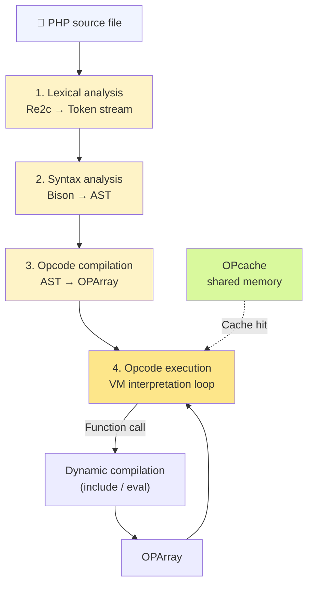

Key points:
- **Without OPcache**: each request executes the complete "parse → compile → execute" pipeline
- **With OPcache**: parsing and compilation are skipped, but the Opcode interpretation loop still runs
- **Dynamic feature support**: `include`, `eval`, `create_function()`, etc. can trigger new compilation at runtime
- **`zval` overhead**: all values (including integers and floats) are boxed in `zval` structs, and every Opcode involves type checking and reference counting

## ZendVM vs TypePHP Compiler Comparison

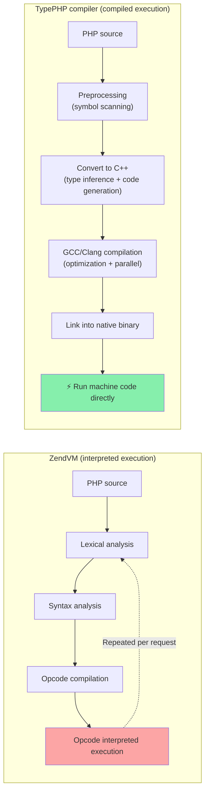

| Dimension | ZendVM | TypePHP compiler |
|------|--------|-----------|
| Translation approach | Interprets Opcode line by line per request | Translates to machine code once at compile time |
| Runtime dependency | Requires PHP interpreter | Standalone binary, depends only on phpx runtime library |
| Type system | Dynamic typing, zval boxing | Static inference + native C++ scalar types by default |
| Function calls | `zend_call_function()` dynamic dispatch | Direct C++ function calls (Native Call) |
| Dynamic features | Full support for `eval`, `call_user_func`, etc. | Partial support (restricted dynamic calls) |
| Performance | Baseline (1x) | Greatly improved (tens to hundreds of times) |
| Startup speed | Needs to load PHP + parse scripts | Instant startup (precompiled machine code) |

> **Key trade-off**: after AOT compilation, all PHP code is converted from Opcode bytecode to machine instructions, greatly enhancing execution efficiency. But compilation loses dynamism — modifying Opcode bytecode or dynamically inserting new execution instructions at runtime is not allowed. Features such as `eval()` and dynamic function definitions are restricted or unavailable in AOT mode.
