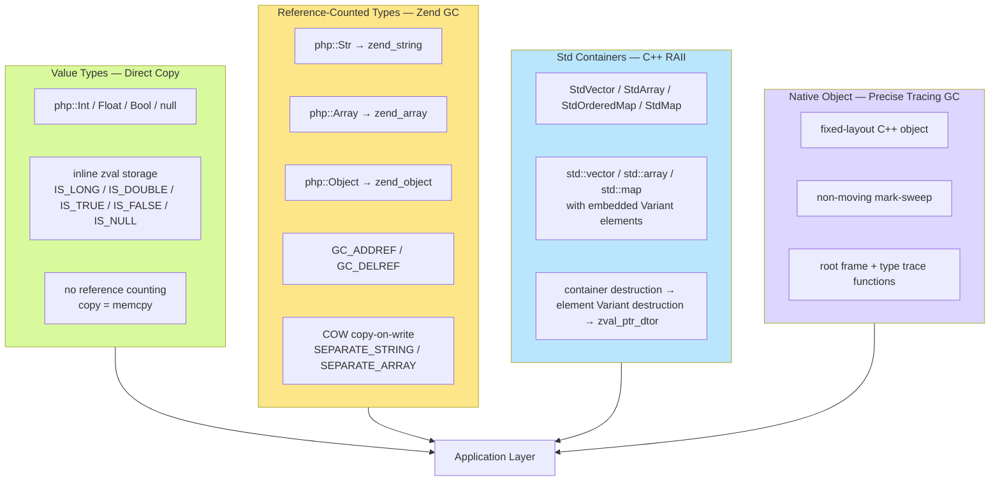
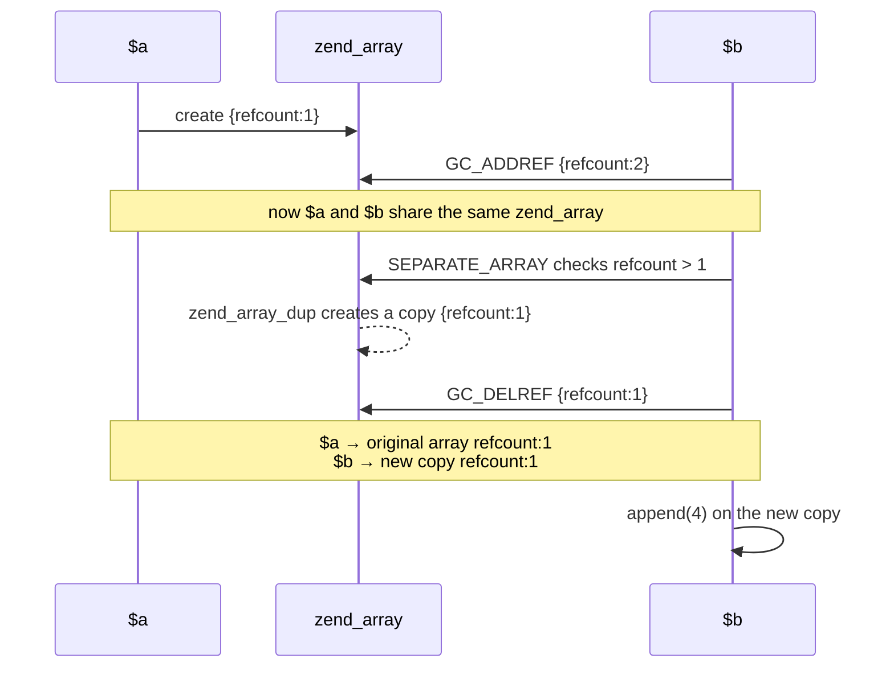
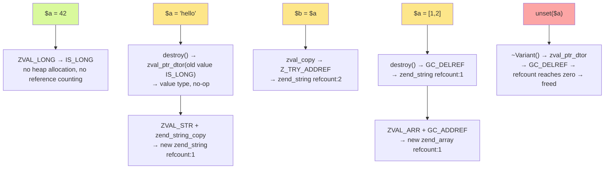
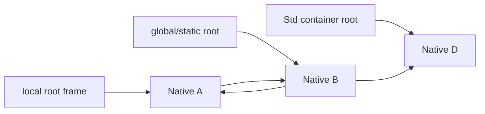

## GC Mechanism

The TypePHP compiler follows ZendVM's memory management mechanism — value types are copied directly, reference types use reference counting, and copy-on-write (COW) ensures sharing safety. Std containers use C++ RAII for lifecycle management; [`#[Native]` Native Classes](native-class.md) explicitly declared as such use TypePHP/PHPX's independent tracing GC.

### Overall Architecture



---

## 1. Value Types — Direct Copy

`php::Int`, `php::Float`, and `php::Bool` do not participate in reference counting.

### Principle

Value types are stored directly inside the `zval` structure and do not allocate heap memory. The type flags (`IS_LONG`, `IS_DOUBLE`, `IS_TRUE`, `IS_FALSE`) do not set the `Z_REFCOUNTED` flag, so all reference counting operations (`Z_TRY_ADDREF`, `Z_TRY_DELREF`) are no-ops.

```cpp
// assignment copies the value, with zero GC overhead
Variant &operator=(long v) {
    destroy();        // release the old value (if the old value held a refcounted type)
    ZVAL_LONG(unwrap_ptr(), v);  // write directly into the zval's lval field
    return *this;
}

Variant &operator=(double v) {
    destroy();
    ZVAL_DOUBLE(unwrap_ptr(), v);  // write directly into the zval's dval field
    return *this;
}

Variant &operator=(bool v) {
    destroy();
    ZVAL_BOOL(unwrap_ptr(), v);   // directly set IS_TRUE / IS_FALSE
    return *this;
}

// null is also a value type, stored inside the zval
Variant &setNull() {
    destroy();
    ZVAL_NULL(unwrap_ptr());    // directly set IS_NULL, no heap allocation
    return *this;
}
```

### Behavior

```php
use native_types;

$a = 42;        // php::Int — the value is stored directly in zval.lval on the stack
$b = $a;        // copies an 8-byte integer, with no reference counting operation
$b = 100;       // $a is unaffected
```

```cpp
// generated C++ code
php::Int a = 42L;
php::Int b = a;     // memcpy semantics
b = 100L;           // direct overwrite
```

### Value Type List

| Type | C++ type | zval storage | Reference counted |
|------|---------|----------|---------|
| `int` | `php::Int` | `zval.value.lval` (`IS_LONG`) | No |
| `float` | `php::Float` | `zval.value.dval` (`IS_DOUBLE`) | No |
| `bool` | `php::Bool` | `IS_TRUE`/`IS_FALSE` of `zval.value.val` | No |
| `null` | `php::Var` (value) | `IS_NULL` of `zval` | No |

---

## 2. Reference Counting — String / Array / Object

`php::Str`, `php::Array`, and `php::Object` internally hold pointers to Zend heap objects (`zend_string*`, `zend_array*`, `zend_object*`), tracking sharing through reference counting.

### 2.1 Basic Reference Counting Operations

The Zend engine provides conditional reference counting macros in `zend_types.h`:

```c
// only takes effect on Z_REFCOUNTED types; no-op for value types
#define Z_TRY_ADDREF_P(pz) do { \
    if (Z_REFCOUNTED_P((pz))) { \
        Z_ADDREF_P((pz));       \
    }                           \
} while (0)

#define Z_TRY_DELREF_P(pz) do { \
    if (Z_REFCOUNTED_P((pz))) { \
        Z_DELREF_P((pz));       \
    }                           \
} while (0)
```

### 2.2 Variant's GC Responsibility

`php::Var` is the only dynamic-type container and holds a `zval`. Its construction, assignment, and destruction fully manage reference counting:

**Copy (`operator=`)**:

```cpp
void Variant::copyFrom(const zval *src) {
    auto zv = unwrap_ptr();
    zval tmp = *zv;               // 1. save the old value
    zval_copy(zv, src);           // 2. copy the new value + Z_TRY_ADDREF
    zval_ptr_dtor(&tmp);          // 3. release the old value (decrement reference count or free directly)
}
```

The three steps guarantee: first save the old value, then copy the new value and increment its reference count, then release the old value. Even if the old and new point to the same object, the old value is only released in step 3, so it is not reclaimed prematurely.

**Destruction**:

```cpp
~Variant() {
    if (isReference()) {
        zval_ptr_dtor(&val);        // IS_REFERENCE — free directly
    } else if (!isIndirect()) {
        destroy();                   // calls zval_ptr_dtor
    }
    // IS_INDIRECT — no-op: the pointer is borrowed from an array/object and does not manage the lifecycle
}
```

Three cases:
1. **IS_REFERENCE**: the `zval` itself is a reference type and needs to free the `zend_reference` structure
2. **IS_INDIRECT**: the `zval` is a pointer to an array bucket or object property slot — it does not own the data, so no freeing
3. **Otherwise**: a normal refcounted type, calling `zval_ptr_dtor` to decrement the reference count

### 2.3 String — zend_string Reference Counting

```cpp
// construction: copy the zend_string (increment reference count)
String(zend_string *v) {
    ZVAL_STR(ptr(), zend_string_copy(v));  // zend_string_copy → GC_ADDREF
}

// assignment: release the old first, then increment the new reference count
Variant &operator=(zend_string *v) {
    destroy();                                // release the old value
    ZVAL_STR(unwrap_ptr(), zend_string_copy(v));  // new value + GC_ADDREF
    return *this;
}
```

**Example**:

```php
$s = "hello";   // zend_string{refcount:1} — first allocation
$t = $s;        // GC_ADDREF → refcount:2
$s = "world";   // $s creates a new zend_string{refcount:1}; $t's original zend_string refcount:1
```

```cpp
// generated C++ pseudocode
php::Str s = php::Str("hello");
php::Str t = s;             // Z_TRY_ADDREF: s's zend_string reference count +1
s = php::Str("world");      // destroy() → GC_DELREF: old zend_string -1
                            // ZVAL_STR + zend_string_copy: new zend_string +1
```

### 2.4 Array — zend_array Reference Counting

```cpp
// handled automatically on write
void Array::append(const Variant &v) {
    auto zv = NO_CONST_Z(v.direct_ptr());
    Z_TRY_ADDREF_P(zv);         // 1. value +1
    auto zarr = unwrap_ptr();
    SEPARATE_ARRAY(zarr);       // 2. copy first if shared
    add_next_index_zval(zarr, zv);  // 3. store
}
```

**Example**:

```php
$a = [1, 2];    // zend_array{refcount:1}
$b = $a;        // GC_ADDREF → refcount:2
```

```cpp
php::Array a;
a.append(1); a.append(2);  // refcount:1
php::Array b = a;           // Z_TRY_ADDREF: refcount → 2
```

### 2.5 Object — zend_object Reference Counting

```cpp
Object(zend_object *o, Ctor method = Ctor::Copy) {
    ZVAL_OBJ(&val, o);
    if (method == Ctor::Copy) {
        addRef();   // GC_ADDREF increments the zend_object's reference count
    }
}
```

---

## 3. Copy-on-Write (COW)

When multiple variables share the same `zend_string` or `zend_array` (refcount > 1), a write operation must first copy a private copy before modifying — this is COW.

### 3.1 SEPARATE_STRING

```c
#define SEPARATE_STRING(zv) do {                          \
    zval *_zv = (zv);                                     \
    if (Z_REFCOUNT_P(_zv) > 1) {                          \
        zend_string *_str = Z_STR_P(_zv);                 \
        ZVAL_NEW_STR(_zv, zend_string_init(               \
            ZSTR_VAL(_str), ZSTR_LEN(_str), 0));          \
        GC_DELREF(_str);                                  \
    }                                                     \
} while (0)
```

When `refcount > 1`: create a new `zend_string` with the same content, decrement the old string's reference count, and replace the `zval` with the new pointer.

### 3.2 SEPARATE_ARRAY

```c
#define SEPARATE_ARRAY(zv) do {                           \
    zval *__zv = (zv);                                    \
    zend_array *_arr = Z_ARR_P(__zv);                     \
    if (UNEXPECTED(GC_REFCOUNT(_arr) > 1)) {              \
        ZVAL_ARR(__zv, zend_array_dup(_arr));             \
        GC_TRY_DELREF(_arr);                              \
    }                                                     \
} while (0)
```

When `GC_REFCOUNT > 1`: deep-copy the array via `zend_array_dup` and decrement the old array's reference count.

### 3.3 COW Trigger Timing

All **modifying operations** on String and Array call `SEPARATE_*` first:

| Type | Operations that trigger COW | Call site |
|------|---------------|---------|
| `String` | `offsetSet($i, $v)` — modify a character | `SEPARATE_STRING` |
| `Array` | `set()` / `append()` / `del()` / `clean()` / `sort()` / `merge()` | `SEPARATE_ARRAY` |
| `Object` | `updateArrayProperty()` / `appendArrayProperty()` | `SEPARATE_ARRAY` |

### 3.4 Example

```php
$a = [1, 2, 3];   // zend_array{refcount:1}
$b = $a;           // GC_ADDREF → refcount:2, sharing the same data

$b[] = 4;          // SEPARATE_ARRAY before writing: refcount > 1
                   //   → zend_array_dup creates a copy {refcount:1}
                   //   → GC_DELREF on the old array → refcount:1 ($a still holds it)
                   //   → appends 4 to the new copy

// result: $a = [1, 2, 3], $b = [1, 2, 3, 4]
```



COW ensures:
- Zero copy when sharing — only the reference count is incremented
- Automatic isolation on modification — other variables are not accidentally affected
- Completely transparent to PHP code

---

## 4. The Special Nature of Std Containers

Std containers use C++ native memory management and do not go through Zend GC.

### 4.1 Memory Model

```cpp
template <typename T>
class StdVector {
private:
    std::vector<T> data_;  // C++ standard library container, managed by RAII
    // ...
};
```

- **Container itself**: can be a stack object (small StdArray) or heap `make_unique` (large StdArray); the lifecycle is managed by C++ scope/smart pointers
- **Element storage**: `std::vector<T>` allocates contiguous memory on the heap for elements, freed automatically on destruction
- **Element GC**: the element's `Variant` destructor calls `zval_ptr_dtor` — this is where C++ RAII and Zend GC intersect

### 4.2 Lifecycle

```cpp
void php_example() {
    php::StdVector<php::Int> vector;  // constructed on the stack; the elements' std::vector is on the heap

    vector.push_back(php::toInt(1L));  // Variant elements are copied into the vector
    vector.push_back(php::toInt(2L));

}  // scope ends
   // → StdVector destruction → std::vector::~vector()
   // → each Variant element calls ~Variant()
   // → value types (Int) have no heap resources, no-op
```

```cpp
void php_example_string_vector() {
    php::StdVector<php::Str> vector;

    vector.push_back(php::Str("hello"));  // the string's zend_string refcount:1

}  // StdVector destruction
   // → each Str element calls ~Variant() → zval_ptr_dtor
   // → GC_DELREF decrements the zend_string reference count
   // → refcount reaches zero → frees the zend_string memory
```

### 4.3 Comparison with php::Array

| Dimension | `php::Array` | `php::StdVector<Int>` |
|------|-------------|----------------------|
| Underlying container | `zend_array` (Zend HashTable) | `std::vector` (C++ standard library) |
| Memory management | Zend GC (reference counting + COW) | C++ RAII (chained destructor release) |
| Copy semantics | sharing + COW | deep copy or disabled |
| Type safety | dynamic (can mix arbitrary types) | static (compile-time type checking) |
| Performance characteristics | generic HashTable has some overhead | zero-overhead C++ templates, direct machine code |

### 4.4 Smart Pointers for Large StdArray

When a single StdArray exceeds 65536 bytes, the compiler automatically switches to `std::make_unique`:

```cpp
// small array — on the stack
php::StdArray<php::Int, 100> small{};

// large array — unique_ptr heap allocation
auto large = std::make_unique<php::StdArray<php::Int, 10000>>();
// access: large->offsetGet(i) / large->offsetSet(i, v)
// destruction: unique_ptr::~unique_ptr() → StdArray::~StdArray() → std::array destruction
```

The compiler automatically handles the `.` to `->` syntax switch, transparent to PHP code.

---

## 5. $var / mixed — the Complete Lifecycle of the Dynamic Type

`php::Var` is the only container that can hold a value of any type; the complete GC flow of its assignment:



Every assignment follows the "release the old → hold the new" semantics: the old value's reference count is decremented (freed if zero), and the new value's reference count is incremented.

---

## 6. Tracing GC for Native Class Objects

Ordinary PHP objects use reference counting, while a Native Object is just a pointer to a fixed C++ structure, with no zval and no `zend_object`. If every assignment incremented an atomic reference count for it, the performance advantage of native classes in heavy object passing and property writing scenarios would be negated, and circular references could not be handled naturally.

TypePHP therefore uses an independent, precise, non-moving mark-sweep GC for Native Objects. The implementation references Wren's GC algorithm, but object layout, root enumeration, finalizers, and request lifecycle are all managed by TypePHP/PHPX.

### 6.1 Object Layout and Basic Characteristics

Every Native Object has a GC header before its user fields, invisible to business code. The header is only two machine words, fixed at 16 bytes on 64-bit platforms:

```text
┌──────────────────────┬──────────────────────────────┐
│ GC header            │ Native Class C++ fields      │
│ next+flags/type       │ int/string/array/pointers…   │
└──────────────────────┴──────────────────────────────┘
                       ↑
                 the user variable stores the pointer here
```

The GC has the following characteristics:

- **non-moving**: the object's address never changes after creation, so ordinary variables and properties can hold the raw pointer;
- **precise**: only traverses Native pointers explicitly registered by the compiler, without conservatively scanning arbitrary stack memory;
- **stop-the-world**: only runs synchronously at safe points of the current request/thread, not asynchronously in the background;
- **mark-sweep**: marks all reachable objects from the roots, then reclaims unmarked objects;
- **no write barrier**: `$a = $b` and Native property assignment only copy the pointer, without retain/release;
- **thread isolation**: Native Objects do not cross threads. Under ZTS, the heap, roots, and global/static state are all thread-local.

The low 3 bits of the linked-list pointer store the mark, finalized, and "allocated in this collection cycle" states; the object size and the trace, finalize, and destroy callbacks come from the unique static type descriptor of each Native Class, and are not stored repeatedly in each instance.

The GC header is not part of the generated native class struct and does not change property offsets. A program with no Native Class does not create a Native Heap and does not incur this GC's runtime cost. The 16 bytes here only count the TypePHP GC metadata, not the block management overhead that the system allocator itself may add.

### 6.2 Type Descriptor and Object Graph

Each Native Class generates a static type descriptor containing the object size, alignment, and trace, finalize, and destroy functions. The trace function only reports Native Object pointer fields:

```php
#[Native]
class Node
{
    public int $value = 0;
    public ?Node $next = null;
}
```

Conceptually it generates:

```cpp
void traceNode(void *pointer, NativeMarker &marker)
{
    auto *node = static_cast<NativeNode *>(pointer);
    marker.mark(node->next);
}
```

string, array, ordinary PHP object, mixed, and Stream fields are still managed by Zend reference counting; the Native GC only properly destructs these PHPX fields when destroying the outer object. It does not deeply scan `php::Array` or `php::Object` to find Native Objects.

This is also an important reason why Native Objects cannot enter ordinary PHP arrays, ordinary object properties, mixed, Box, or ZendVM dynamic code: the Native object graph must remain closed so the compiler can generate complete and precise trace functions. For specific interoperability limitations, see [Native Classes: ZendVM Boundary](native-class.md#zendvm-边界与不支持功能).

### 6.3 GC Roots

GC roots are Native Object pointers still directly accessible by the executing TypePHP code. There are currently four categories:

1. **Function local variables**: the compiler generates a lightweight root frame for variables that must survive across Native allocation safe points; it is automatically removed by RAII when the function exits or a C++ exception unwinds.
2. **TypePHP globals and static locals**: they use independent C++ pointer slots and are not registered in the Zend symbol table; they are registered as request roots at RINIT.
3. **Local Std containers**: when a container explicitly uses a Native Class as its element type, a dedicated container root frame traverses the container's current elements during the marking phase. It registers the container itself, not the element addresses, so vector/map reallocation leaves no dangling roots.
4. **Native Object fields**: after reaching an object from the above roots, traversal continues through the trace function in that object's type descriptor.



In the diagram, even if A and B reference each other, as long as no local and global/static root points to them, they are both determined unreachable together in the next collection. The tracing GC does not rely on reference counting, so no additional cycle detector is needed.

Functions that do not contain Native Objects do not generate a root frame. The compiler also avoids registering short-lived temporaries that do not cross allocation safe points; ordinary field reads, writes, and resolved method calls do not themselves trigger GC.

### 6.4 Fiber and Non-LIFO Lifecycles

After a Fiber is suspended, its C++ stack and Native root frames may remain alive; another Fiber's frame may exit first, so root frames cannot assume a strict stack LIFO order.

PHPX uses a doubly-linked intrusive list that supports O(1) removal from any position to register root frames. The GC scans all valid frames of running and suspended Fibers in the current thread. At request shutdown, an epoch invalidates residual frames, so when a Fiber later unwinds its old stack it does not access an already-destroyed Native Heap again.

Native Objects still cannot be used as Zend arguments or return values of `Fiber::resume()`/`Fiber::suspend()`, and cannot be captured into a Zend Closure. This only guarantees that ordinary TypePHP C++ local variables remain valid roots across Fiber suspension.

### 6.5 When Collection Is Triggered

The Native GC only runs at two deterministic safe points:

- the next Native Object allocation would make heap usage exceed the current threshold;
- request shutdown forcibly destroys all remaining objects.

The current default policy is:

| Parameter | Default value |
|---|---:|
| First collection threshold | 16 MiB |
| Minimum threshold | 1 MiB |
| Surviving heap growth space | 50% |

After one collection completes, the next threshold is set to "current surviving object occupancy + 50%", but not below 1 MiB. The threshold adapts to the real surviving amount: many short-lived objects are collected promptly, while a stable long-lived object graph is not rescanned on every small allocation after it grows.

TypePHP provides no language-level manual GC interface. The GC does not occur between arbitrary C++ instructions and does not interrupt business code from a background thread.

### 6.6 Mark and Sweep Process

An ordinary collection runs in the following order:

1. clear the previous round's mark state;
2. enumerate local, global/static, and Std container roots;
3. call each type's trace function using an explicit worklist, marking the entire reachable object graph;
4. find objects that are unmarked and require user destruction, and run their finalizers;
5. after finalizers run, rescan the roots to handle object resurrection;
6. for objects still unreachable, run C++ field destruction and free the storage;
7. clear the mark state of surviving objects and compute the next threshold.

Marking uses an explicit worklist rather than recursive C++ function calls, so very deep linked lists or object graphs do not exhaust the C++ call stack.

### 6.7 `__destruct()`, Finalizers, and Object Resurrection

Native Classes support `__destruct()`, but cannot adopt the PHP model of immediate destruction when the reference count reaches zero. The Native GC separates user finalizers from real memory destruction into two phases:

- **finalize**: call the user's `__destruct()`; the inheritance chain runs from the most-derived class to the base class, at most once per object;
- **destroy**: destruct C++/PHPX fields such as string, array, Zend Object, mixed, and then free the object storage.

Separating these two phases is necessary because `__destruct()` can call PHP, throw exceptions, allocate new Native Objects, and even write `$this` back into a TypePHP global/static or another Native Object, resurrecting the current object.

After finalizers run, the GC re-marks from the roots:

- resurrected objects continue to live, but `__destruct()` will never be called on them again;
- objects that did not resurrect enter destroy;
- new Native Objects created in a finalizer are protected within the current collection cycle, and their lifecycle is determined by the next full root scan;
- recursive collection requests during a finalizer do not directly re-enter the current GC critical section.

If a finalizer throws an exception during an ordinary collection, the GC first restores internal state, completes a safe sweep, and then propagates the first saved exception back to the current TypePHP exception boundary. If a destructor at some layer of the inheritance chain throws, the remaining base class destructors still continue to run.

Therefore, `unset($object)` or `$object = null` only clears the current pointer slot and does not guarantee immediate `__destruct()` invocation. Files, locks, transactions, or connections that need deterministic release timing should provide explicit `close()`, `unlock()`, `commit()`, and similar methods.

### 6.8 Safety on Construction and clone Failure

Constructors and `__clone()` may allocate Native Objects again during execution and trigger GC. The runtime temporarily registers the object being constructed or cloned as a root before calling user initialization code, to prevent it from being reclaimed halfway.

- If construction fails and the object has not escaped, immediately destruct the already-initialized fields and free the storage;
- If the constructor published `$this` before throwing, the object remains valid, but its user `__destruct()` will not run again, consistent with the safety requirement for failed-construction objects;
- `__clone()` is called only after the clone's field copying is complete; if the hook fails, the GC decides the safe cleanup path based on whether the object has escaped and whether it has a finalizer.

These processes happen inside runtime helpers and do not require business code to maintain roots manually.

### 6.9 Request Lifecycle and ZTS

At RINIT, the current request establishes an independent Native GC lifecycle and root registry; the Native Heap is created lazily on the first allocation. Before PHP's memory pool is destroyed, RSHUTDOWN must complete the following operations:

1. invalidate old root frames still belonging to suspended Fibers;
2. clear TypePHP global/static Native pointer slots;
3. run not-yet-run finalizers for all remaining objects in the heap;
4. destruct the PHPX/Zend fields in the objects and free all Native storage;
5. clear global/static slots again, to prevent shutdown finalizers from leaving dangling cross-request pointers after resurrecting objects;
6. clear exceptions and new frames temporarily stored during shutdown.

Request shutdown is the final fallback, not the only collection timing of a normal program. Long-running CLI, HTTP Server, or long requests collect periodically when the allocation threshold is reached, and do not wait until process exit to free all Native Objects.

Under ZTS, the Native Heap, root chain, request epoch, and global/static slots are all thread-local, without cross-thread shared objects or a global GC lock. NTS builds do not introduce locks or atomic operations for this.

### 6.10 Differences from Zend GC

| Dimension | Ordinary PHP/TypePHP object | Native Object |
|---|---|---|
| Object representation | `zend_object` / zval | fixed C++ struct pointer |
| Primary reclamation mechanism | reference counting, cycles handled by Zend GC | precise tracing mark-sweep |
| Ordinary assignment | increment/decrement reference count | only copies the pointer |
| Object address | managed by Zend | non-moving, always stable |
| Circular references | needs a cycle collector | reclaimed naturally during tracing |
| Destruction after `unset()` | usually immediate when the last reference disappears | at the next GC or shutdown |
| Root sources | zval, execution stack, Zend symbol table | compiler root frame, Native slot, Native fields |
| Reflection/dynamic PHP | supported | not supported |
| Cross-thread objects | depends on extension and runtime constraints | explicitly forbidden |

The two GCs can be safely combined: the PHPX fields of a Native Object continue to be managed by Zend reference counting, while Zend values cannot hold Native Objects in reverse. This one-way ownership boundary avoids the need for the two collectors to scan each other or establish a cross-heap write barrier.

## 7. Summary

| Type | Storage | GC mechanism | COW |
|------|---------|---------|-----|
| `php::Int` / `Float` / `Bool` / `null` | inline in `zval` | none (direct value copy) | not applicable |
| `php::Str` | points to `zend_string*` | Zend reference counting | `SEPARATE_STRING` |
| `php::Array` | points to `zend_array*` | Zend reference counting | `SEPARATE_ARRAY` |
| `php::Object` | points to `zend_object*` | Zend reference counting | `SEPARATE_ARRAY` on property modification |
| `php::Var` | `zval` (any type) | dynamic: value types have no GC, reference types use Zend GC | depends on the actual held type |
| Std containers | C++ template classes | C++ RAII + element Variant destructor chain | deep copy / reference passing |
| Native Object | fixed C++ struct pointer | precise, non-moving tracing GC | not applicable; object variables share identity |
