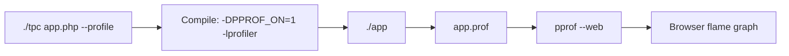

# Profiling

The TypePHP compiler supports two profiling approaches: the compiler's built-in gperftools CPU Profiler, and the general Linux `perf` tool.

---

## gperftools CPU profiling (--profile)

The compiler has built-in support for Google [gperftools](https://github.com/gperftools/gperftools)'s CPU Profiler. Enable it at compile time with the `--profile` argument; run the binary to generate a profiling data file, then use `pprof` to generate a flame graph or call graph.

### Prerequisites

- **Linux only** (not supported on macOS/Windows)
- Install gperftools:

```bash
# Ubuntu/Debian
sudo apt-get install google-perftools libgoogle-perftools-dev

# CentOS/RHEL
sudo yum install gperftools gperftools-devel
```

- Install `pprof`:

```bash
# pprof is installed with google-perftools (recommended), or install it separately:
# go install github.com/google/pprof@latest
```

> `pprof --web` mode renders directly in the browser without Graphviz. To generate PDF or SVG files (`--pdf` / `--svg`), you need to install Graphviz: `sudo apt-get install graphviz`

### Usage

**1. Enable the profiler at compile time**

```bash
./tpc app.php --profile
```

`--profile` automatically performs three actions:
- Appends the `-DPPROF_ON=1` compile macro, enabling the `ProfilerStart`/`ProfilerStop` calls in the main function
- Automatically links `-lprofiler`, no need to configure ldflags manually
- Forces recompilation of `main.cc` to ensure the profiler code takes effect

**2. Run the program**

```bash
./app
# After the program exits normally, an app.prof data file is generated
```

Output filename rule: `{target}.prof` (consistent with the name specified by `--output` or the project name).

**3. Analyze the data**

The compiler has a built-in `pprof` analysis entry; run the compiler directly on the `.prof` file:

```bash
# Default web mode, automatically opens the browser to show the flame graph
./tpc app.prof
```

Web mode provides an interactive flame graph (Flame Graph) with zoom, search, and focus, and is the recommended way to view.


You can also invoke pprof manually:

```bash
# Web flame graph (no Graphviz needed)
pprof --web ./app app.prof

# PDF call graph (requires installing Graphviz: sudo apt-get install graphviz)
pprof --pdf ./app app.prof > profile.pdf

# Text top list
pprof --text ./app app.prof

# Interactive command line
pprof ./app app.prof
```

### Data files

| Name | Description |
|------|------|
| `app.prof` | gperftools sampling data (binary format) |
| `pprof` | Google profiling visualization tool (command line) |

### Workflow



### Notes

- **Do not use in debug mode** — `--debug` sets `-O0`, while the profiler should be used under an optimized build (`-O2`) to get realistic performance data
- **Signal control** — gperftools supports `SIGUSR1`/`SIGUSR2` for manually controlling the start and end of sampling; see the gperftools documentation
- **Sampling frequency** — 100 samples per second by default; adjust with the `CPUPROFILE_FREQUENCY` environment variable
- **The program must exit normally** — `ProfilerStop()` is called at the end of `main()`; if the program terminates abnormally (crash/abort), no prof file is generated

---

## perf general profiling

The `perf` tool built into the Linux kernel can analyze any binary without recompilation. It is suitable for quickly locating hot spots and counting events.

### Installation

```bash
sudo apt-get install linux-tools-common linux-tools-generic
```

### Basic usage

```bash
# CPU sampling (generates perf.data)
perf record -g ./app

# Interactive view (sorted by function hotness)
perf report --sort=symbol

# Count hardware events
perf stat -e cache-misses,cache-references,instructions,cycles ./app
```

### Flame graph

The flame graph is the most intuitive way to visualize profiling.

```bash
# 1. Sampling
perf record -g -F 99 ./app       # -F 99: 99 samples per second (recommended value, avoids synchronizing with clock interrupts)

# 2. Generate a flame graph (requires downloading the FlameGraph scripts from GitHub)
git clone https://github.com/brendangregg/FlameGraph.git
perf script | FlameGraph/stackcollapse-perf.pl | FlameGraph/flamegraph.pl > flame.svg
```

Open `flame.svg` in a browser:
- **Width** = proportion of CPU time occupied by the function
- **Vertical** = call stack depth
- Click a function name to zoom in and view details

### Common perf subcommands

| Command | Description |
|------|------|
| `perf record -g <cmd>` | Sample and record the call stack |
| `perf report` | Interactive report view |
| `perf stat <cmd>` | Count performance counters |
| `perf top` | View system hot spots in real time |
| `perf list` | List available event types |
| `perf annotate` | Source-level disassembly analysis |

---

## gperftools vs perf comparison

| Dimension | gperftools (`--profile`) | `perf` |
|------|--------------------------|--------|
| Requires recompilation | Yes (needs `--profile`) | No |
| Platform support | Linux only | Linux only |
| Output file | `app.prof` (named by target) | `perf.data` |
| Visualization tool | `pprof --web` (flame graph / call graph) | `perf report` + FlameGraph scripts |
| Overhead | Low (sampling mode) | Very low (hardware PMU) |
| Precision | Function level | Function level / instruction level |
| Ease of use | Low (one command to analyze) | Medium (requires combining multiple tools) |

### Recommended use cases

- **Daily development** — use `--profile`; three commands (compile → run → `app.prof`) show the flame graph
- **CI/production** — use `perf`; analyze without recompilation with lower overhead
- **Deep investigation** — `perf annotate` can pinpoint hotness down to a single instruction

---

*This document was last updated: 2026-06-03*
