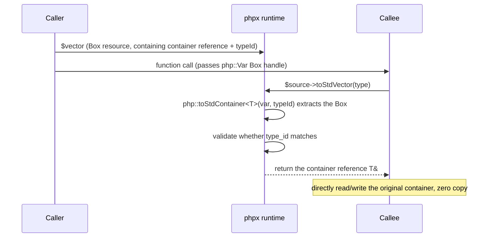

## Std Containers

The TypePHP compiler wraps C++ standard library containers as Box resources, held via `php::Var`, providing zero-overhead type-safe storage. The container body lives inside `StdContainerBox<T>` and is accessed via the `_ref` reference; when passed across functions, the Box resource preserves reference semantics — modifications by the callee are reflected in the original container.

### Four Std Containers

| Container | C++ type | PHP expression | Description |
|------|---------|-----------|------|
| Fixed-length array | `php::StdArray<T, N>` | `std::array(type, size)` | Compile-time fixed size, allocated on the heap via Box |
| Dynamic array | `php::StdVector<T>` | `std::vector(type, [size])` | `std::vector` wrapper, allocated on the heap |
| Ordered map | `php::StdOrderedMap<K, T>` | `std::ordered_map(ktype, vtype)` | `std::map`, string keys use `zend_binary_strcmp` |
| Hash map | `php::StdMap<K, T>` | `std::map(ktype, vtype)` | `std::unordered_map`, string keys use `zend_string_hash_val` |

### Internal Implementation

Each std container variable expands into two statements in C++:

```cpp
php::Var v = php::Var(new php::StdContainerBox<php::StdVector<php::Int>>(typeId));
auto &v_ref = v.toBox<php::StdContainerBox<php::StdVector<php::Int>>>()->container;
```

- **`php::Var v`** — Box resource handle, owns the container and can be passed across functions
- **`auto &v_ref`** — container body reference; all read/write operations go through this reference

### Value Type Parameters

Container value types are specified through the root namespace `Type` symbols:

| Type symbol | Mapped type | C++ storage |
|---------|---------|----------|
| `Type::Int` | `php::Int` | `php::Int` |
| `Type::Float` | `php::Float` | `php::Float` |
| `Type::Bool` | `php::Bool` | `php::Bool` |
| `Type::BigInt` | `php::BigInt` | `php::Var` |
| `Type::BigFloat` | `php::BigFloat` | `php::Var` |
| `Type::Decimal` | `php::Decimal` | `php::Var` |
| `Type::String` | `php::Str` | `php::Str` |
| `Type::Array` | `php::Array` | `php::Array` |
| `Type::Object` | `php::Object` | `php::Object` |
| `Type::Any` | `php::Var` | `php::Var` |
| `Type::Stream` | `php::Stream` | `php::Var` |
| `ClassName::class` | `php::Object` (with class info) | `php::Object` |

> **Note**: `BigInt`, `BigFloat`, `Decimal`, and `Stream` use `php::Var` (Box resource) as their underlying storage. When writing, the compiler automatically performs type conversion via `php::newBigInt()`, `php::newBigFloat()`, and other functions; after reading, the corresponding universal methods (such as `->toString()`) can be called directly.

Key types support only `Type::Int` and `Type::String`.

### High-Precision Types and Stream Example

```php
declare(strict_types=1);
use native_types;

// BigInt vector — int literals are automatically converted to BigInt when writing
$bigVec = std::vector(Type::BigInt);
$bigVec[] = 99;
$bigVec[] = 12345678901234567890;
var_dump($bigVec[0]->toString());  // "99"

// BigFloat map — int key, BigFloat value
$bigMap = std::ordered_map(Type::Int, Type::BigFloat);
$bigMap[0] = 3.14;
$bigMap[1] = 2.71;
var_dump($bigMap[0]->toString());  // "3.1400000000000001"

// Decimal array — fixed-length Decimal array
$decArray = std::array(Type::Decimal, 3);
$decArray[0] = 0.1;
$decArray[1] = 0.2;
var_dump($decArray[0]->toString());  // "0.1"

// Stream vector — holds multiple stream resources
$streamVec = std::vector(Type::Stream);
$fp = fopen("test.txt", "r");
$streamVec[] = $fp;
var_dump($streamVec[0]->read(1024));
```

The generated C++ code uses `StdVector<php::Var>` and other Var types for storage, with the compiler automatically inserting type conversion when writing:

```cpp
php::Var bigVec = php::Var(new php::StdContainerBox<php::StdVector<php::Var>>(1));
auto &bigVec_ref = bigVec.toBox<php::StdContainerBox<php::StdVector<php::Var>>>()->container;
bigVec_ref.push_back(php::newBigInt(99L));                         // int → BigInt
bigVec_ref.push_back(php::newBigInt(12345678901234567890L));       // int → BigInt
php::BigInt::toString(bigVec_ref.offsetGet(php::toInt(0L)));       // call a universal method
```

---

## 1. StdVector — Dynamic Array

Based on `std::vector<T>`, supports dynamic appending and random access.

```php
declare(strict_types=1);
use native_types;

function main(): void {
    // create an empty int vector
    $v = std::vector(Type::Int);

    // push_back appends
    $v[] = 10;
    $v[] = 20;
    $v[] = 30;

    // random access
    echo $v[0];  // 10
    echo $v[1];  // 20

    // compound assignment
    $v[1] += 5;
    echo $v[1];  // 25

    // get the size
    echo count($v);  // 3

    // foreach iteration
    foreach ($v as $val) {
        echo $val;
    }
}
```

Generated C++ code:

```cpp
php::Var v = php::Var(new php::StdContainerBox<php::StdVector<php::Int>>(1));
auto &v_ref = v.toBox<php::StdContainerBox<php::StdVector<php::Int>>>()->container;
v_ref.push_back(php::toInt(10L));
v_ref.push_back(php::toInt(20L));
v_ref.push_back(php::toInt(30L));
php::echo(v_ref.offsetGet(php::toInt(0L)));
v_ref.offsetGet(php::toInt(1L)) += php::toInt(5L);
php::echo(php::toInt(v_ref.size()));
```

**Specifying an initial size**:

```php
$v = std::vector(Type::Int, 100);
```

Generated C++ code:

```cpp
php::Var v = php::Var(new php::StdContainerBox<php::StdVector<php::Int>>(1, 100));
auto &v_ref = v.toBox<php::StdContainerBox<php::StdVector<php::Int>>>()->container;
```

### StdVector Method Quick Reference

| Operation | PHP | Generated C++ |
|------|-----|-----------|
| Append | `$v[] = $x` | `v_ref.push_back(x)` |
| Read | `$v[$i]` | `v_ref.offsetGet(i)` |
| Write | `$v[$i] = $x` | `v_ref.offsetSet(i, x)` |
| Compound assignment | `$v[$i] += $x` | `v_ref.offsetGet(i) += x` |
| Size | `count($v)` | `v_ref.size()` |
| Iteration | `foreach ($v as $val)` | `for (auto it = v_ref.begin(); ...)` |
| Delete | `unset($v[$i])` | `v_ref.offsetUnset(i)` → reset to `T{}` |

> **Note**: `unset` resets the element to `T{}` (zero value) and does not shrink the array size.

---

## 2. StdArray — Fixed-Length Array

Based on `std::array<T, N>`, size determined at compile time, allocated on the heap via `StdContainerBox`, with bounds checking support.

```php
declare(strict_types=1);
use native_types;

function main(): void {
    // create a fixed-length int array of size 5
    $a = std::array(Type::Int, 5);

    // indexed writes
    $a[0] = 42;
    $a[1] = 100;
    $a[4] = 999;

    // indexed read
    echo $a[0];  // 42

    // out-of-bounds access: constant indexes are checked at compile time, variable indexes at runtime
    // $a[5] = 10;  // ❌ compile error: index out of bounds (0..4)

    // fill
    std::fill($a, 7);  // set all elements to 7

    // foreach iteration
    foreach ($a as $val) {
        echo $val;
    }
}
```

Generated C++ code:

```cpp
php::Var a = php::Var(new php::StdContainerBox<php::StdArray<php::Int, 5>>(1));
auto &a_ref = a.toBox<php::StdContainerBox<php::StdArray<php::Int, 5>>>()->container;
a_ref[php::safeIndex(php::toInt(0L), 5)] = php::toInt(42L);
a_ref.offsetSet(php::toInt(1L), php::toInt(100L));
a_ref.offsetSet(php::toInt(4L), php::toInt(999L));
```

### Bounds Checking

- **Compile time**: when an integer literal is used as the index, the compiler validates `0 <= index < N`
- **Runtime**: variable indexes call `safeIndex()` via `offsetGet`/`offsetSet`; out-of-bounds throws an error

### Nested StdArray

Multi-dimensional fixed-length arrays are supported:

```php
// a 4×5 two-dimensional int array
$matrix = std::array(std::array(Type::Int, 5), 4);

// access: $matrix[row][col]
$matrix[0][0] = 1;
echo $matrix[2][3];

// fill a nested array
std::fill($matrix[0], 0);
```

Generated C++ type:

```cpp
php::Var matrix = php::Var(new php::StdContainerBox<php::StdArray<php::StdArray<php::Int, 5>, 4>>(1));
auto &matrix_ref = matrix.toBox<php::StdContainerBox<php::StdArray<php::StdArray<php::Int, 5>, 4>>>()->container;
matrix_ref[0L][0L] = php::toInt(1L);
```

### Memory Allocation

All std containers (including StdArray) are wrapped by `php::StdContainerBox<T>`; the Box object is allocated on the heap. The container body (the `container` member) lives inside the Box and is managed on the heap together with the Box. Access always goes through the `name_ref` reference and is completely transparent to PHP code — usage is unchanged.

### StdArray Method Quick Reference

| Operation | PHP | Generated C++ |
|------|-----|-----------|
| Read | `$a[$i]` | `a_ref.offsetGet(i)` (runtime bounds check) |
| Write | `$a[$i] = $x` | `a_ref.offsetSet(i, x)` |
| Literal index | `$a[3]` | `a_ref[3L]` (compile-time bounds check) |
| Size | `count($a)` | `a_ref.size()` |
| Iteration | `foreach ($a as $val)` | `for (auto it = a_ref.begin(); ...)` |
| Fill | `std::fill($a, $v)` | loop assignment |
| Delete | `unset($a[$i])` | `a_ref.offsetUnset(i)` → reset to `T{}` |

---

## 3. StdOrderedMap — Ordered Map

Based on `std::map<K, T>`, keys stored in sorted order. String keys are compared using `zend_binary_strcmp`.

```php
declare(strict_types=1);
use native_types;

function main(): void {
    // create a string → int map
    $m = std::ordered_map(Type::String, Type::Int);

    // writes
    $m["alpha"] = 100;
    $m["beta"] = 200;

    // read
    echo $m["alpha"];  // 100

    // compound assignment
    $m["alpha"] += 10;
    echo $m["alpha"];  // 110

    // check size
    echo count($m);  // 2

    // foreach iteration (in key order)
    foreach ($m as $key => $val) {
        echo $key . "=" . $val;
    }
    // output: alpha=110 beta=200

    // delete
    unset($m["beta"]);
}
```

Generated C++ code:

```cpp
php::Var m = php::Var(new php::StdContainerBox<php::StdOrderedMap<php::Str, php::Int>>(1));
auto &m_ref = m.toBox<php::StdContainerBox<php::StdOrderedMap<php::Str, php::Int>>>()->container;
m_ref.offsetSet(php::Str("alpha"), php::toInt(100L));
m_ref.offsetSet(php::Str("beta"), php::toInt(200L));
php::echo(m_ref.offsetGet(php::Str("alpha")));
m_ref.offsetGet(php::Str("alpha")) += php::toInt(10L);
```

### Read Behavior Difference

- **`$v = $map[$k]` (rvalue)**: uses `std::map::at()` — if the key does not exist, throws `std::out_of_range`
- **`$map[$k] = $v` (lvalue)**: uses `std::map::operator[]` — if the key does not exist, inserts a default

### StdOrderedMap Method Quick Reference

| Operation | PHP | Generated C++ |
|------|-----|-----------|
| Write | `$m[$k] = $v` | `m_ref.offsetSet(k, v)` |
| Read | `$m[$k]` | `m_ref.offsetGet(k)` (throws if not present) |
| Compound assignment | `$m[$k] += $v` | `m_ref.offsetGet(k) += v` |
| Size | `count($m)` | `m_ref.size()` |
| Iteration | `foreach ($m as $k => $v)` | `for (auto it = m_ref.begin(); ...)` |
| Delete | `unset($m[$k])` | `m_ref.offsetUnset(k)` → real delete (`erase`) |

---

## 4. StdMap — Hash Map

Based on `std::unordered_map<K, T>`, string keys use `zend_string_hash_val` hashing and `zend_string_equals` comparison. The interface is consistent with `StdOrderedMap`.

```php
declare(strict_types=1);
use native_types;

function main(): void {
    // create an int → User hash map
    $u = std::map(Type::Int, User::class);

    $u[1] = new User(1);
    $u[2] = new User(2);

    echo $u[1]->id;   // 1
    echo count($u);   // 2

    unset($u[2]);
}
```

Generated C++ code:

```cpp
php::Var u = php::Var(new php::StdContainerBox<php::StdMap<php::Int, php::Object>>(1));
auto &u_ref = u.toBox<php::StdContainerBox<php::StdMap<php::Int, php::Object>>>()->container;
u_ref.offsetSet(php::toInt(1L), user1);
u_ref.offsetSet(php::toInt(2L), user2);
```

### StdOrderedMap vs StdMap

| Feature | StdOrderedMap | StdMap |
|------|--------|-----------------|
| Underlying | `std::map` (red-black tree) | `std::unordered_map` (hash table) |
| Iteration order | Sorted by key | No order guarantee |
| Lookup performance | O(log n) | O(1) average |
| String key comparison | `zend_binary_strcmp` | `zend_string_hash_val` + `zend_string_equals` |
| Deletion in foreach | ❌ forbidden | ❌ forbidden |

---

## 5. Cross-Function Reference Passing and toStd* Keyword Methods

Std containers are held as `php::Var` (Box resource); when passed as function arguments, the Box handle is passed. The callee can extract the container reference via `toStd*` keyword methods (such as `toStdVector`, `toStdArray`), and modifications are reflected in the caller's original container — **zero copy, zero allocation**.

### Working Mechanism



1. **Caller**: passes the std container variable to the callee — the compiler directly passes the `php::Var` Box handle
2. **Callee**: uses `$source->toStd*(type)` to extract the container reference and performs runtime type validation
3. After validation passes, the container reference is returned directly — **zero copy, zero allocation**

### Usage Example

```php
declare(strict_types=1);
use native_types;

// callee: receives the container and modifies it
function vector_update($source): void
{
    $v = $source->toStdVector(Type::Int);
    // $v is now a reference to the caller's vector; modifications are reflected in the original container
    var_dump($v[1]);
    $v[2] = 9;
}

function main(): void {
    $vector = std::vector(Type::Int, 3);
    $vector[0] = 1;
    $vector[1] = 7;
    $vector[2] = 3;

    vector_update($vector);   // passes the Box handle, internally references the original container
    var_dump($vector[2]);     // 9 — the modification has taken effect
}
```

Output:

```text
int(7)
int(9)
```

Generated C++ code:

```cpp
// vector_update
void php_vector_update(php::Var source) {
    auto &v_ref = php::toStdContainer<php::StdVector<php::Int>>(source, 1);
    php::var_dump(v_ref.offsetGet(php::toInt(1L)));
    v_ref.offsetSet(php::toInt(2L), php::toInt(9L));
}

// main
php::Var vector = php::Var(new php::StdContainerBox<php::StdVector<php::Int>>(1, 3));
auto &vector_ref = vector.toBox<php::StdContainerBox<php::StdVector<php::Int>>>()->container;
vector_ref.offsetSet(php::toInt(0L), php::toInt(1L));
vector_ref.offsetSet(php::toInt(1L), php::toInt(7L));
vector_ref.offsetSet(php::toInt(2L), php::toInt(3L));
php_vector_update(vector);                                          // passes the Box handle
php::var_dump(vector_ref.offsetGet(php::toInt(2L)));                // 9
```

### Runtime Type Validation

Type IDs are assigned at compile time and validated at runtime. A type mismatch throws a `TypeError`:

```php
function process_float_array($source): void
{
    // expects a float array
    $array = $source->toStdArray(Type::Float, 3);
}

function main(): void {
    $array = std::array(Type::Int, 3);  // actually an int array

    try {
        process_float_array($array);
    } catch (TypeError $e) {
        echo $e->getMessage();  // "std container type mismatch"
    }
}
```

---

## 6. Limitations

1. **Top-level scope declaration**: std containers and `toStd*` conversion methods can only be declared at the top-level scope of a function, not in nested blocks such as `if`/`for`/`while`
2. **Cannot be reassigned**: once a variable is declared as a certain std container type, it cannot be reassigned to a container of a different type
3. **Nested access not supported (non-Array types)**: `$vec[a][b]` is only supported by StdArray; StdVector/StdOrderedMap/StdMap do not support it
4. **Cannot delete in foreach**: when StdOrderedMap/StdMap are in a foreach loop, their elements cannot be `unset`
5. **Key type limitation**: map/ordered_map keys support only `type_int` and `type_string`
6. **unset semantic difference**: for StdVector/StdArray, `unset` on an element resets it to the zero value (`T{}`) without changing the container size; for StdOrderedMap/StdMap, `unset` on an element is a real delete (`erase`), which shrinks the container size, and reading that key afterwards throws an exception
7. **Cannot be passed as a reference parameter**: std container variables cannot be passed via the `&$var` reference form
