## 执行过程概述

`AOT` 编译将 `PHP` 代码**离线翻译为 `C++` 源码**，再经 `gcc`/`clang`/`msvc` 编译为原生机器码。编译产物的运行时执行与传统 PHP（逐请求解析 → 编译 → 解释）截然不同——机器码直接在 CPU 上执行，无需经过 ZendVM 的 Opcode 解释循环。

在实际执行中，一个 `AOT` 编译后的程序会运行在一个**混合执行环境**中。
静态编译的用户代码以原生机器指令执行，但与 PHP 生态的深度交互（内置函数、扩展、动态加载）仍然依赖 `Zend Engine` 运行时。
因此，TypePHP 程序的执行并非"全静态"，而是三种执行方式协同工作的结果：

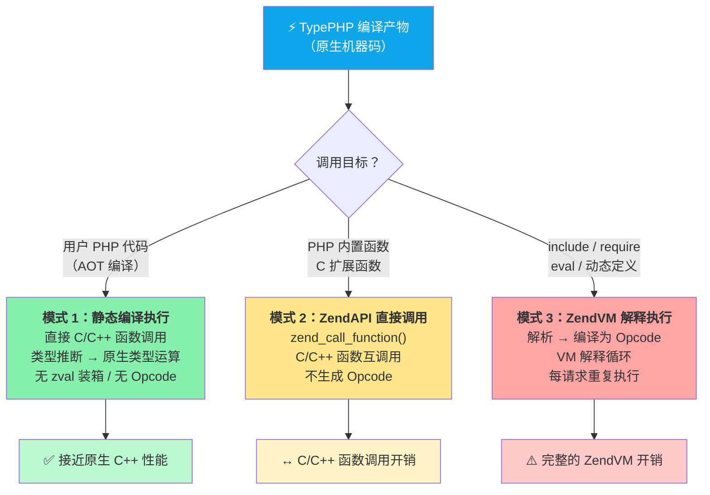

> **核心思想**：TypePHP 编译器尽可能将 PHP 代码提升为**模式 1**（原生机器码），以获取最大性能收益。无法静态编译的特性（如 `eval()`、动态类定义）回退到**模式 3**（ZendVM 解释），但这类回退在实际项目中应尽量避免。

### 1. 静态编译的用户代码

这是 `AOT` 编译的核心价值所在。`PHP` 源码中的函数、方法、类经编译器翻译后，生成等价的 `C++` 函数。
运行时直接以机器指令执行，**完全不经过 `ZendVM` 的 `Opcode` 编译/解释管线**。

**类型处理**分为两个层次：

| 类型层次 | 启用方式 | C++ 类型 | 示例 |
|---------|---------|---------|------|
| 原生类型 | `use native_types` | `php::Int`、`php::Float`、`php::Bool` | `int64_t`、`double`、`bool` |
| 动态类型 | 默认 / 未声明类型 | `php::Var`（`zval` 包装） | `php::Array`、`php::String`、`php::Object` |

启用 `use native_types` 后，`int`/`float`/`bool` 类型直接映射为 C++ 原生类型（`int64_t`、`double`、`bool`），消除 `zval` 的装箱/拆箱和类型标记检查开销。对于无法确定类型的场景，使用 `php::Var` 保留动态性。

```php
use native_types;

function calculate(int $a, int $b): int {
    return $a * $b + 10;   // → 直接 C++ 整数运算，无 zval 开销
}
```

**调用方式**：用户函数之间的调用为直接的 C++ 函数调用，无需函数指针查找或动态分发（除非存在子类方法覆盖，编译器会尝试去虚化优化）。

### 2. PHP 内置函数和扩展函数

PHP 标准库（如 `explode()`、`array_map()`、`preg_match()`）和第三方扩展（如 `json_decode()`、`curl_init()`）由 C 语言编写，编译在 `.so` / `.dll` 扩展文件中。它们的实现在 Zend Engine 内部，不存在 AOT 可静态链接的版本。

调用这些函数时，TypePHP 编译器生成代码通过 **ZendAPI** 的 `zend_call_function()` 直接调用其底层的 C 函数指针：

```
用户代码 (AOT 机器码)
  → zend_call_function(internal_function_handler)
    → C 扩展函数体
      → 返回 zval 结果
```

这相当于 **C/C++ 函数之间的互调用**，不需要生成 Opcode 字节码，也不需要启动 VM 解释循环。开销仅在于：
- `zend_call_function()` 的函数指针查找和参数栈设置
- 输入/输出参数的 `zval` 包装（若调用方使用原生类型，需要临时装箱）

### 3. 动态加载的代码

部分 PHP 特性无法在编译期静态处理，必须在运行时动态编译执行：

- `include()` / `require()` — 动态加载 PHP 文件
- `eval()` — 运行时执行字符串中的 PHP 代码
- `create_function()` — 动态创建匿名函数
- 动态类定义、动态方法添加

这些代码在**运行时**由 ZendVM 重新执行完整的"解析 → 编译 → 解释"管线，产生 Opcode 字节码并通过 VM 解释循环执行。其执行效率与标准 PHP 中的动态代码完全一致。

> **注意**：过度依赖 `include`/`eval` 会稀释 AOT 编译的性能收益。最佳实践是将核心业务逻辑放在静态编译文件中，仅将配置加载、路由分发等必要场景留给动态加载。

## TypePHP 编译器的执行方式

TypePHP 编译器将 PHP 编译为 C++ 再编译为原生机器码，分为 `4` 个阶段。整个编译流程完全离线完成，运行时不再需要解析、编译或解释 PHP 代码。

### 整体执行流程

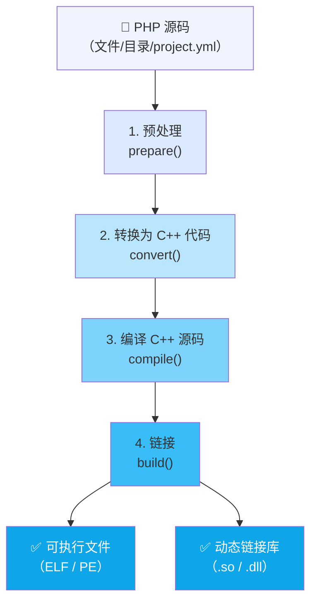

### 1. 预处理 — `prepare()`

预处理阶段负责扫描、收集、排序所有源文件，构建完整的符号表。

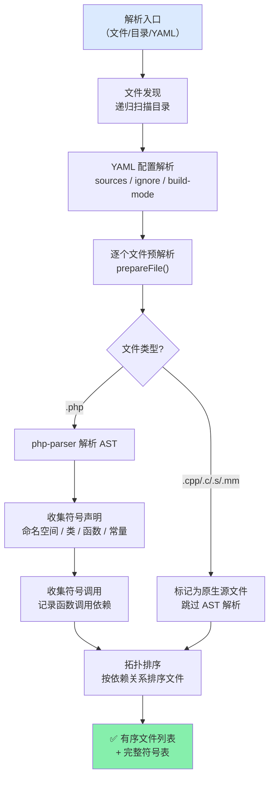

#### 详细步骤

**1.1 入口解析**

支持三种入口模式：
- **单文件**：`./tpc app.php`
- **目录**：`./tpc src/`，递归发现所有源文件
- **YAML 配置**：`./tpc project.yml`，从配置文件加载项目设置

**1.2 文件发现**

使用 `FileScanner` 递归扫描目录，支持以下扩展名：
- **PHP**: `.php`
- **C++**: `.cpp`, `.cc`, `.cxx`
- **C**: `.c`
- **汇编**: `.s`
- **Objective-C** (macOS): `.m`, `.mm`

**1.3 YAML 配置解析**

读取 `project.yml` 中的 `sources`、`ignore`、`build-mode`、`cxx-flags`、`ld-flags`、`cpp-compiler`、`resource` 等配置项。配置文件路径作为项目根目录，所有相对路径基于此解析。

**1.4 预解析（prepareFile）**

对每个 PHP 文件执行 AST 解析，但**不生成代码**，只收集符号信息：

| 语句类型 | 收集内容 |
|----------|---------|
| `Stmt_Namespace` | 当前命名空间 |
| `Stmt_Class` / `Stmt_Trait` / `Stmt_Enum` | 类名、父类、属性、方法签名 |
| `Stmt_Interface` | 接口名、方法签名 |
| `Stmt_Function` | 函数名、参数类型、返回值类型 |
| `Stmt_Const` | 常量定义 |
| `Expr_FuncCall` | 全局函数调用（用于依赖分析） |

**1.5 依赖分析与拓扑排序**

编译器记录每个文件调用的函数符号，并映射到声明该符号的文件。使用拓扑排序确定编译顺序，确保依赖的文件先被编译。不参与依赖管理的文件（无交叉引用）排在最后。

> 内置函数不参与依赖管理——它们由 phpx 运行时库提供，不在用户文件中声明。

**1.6 检测平台环境**

在预处理阶段同步检测运行环境：
- 操作系统：Linux / macOS / Windows
- C++ 编译器：GCC / Clang / MSVC
- `clang-format` 可用性（用于代码格式化）

### 2. 转换为 C++ 代码 — `convert()`

转换阶段将每个 PHP 文件的 AST 逐个翻译为 C++ 源代码。

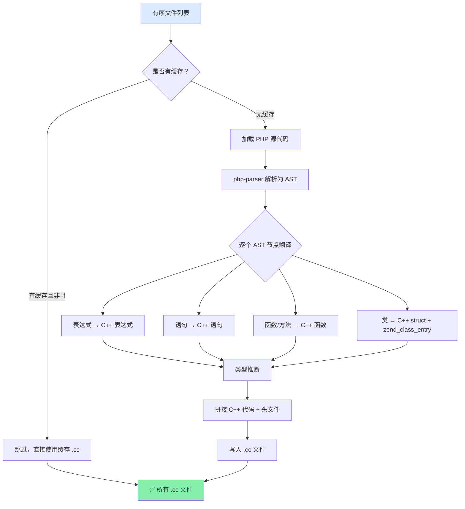

#### 详细步骤

**2.1 缓存检查**

编译器为每个 PHP 文件维护编译缓存。若源文件未修改且对应的 `.cc` 文件已存在，则跳过转换，直接使用缓存。使用 `-f`（`--force`）可强制重新转换。

**2.2 AST 解析与遍历**

使用 `nikic/php-parser` 将 PHP 源码解析为 AST。生成的 AST 被逐节点遍历，每个节点类型对应一个 `parse*()` 处理方法。部分关键映射：

| PHP 节点 | 翻译方法 | C++ 产物 |
|----------|---------|---------|
| `Expr_Assign` | `parseAssignExpr()` | `var = expr;` |
| `Expr_BinaryOp_Plus` | `parseBinaryOp()` | `php::BigInt::add(a, b)` 或 `a + b` |
| `Expr_FuncCall` | `parseFuncCall()` | `php::func_name(args)` |
| `Expr_MethodCall` | `parseMethodCall()` | `obj.method(args)` |
| `Stmt_If` | `parseIf()` | `if (cond) { ... }` |
| `Stmt_For` / `Stmt_Foreach` | `parseFor()` / `parseForeach()` | C++ for/for-each 循环 |
| `Stmt_Class` | `parseClass()` | struct + 注册函数 |
| `Scalar_String` | `parseScalar()` | `php::String("...")` |

**2.3 类型推断**

编译器在翻译过程中进行类型推断（`detectTypeOfExpr()`），分析每个表达式的 C++ 类型。推断结果直接影响生成的代码：
- 若类型明确（如 `php::Int`），生成原生运算
- 若类型为 `php::Var`，生成 `zval` 动态运算

**2.4 编译缓存（Redo 机制）**

若翻译过程中遇到尚未声明的符号（如未解析的类常量），翻译器会抛出 `Redo` 异常，待依赖的文件处理完毕后重新执行转换。这确保所有符号引用在生成代码时已可用。

**2.5 生成产物**

每份 PHP 文件生成一个对应的 `.cc` 文件，放置在 `build/` 目录中，目录结构与源码目录保持一致。

### 3. 编译 C++ 源码 — `compile()`

编译阶段调用平台 C++ 编译器（GCC / Clang / MSVC），将 `.cc` 源文件编译为 `.o` 目标文件。

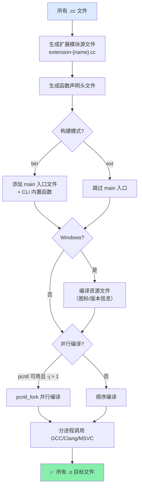

#### 详细步骤

**3.1 生成扩展模块源文件**

编译器自动生成 `extension-{name}.cc`，包含：
- 所有 PHP 类的 `zend_class_entry` 注册
- 全局变量的 C++ 定义
- 函数/类入口映射表
- `get_module()` 函数（扩展模式）

**3.2 生成头文件**

生成两个辅助头文件：
- `php_{name}_func_decl.h`：所有函数的 C++ 前向声明
- `php_{name}_global_var_decl.h`：全局变量的 extern 声明

**3.3 平台特定处理**

| 平台 | 编译器 | 特殊处理 |
|------|--------|---------|
| Linux | GCC / Clang | `-fPIC`（扩展模式），rpath 设置 |
| macOS | Clang / GCC | `-undefined dynamic_lookup`，rpath 设置 |
| Windows | MSVC / Clang-cl | 资源文件编译（`.rc` → `.res`），PDB 调试信息 |

**3.4 并行编译**

Unix/Linux/macOS 平台支持 `pcntl_fork` 多进程并行编译，通过 `-j` 参数控制并发数。编译进度在终端实时显示。若 `pcntl` 不可用或 `-j 1`，则回退到顺序编译。

**3.5 编译选项**

从 CLI 参数和 `project.yml` 合并编译选项：
- 优化级别（`-O0` ~ `-O3`）
- 调试符号（`-g`，debug 模式）
- Sanitizer（`-fsanitize=address` 等）
- C++ 标准版本（`-std=c++17`）
- 用户自定义 `cxx-flags`

### 4. 链接 — `build()`

链接阶段将所有目标文件连接为最终的可执行文件或动态库。

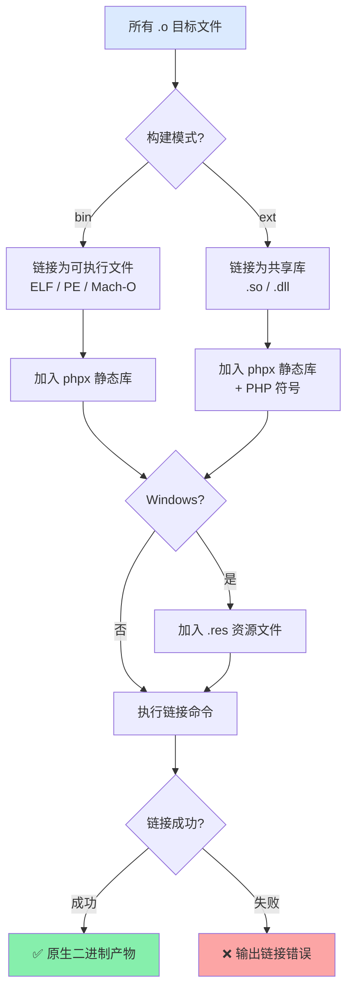

#### 详细步骤

**4.1 生成链接命令**

根据平台和构建模式，编译后端（`CompilerBackend`）生成对应的链接命令：

| 平台 | bin 模式链接参数 | ext 模式链接参数 |
|------|-----------------|-----------------|
| Linux | `-Wl,-rpath,...` | `-shared -fPIC` |
| macOS | `-Wl,-rpath,...` | `-dynamiclib -undefined dynamic_lookup` |
| Windows | `-Wl,/SUBSYSTEM:CONSOLE` | `-shared` |

**4.2 最终产物**

| 构建模式 | Linux/macOS 产物 | Windows 产物 |
|---------|-----------------|-------------|
| `bin` | 可执行文件（ELF/Mach-O） | `.exe`（PE） |
| `ext` | `.so` / `.dylib` | `.dll` |

## ZendVM 的执行方式

`ZendVM` 是 `PHP` 官方的参考实现，采用"解析—编译—解释执行"的经典虚拟机架构。每次请求到达时，`ZendVM` 重新执行完整的编译-执行流程。

### 整体执行流程

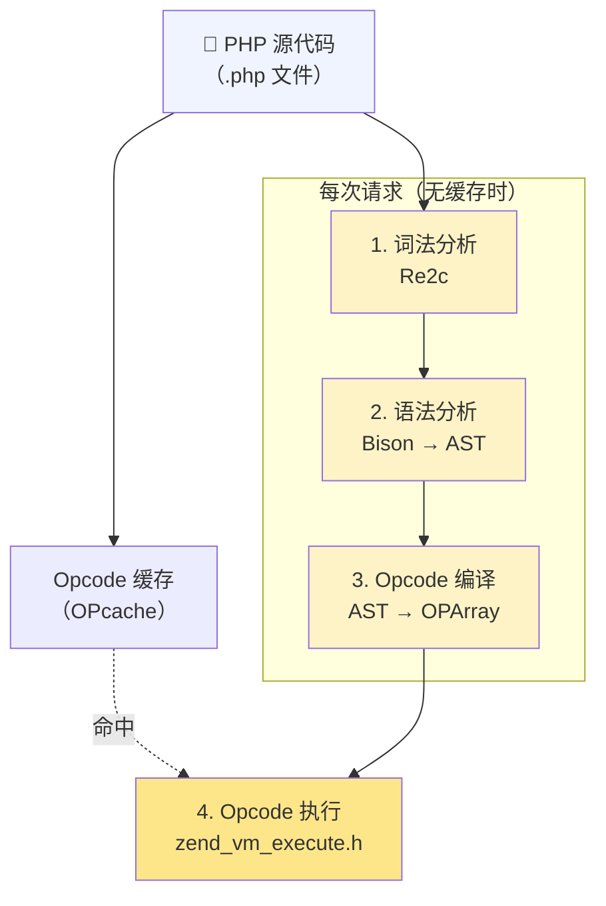

> OPcache 可以缓存阶段 1~3 的产物（Opcode 数组），避免重复解析和编译。但即使命中缓存，阶段 4 的解释执行仍然每次请求都发生。

### 1. 词法分析（Lexical Analysis）

将 PHP 源代码字符流拆分为 `Token`（词元）序列。

**实现机制**：使用 `Re2c` 工具生成词法分析器 C 代码。`Re2c` 将正则规则编译为确定性有限自动机（DFA），输出的 C 代码使用 `goto` 跳转表实现高效字符匹配。生成的扫描器位于 `Zend/zend_language_scanner.c`。

**Token 类型**：包括标识符（`T_VARIABLE`、`T_STRING`）、字面量（`T_LNUMBER`、`T_DNUMBER`、`T_CONSTANT_ENCAPSED_STRING`）、运算符（`+`、`-`、`.`）、关键字（`if`、`while`、`class`）等。

在用户侧可使用 `token_get_all()` 观察词法分析结果：

```php
// 源代码
$name = "World"; echo "Hello, " . $name;

// token_get_all() 输出:
[
    [T_OPEN_TAG, "<?php ", 1],
    [T_VARIABLE, "$name", 2],
    "=",
    [T_CONSTANT_ENCAPSED_STRING, '"World"', 2],
    ";",
    [T_ECHO, "echo", 3],
    [T_CONSTANT_ENCAPSED_STRING, '"Hello, "', 3],
    ".",
    [T_VARIABLE, "$name", 3],
    ";",
    [T_CLOSE_TAG, "?>", 4],
]
```

### 2. 语法分析（Syntax Analysis）

使用 **Bison**（LALR(1) 解析器生成器）将 Token 流转换为**抽象语法树（AST）**。

**实现机制**：PHP 语法规则定义在 `Zend/zend_language_parser.y` 中。Bison 将其编译为 C 语言的 LALR(1) 解析表，生成的解析器通过移进-归约（shift-reduce）算法将 Token 序列归约为 AST 节点。每个语法规则对应一个 AST 节点构造动作。

**AST 节点结构**（`Zend/zend_ast.h`）：

```c
struct _zend_ast {
    zend_ast_kind kind;       // 节点类型（如 ZEND_AST_ASSIGN）
    zend_ast_attr attr;       // 属性（运算符、修饰符等）
    uint32_t lineno;          // 源代码行号
    zend_ast *children[1];    // 可变长子节点数组
};
```

**AST 示例** — `$name = "World"; echo "Hello, " . $name;`：

```text
ZEND_AST_STMT_LIST
├── ZEND_AST_ASSIGN
│   ├── ZEND_AST_VAR (name: "name")
│   └── ZEND_AST_ZVAL (value: "World", type: IS_STRING)
└── ZEND_AST_ECHO
    └── ZEND_AST_BINARY_OP (op: CONCAT)
        ├── ZEND_AST_ZVAL (value: "Hello, ", type: IS_STRING)
        └── ZEND_AST_VAR (name: "name")
```

### 3. Opcode 编译（AST → OPArray）

遍历 AST 生成 **OPArray**——操作码数组及关联的运行时数据。

**实现机制**：编译器位于 `Zend/zend_compile.c`，通过递归下降遍历 AST，每个 AST 节点类型对应一个 `zend_compile_*()` 函数。生成的 Opcode 是 ZendVM 的"字节码"——每个 Opcode 包含操作码和操作数。

**OPArray 结构**（`Zend/zend_compile.h`）：

```c
struct _zend_op_array {
    zend_op *opcodes;              // Opcode 序列
    zval *literals;                // 字面量数组（字符串、数字等）
    int last;                      // Opcode 数量
    // ... 变量槽位、临时变量、异常表等
};

struct _zend_op {
    const void *handler;           // 执行时填充：对应的 handler 函数指针
    znode_op op1, op2, result;     // 操作数和结果（寄存器/常量/跳转偏移）
    uint32_t lineno;               // 对应源代码行号
    uint8_t opcode;                // 操作码（如 ZEND_ASSIGN、ZEND_ECHO）
};
```

**示例** — `$a = 3 + $b;` 编译为：

```text
OPArray:
  [0] ZEND_ADD      CV($b)  CONST(3)  TMP_VAR($0)
  [1] ZEND_ASSIGN   CV($a)  TMP_VAR($0)
```

| Opcode | 说明 | op1 | op2 | result |
|--------|------|-----|-----|--------|
| `ZEND_ADD` | 加法运算 | `CV($b)` — 编译变量 | `CONST(3)` — 常量 3 | `TMP_VAR` — 临时寄存器 |
| `ZEND_ASSIGN` | 赋值 | `CV($a)` — 目标变量 | `TMP_VAR` — 源临时值 | — |

ZendVM 使用**虚拟寄存器**模型：`CV`（Compiled Variable）映射到调用帧的变量槽，`TMP_VAR` 是临时寄存器，`CONST` 引用字面量池。

**OPcache 的作用**：OPcache 将编译产出的 OPArray 缓存到共享内存中。命中缓存时，阶段 1~3 被完全跳过——这是 ZendVM 最重要的性能优化。但请注意，OPcache 只缓存编译结果，执行阶段仍然每次发生。

### 4. Opcode 执行（VM 解释循环）

ZendVM 核心执行器加载 OPArray 并逐条执行 Opcode。

**实现机制**：执行器位于 `Zend/zend_vm_execute.h`。这是一个巨大的 `while` 或 `goto` 分发循环，每个 Opcode 对应一个 `C 函数` 或内联 `handler`。CPU 从 OPArray 中取指、通过 handler 函数指针间接跳转、解码操作数、执行语义、写入结果、推进指令指针，循环往复。

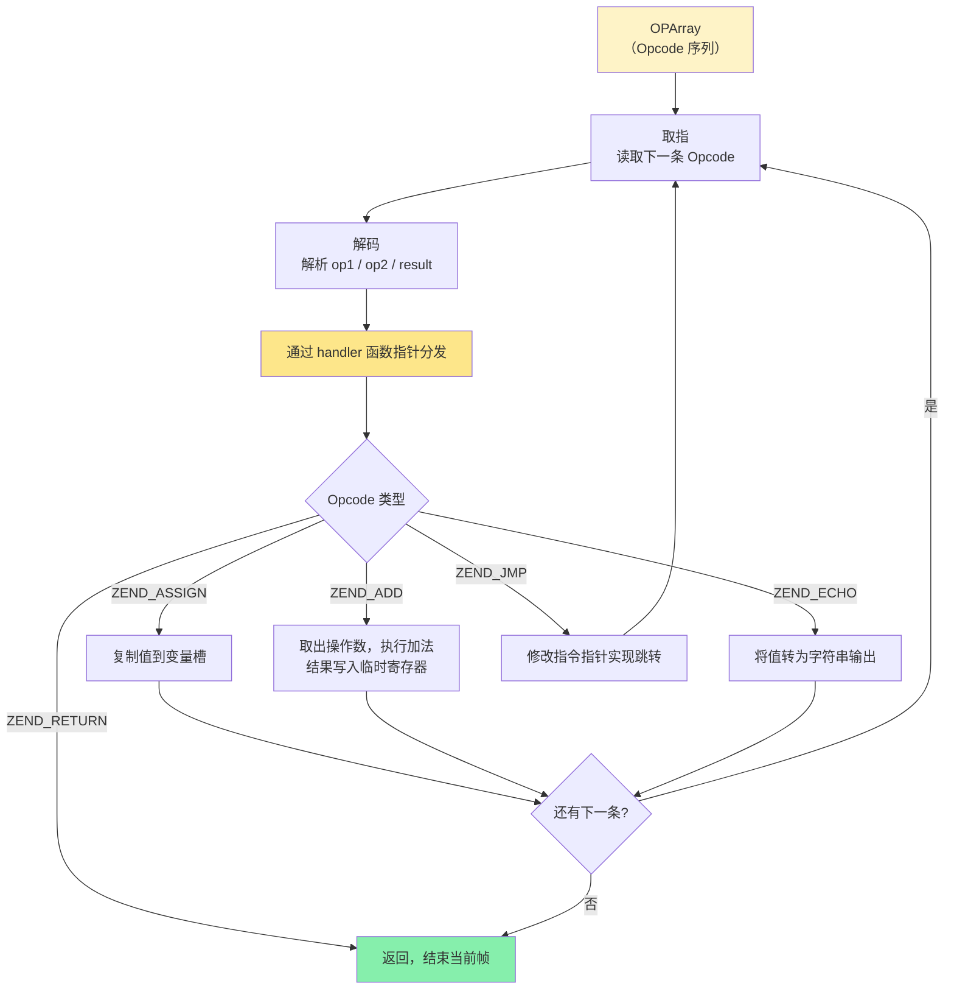

**执行开销分析**：每条 Opcode 执行时，CPU 必须完成：
1. 间接跳转（handler 函数指针调用）
2. 操作数解码（区分 CV / TMP / CONST 类型）
3. 类型检查（`zval` 的类型标记，决定实际运算逻辑）
4. 引用计数管理（`zval` 的 `refcount` 增减）
5. 运算执行
6. 下一条 Opcode 取指

`zval` 的装箱/拆箱和类型标记检查是主要开销来源。即使最简单的 `$a + $b`，ZendVM 也需要检查两个操作数的类型、处理类型转换、分配临时 `zval` 存储结果。

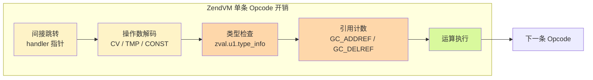

### ZendVM 完整流程总结

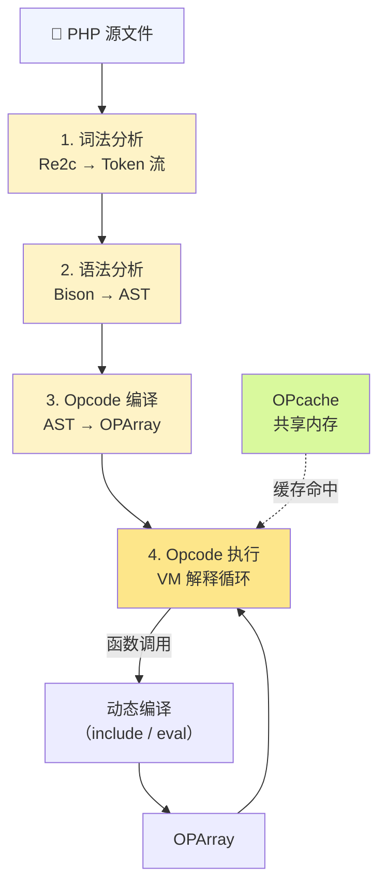

关键点：
- **无 OPcache 时**：每次请求执行完整的"解析 → 编译 → 执行"管线
- **有 OPcache 时**：跳过解析和编译，但仍需执行 Opcode 解释循环
- **动态特性支持**：`include`、`eval`、`create_function()` 等可在运行时触发新的编译
- **`zval` 开销**：所有值（包括整数、浮点）都装箱在 `zval` 结构体中，每条 Opcode 都涉及类型检查和引用计数

## ZendVM vs TypePHP 编译器对比

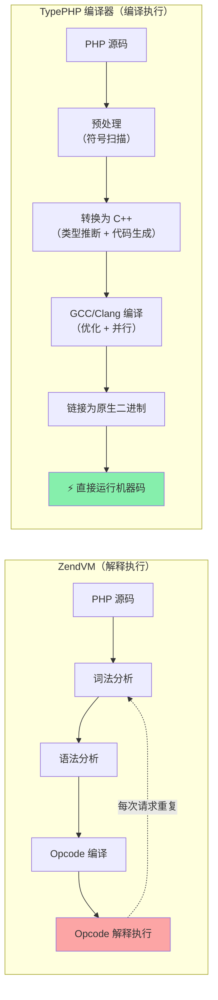

| 维度 | ZendVM | TypePHP 编译器 |
|------|--------|-----------|
| 翻译方式 | 每请求逐行解释 Opcode | 编译期一次性翻译为机器码 |
| 运行时依赖 | 需要 PHP 解释器 | 独立二进制，仅依赖 phpx 运行时库 |
| 类型系统 | 动态类型，zval 装箱 | 静态推断 + `use native_types` 原生 C++ 类型 |
| 函数调用 | `zend_call_function()` 动态分发 | 直接 C++ 函数调用（Native Call） |
| 动态特性 | 完整支持 `eval`、`call_user_func` 等 | 部分支持（受限的动态调用） |
| 性能 | 基准（1x） | 大幅提升（数十倍 ~ 百倍） |
| 启动速度 | 需要加载 PHP + 解析脚本 | 瞬时启动（预编译机器码） |

> **关键取舍**：AOT 编译后所有 PHP 代码从 Opcode 字节码转为机器指令，执行效率大幅增强。但编译后丧失了动态性——不允许运行时修改 Opcode 字节码或动态插入新的执行指令。`eval()` 和动态函数定义等特性在 AOT 模式下受限或不可用。
