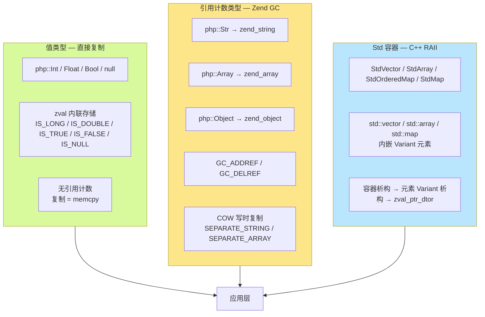
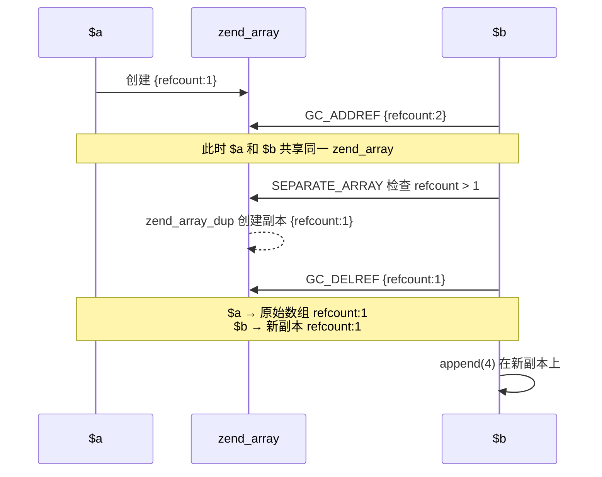
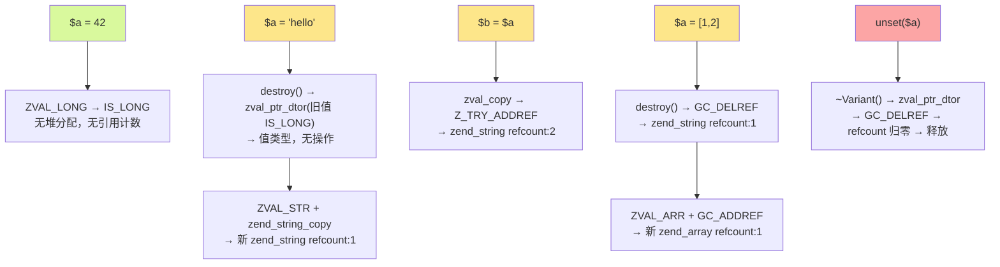

## GC 机制

AOT 编译器沿用 ZendVM 的内存管理机制——值类型直接复制、引用类型使用引用计数、写时复制（COW）确保共享安全。Std 容器则使用 C++ RAII 管理生命周期。

### 整体架构



---

## 1. 值类型 — 直接复制

`php::Int`、`php::Float`、`php::Bool` 不参与引用计数。

### 原理

值类型直接存储在 `zval` 结构体内部，不分配堆内存。类型标记（`IS_LONG`、`IS_DOUBLE`、`IS_TRUE`、`IS_FALSE`）不设置 `Z_REFCOUNTED` 标志位，因此所有引用计数操作（`Z_TRY_ADDREF`、`Z_TRY_DELREF`）都是空操作。

```cpp
// 赋值即复制值，零 GC 开销
Variant &operator=(long v) {
    destroy();        // 释放旧值（若旧值持有引用计数类型）
    ZVAL_LONG(unwrap_ptr(), v);  // 直接写入 zval 的 lval 字段
    return *this;
}

Variant &operator=(double v) {
    destroy();
    ZVAL_DOUBLE(unwrap_ptr(), v);  // 直接写入 zval 的 dval 字段
    return *this;
}

Variant &operator=(bool v) {
    destroy();
    ZVAL_BOOL(unwrap_ptr(), v);   // 直接设置 IS_TRUE / IS_FALSE
    return *this;
}

// null 同样是值类型，存储在 zval 内部
Variant &setNull() {
    destroy();
    ZVAL_NULL(unwrap_ptr());    // 直接设置 IS_NULL，无堆分配
    return *this;
}
```

### 行为

```php
use native_types;

$a = 42;        // php::Int — 值直接存于栈上的 zval.lval
$b = $a;        // 复制 8 字节整数，无引用计数操作
$b = 100;       // $a 不受影响
```

```cpp
// 生成的 C++ 代码
php::Int a = 42L;
php::Int b = a;     // memcpy 语义
b = 100L;           // 直接覆盖
```

### 值类型清单

| 类型 | C++ 类型 | zval 存储 | 引用计数 |
|------|---------|----------|---------|
| `int` | `php::Int` | `zval.value.lval` (`IS_LONG`) | 否 |
| `float` | `php::Float` | `zval.value.dval` (`IS_DOUBLE`) | 否 |
| `bool` | `php::Bool` | `zval.value.val` 的 `IS_TRUE`/`IS_FALSE` | 否 |
| `null` | `php::Var` (值) | `zval` 的 `IS_NULL` | 否 |

---

## 2. 引用计数 — String / Array / Object

`php::Str`、`php::Array`、`php::Object` 内部持有指向 Zend 堆对象的指针（`zend_string*`、`zend_array*`、`zend_object*`），通过引用计数追踪共享。

### 2.1 引用计数基本操作

Zend 引擎在 `zend_types.h` 中提供了条件化的引用计数宏：

```c
// 仅对 Z_REFCOUNTED 类型生效；值类型无操作
#define Z_TRY_ADDREF_P(pz) do { \
    if (Z_REFCOUNTED_P((pz))) { \
        Z_ADDREF_P((pz));       \
    }                           \
} while (0)

#define Z_TRY_DELREF_P(pz) do { \
    if (Z_REFCOUNTED_P((pz))) { \
        Z_DELREF_P((pz));       \
    }                           \
} while (0)
```

### 2.2 Variant 的 GC 职责

`php::Var` 是唯一的动态类型容器，持有 `zval`。其构造、赋值、析构完整管理引用计数：

**复制（`operator=`）**：

```cpp
void Variant::copyFrom(const zval *src) {
    auto zv = unwrap_ptr();
    zval tmp = *zv;               // 1. 保存旧值
    zval_copy(zv, src);           // 2. 复制新值 + Z_TRY_ADDREF
    zval_ptr_dtor(&tmp);          // 3. 释放旧值（减引用计数或直接释放）
}
```

三步保证：先保存旧值，复制新值并增加引用计数，再释放旧值。即使新旧指向同一对象，旧值在步骤 3 才释放，不会提前回收。

**析构**：

```cpp
~Variant() {
    if (isReference()) {
        zval_ptr_dtor(&val);        // IS_REFERENCE — 直接释放
    } else if (!isIndirect()) {
        destroy();                   // 调用 zval_ptr_dtor
    }
    // IS_INDIRECT — 无操作：指针借自数组/对象，不管理生命周期
}
```

三种情况：
1. **IS_REFERENCE**：`zval` 本身是引用类型，需要释放 `zend_reference` 结构
2. **IS_INDIRECT**：`zval` 是指向数组桶或对象属性槽的指针——不拥有数据，无释放
3. **其他**：正常的 refcounted 类型，调用 `zval_ptr_dtor` 递减引用计数

### 2.3 String — zend_string 引用计数

```cpp
// 构造：复制 zend_string（增加引用计数）
String(zend_string *v) {
    ZVAL_STR(ptr(), zend_string_copy(v));  // zend_string_copy → GC_ADDREF
}

// 赋值：先释放旧，再增加新的引用计数
Variant &operator=(zend_string *v) {
    destroy();                                // 释放旧值
    ZVAL_STR(unwrap_ptr(), zend_string_copy(v));  // 新值 + GC_ADDREF
    return *this;
}
```

**示例**：

```php
$s = "hello";   // zend_string{refcount:1} — 初次分配
$t = $s;        // GC_ADDREF → refcount:2
$s = "world";   // $s 新建 zend_string{refcount:1}；$t 原 zend_string refcount:1
```

```cpp
// 生成的 C++ 伪代码
php::Str s = php::Str("hello");
php::Str t = s;             // Z_TRY_ADDREF: s 的 zend_string 引用计数 +1
s = php::Str("world");      // destroy() → GC_DELREF: 旧 zend_string -1
                            // ZVAL_STR + zend_string_copy: 新 zend_string +1
```

### 2.4 Array — zend_array 引用计数

```cpp
// 写入时自动处理
void Array::append(const Variant &v) {
    auto zv = NO_CONST_Z(v.direct_ptr());
    Z_TRY_ADDREF_P(zv);         // 1. 值 +1
    auto zarr = unwrap_ptr();
    SEPARATE_ARRAY(zarr);       // 2. 若共享则先复制
    add_next_index_zval(zarr, zv);  // 3. 存入
}
```

**示例**：

```php
$a = [1, 2];    // zend_array{refcount:1}
$b = $a;        // GC_ADDREF → refcount:2
```

```cpp
php::Array a;
a.append(1); a.append(2);  // refcount:1
php::Array b = a;           // Z_TRY_ADDREF: refcount → 2
```

### 2.5 Object — zend_object 引用计数

```cpp
Object(zend_object *o, Ctor method = Ctor::Copy) {
    ZVAL_OBJ(&val, o);
    if (method == Ctor::Copy) {
        addRef();   // GC_ADDREF 增加 zend_object 的引用计数
    }
}
```

---

## 3. 写时复制（COW）

当多个变量共享同一个 `zend_string` 或 `zend_array`（refcount > 1）时，写入操作必须先复制一份私有副本再修改——这就是 COW。

### 3.1 SEPARATE_STRING

```c
#define SEPARATE_STRING(zv) do {                          \
    zval *_zv = (zv);                                     \
    if (Z_REFCOUNT_P(_zv) > 1) {                          \
        zend_string *_str = Z_STR_P(_zv);                 \
        ZVAL_NEW_STR(_zv, zend_string_init(               \
            ZSTR_VAL(_str), ZSTR_LEN(_str), 0));          \
        GC_DELREF(_str);                                  \
    }                                                     \
} while (0)
```

当 `refcount > 1`：创建新的 `zend_string`，内容相同，递减旧字符串的引用计数，用新指针替换 `zval`。

### 3.2 SEPARATE_ARRAY

```c
#define SEPARATE_ARRAY(zv) do {                           \
    zval *__zv = (zv);                                    \
    zend_array *_arr = Z_ARR_P(__zv);                     \
    if (UNEXPECTED(GC_REFCOUNT(_arr) > 1)) {              \
        ZVAL_ARR(__zv, zend_array_dup(_arr));             \
        GC_TRY_DELREF(_arr);                              \
    }                                                     \
} while (0)
```

当 `GC_REFCOUNT > 1`：通过 `zend_array_dup` 深拷贝数组，递减旧数组引用计数。

### 3.3 COW 触发时机

String 和 Array 的所有**修改操作**都会先调用 `SEPARATE_*`：

| 类型 | 触发 COW 的操作 | 调用位置 |
|------|---------------|---------|
| `String` | `offsetSet($i, $v)` — 修改字符 | `SEPARATE_STRING` |
| `Array` | `set()` / `append()` / `del()` / `clean()` / `sort()` / `merge()` | `SEPARATE_ARRAY` |
| `Object` | `updateArrayProperty()` / `appendArrayProperty()` | `SEPARATE_ARRAY` |

### 3.4 示例

```php
$a = [1, 2, 3];   // zend_array{refcount:1}
$b = $a;           // GC_ADDREF → refcount:2，共享同一份数据

$b[] = 4;          // 写入前 SEPARATE_ARRAY: refcount > 1
                   //   → zend_array_dup 创建副本{refcount:1}
                   //   → GC_DELREF 旧数组 → refcount:1 ($a 仍持有)
                   //   → 在新副本上追加 4

// 结果：$a = [1, 2, 3]，$b = [1, 2, 3, 4]
```



COW 确保：
- 共享时零拷贝——仅增加引用计数
- 修改时自动隔离——不会意外影响其他变量
- 对 PHP 代码完全透明

---

## 4. Std 容器的特殊性

Std 容器使用 C++ 原生内存管理，不经过 Zend GC。

### 4.1 内存模型

```cpp
template <typename T>
class StdVector {
private:
    std::vector<T> data_;  // C++ 标准库容器，RAII 管理
    // ...
};
```

- **容器自身**：可以是栈上对象（小 StdArray）或堆上 `make_unique`（大 StdArray），生命周期由 C++ 作用域/智能指针管理
- **元素存储**：`std::vector<T>` 在堆上分配连续内存存储元素，析构时自动释放
- **元素 GC**：元素的 `Variant` 析构函数调用 `zval_ptr_dtor`——C++ RAII 与 Zend GC 在此交汇

### 4.2 生命周期

```cpp
void php_example() {
    php::StdVector<php::Int> vector;  // 栈上构造，元素的 std::vector 在堆上

    vector.push_back(php::toInt(1L));  // Variant 元素被复制到 vector 内部
    vector.push_back(php::toInt(2L));

}  // 作用域结束
   // → StdVector 析构 → std::vector::~vector()
   // → 每个 Variant 元素调用 ~Variant()
   // → 值类型（Int）没有堆资源，无操作
```

```cpp
void php_example_string_vector() {
    php::StdVector<php::Str> vector;

    vector.push_back(php::Str("hello"));  // 字符串的 zend_string refcount:1

}  // StdVector 析构
   // → 每个 Str 元素调用 ~Variant() → zval_ptr_dtor
   // → GC_DELREF 递减 zend_string 引用计数
   // → refcount 归零 → 释放 zend_string 内存
```

### 4.3 与 php::Array 的对比

| 维度 | `php::Array` | `php::StdVector<Int>` |
|------|-------------|----------------------|
| 底层容器 | `zend_array`（Zend HashTable） | `std::vector`（C++ 标准库） |
| 内存管理 | Zend GC（引用计数 + COW） | C++ RAII（析构函数链式释放） |
| 拷贝语义 | 共享 + COW | 深拷贝或禁用 |
| 类型安全 | 动态（可混存任意类型） | 静态（编译期类型检查） |
| 性能特征 | 通用 HashTable 有一定开销 | 零开销 C++ 模板，直接机器码 |

### 4.4 大 StdArray 的智能指针

单独 StdArray 超过 65536 字节时，编译器自动切换为 `std::make_unique`：

```cpp
// 小数组 — 栈上
php::StdArray<php::Int, 100> small{};

// 大数组 — unique_ptr 堆分配
auto large = std::make_unique<php::StdArray<php::Int, 10000>>();
// 访问：large->offsetGet(i) / large->offsetSet(i, v)
// 析构：unique_ptr::~unique_ptr() → StdArray::~StdArray() → std::array 析构
```

编译器自动处理 `.` 到 `->` 的语法切换，对 PHP 代码透明。

---

## 5. $var / mixed — 动态类型的完整生命周期

`php::Var` 是唯一可以持有任意类型值的容器，其赋值的完整 GC 流程：



每个赋值都遵循"释放旧 → 持有新"的语义：旧值的引用计数递减（为零则释放），新值的引用计数递增。

---

## 6. 总结

| 类型 | 存储方式 | GC 机制 | COW |
|------|---------|---------|-----|
| `php::Int` / `Float` / `Bool` / `null` | `zval` 内联 | 无（直接复制值） | 不适用 |
| `php::Str` | 指向 `zend_string*` | Zend 引用计数 | `SEPARATE_STRING` |
| `php::Array` | 指向 `zend_array*` | Zend 引用计数 | `SEPARATE_ARRAY` |
| `php::Object` | 指向 `zend_object*` | Zend 引用计数 | 属性修改时 `SEPARATE_ARRAY` |
| `php::Var` | `zval`（任意类型） | 动态：值类型无 GC，引用类型走 Zend GC | 取决于实际持有的类型 |
| Std 容器 | C++ 模板类 | C++ RAII + 元素 Variant 析构链 | 深拷贝 / 引用传递 |
