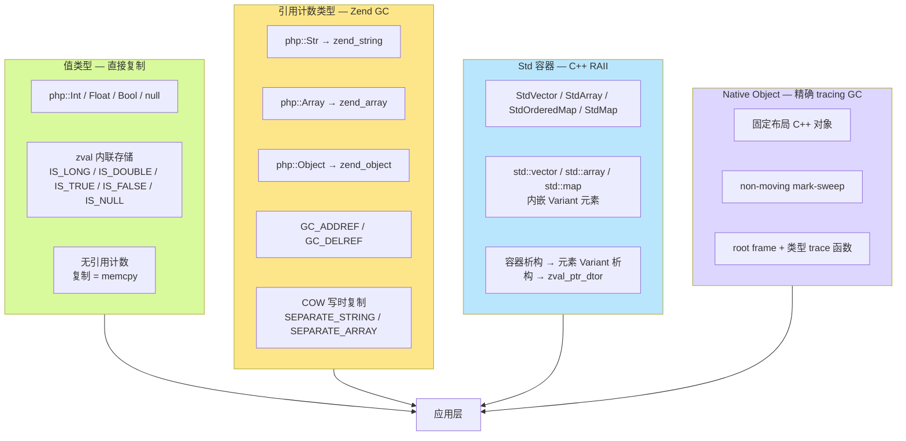
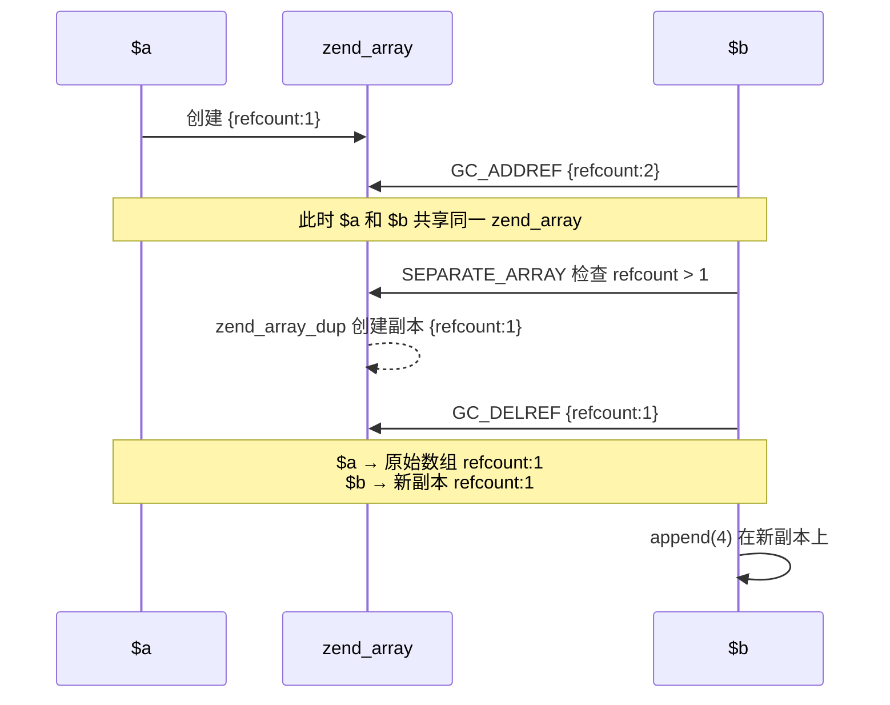
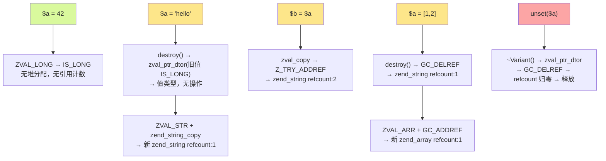
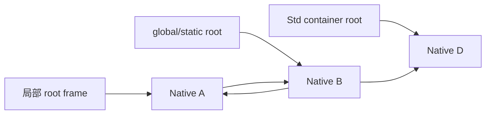

## GC 机制

TypePHP 编译器沿用 ZendVM 的内存管理机制——值类型直接复制、引用类型使用引用计数、写时复制（COW）确保共享安全。Std 容器使用 C++ RAII 管理生命周期；显式声明为 [`#[Native]` 的原生类](native-class.md)则使用 TypePHP/PHPX 独立的 tracing GC。

### 整体架构



---

## 1. 值类型 — 直接复制

`php::Int`、`php::Float`、`php::Bool` 不参与引用计数。

### 原理

值类型直接存储在 `zval` 结构体内部，不分配堆内存。类型标记（`IS_LONG`、`IS_DOUBLE`、`IS_TRUE`、`IS_FALSE`）不设置 `Z_REFCOUNTED` 标志位，因此所有引用计数操作（`Z_TRY_ADDREF`、`Z_TRY_DELREF`）都是空操作。

```cpp
// 赋值即复制值，零 GC 开销
Variant &operator=(long v) {
    destroy();        // 释放旧值（若旧值持有引用计数类型）
    ZVAL_LONG(unwrap_ptr(), v);  // 直接写入 zval 的 lval 字段
    return *this;
}

Variant &operator=(double v) {
    destroy();
    ZVAL_DOUBLE(unwrap_ptr(), v);  // 直接写入 zval 的 dval 字段
    return *this;
}

Variant &operator=(bool v) {
    destroy();
    ZVAL_BOOL(unwrap_ptr(), v);   // 直接设置 IS_TRUE / IS_FALSE
    return *this;
}

// null 同样是值类型，存储在 zval 内部
Variant &setNull() {
    destroy();
    ZVAL_NULL(unwrap_ptr());    // 直接设置 IS_NULL，无堆分配
    return *this;
}
```

### 行为

```php
use native_types;

$a = 42;        // php::Int — 值直接存于栈上的 zval.lval
$b = $a;        // 复制 8 字节整数，无引用计数操作
$b = 100;       // $a 不受影响
```

```cpp
// 生成的 C++ 代码
php::Int a = 42L;
php::Int b = a;     // memcpy 语义
b = 100L;           // 直接覆盖
```

### 值类型清单

| 类型 | C++ 类型 | zval 存储 | 引用计数 |
|------|---------|----------|---------|
| `int` | `php::Int` | `zval.value.lval` (`IS_LONG`) | 否 |
| `float` | `php::Float` | `zval.value.dval` (`IS_DOUBLE`) | 否 |
| `bool` | `php::Bool` | `zval.value.val` 的 `IS_TRUE`/`IS_FALSE` | 否 |
| `null` | `php::Var` (值) | `zval` 的 `IS_NULL` | 否 |

---

## 2. 引用计数 — String / Array / Object

`php::Str`、`php::Array`、`php::Object` 内部持有指向 Zend 堆对象的指针（`zend_string*`、`zend_array*`、`zend_object*`），通过引用计数追踪共享。

### 2.1 引用计数基本操作

Zend 引擎在 `zend_types.h` 中提供了条件化的引用计数宏：

```c
// 仅对 Z_REFCOUNTED 类型生效；值类型无操作
#define Z_TRY_ADDREF_P(pz) do { \
    if (Z_REFCOUNTED_P((pz))) { \
        Z_ADDREF_P((pz));       \
    }                           \
} while (0)

#define Z_TRY_DELREF_P(pz) do { \
    if (Z_REFCOUNTED_P((pz))) { \
        Z_DELREF_P((pz));       \
    }                           \
} while (0)
```

### 2.2 Variant 的 GC 职责

`php::Var` 是唯一的动态类型容器，持有 `zval`。其构造、赋值、析构完整管理引用计数：

**复制（`operator=`）**：

```cpp
void Variant::copyFrom(const zval *src) {
    auto zv = unwrap_ptr();
    zval tmp = *zv;               // 1. 保存旧值
    zval_copy(zv, src);           // 2. 复制新值 + Z_TRY_ADDREF
    zval_ptr_dtor(&tmp);          // 3. 释放旧值（减引用计数或直接释放）
}
```

三步保证：先保存旧值，复制新值并增加引用计数，再释放旧值。即使新旧指向同一对象，旧值在步骤 3 才释放，不会提前回收。

**析构**：

```cpp
~Variant() {
    if (isReference()) {
        zval_ptr_dtor(&val);        // IS_REFERENCE — 直接释放
    } else if (!isIndirect()) {
        destroy();                   // 调用 zval_ptr_dtor
    }
    // IS_INDIRECT — 无操作：指针借自数组/对象，不管理生命周期
}
```

三种情况：
1. **IS_REFERENCE**：`zval` 本身是引用类型，需要释放 `zend_reference` 结构
2. **IS_INDIRECT**：`zval` 是指向数组桶或对象属性槽的指针——不拥有数据，无释放
3. **其他**：正常的 refcounted 类型，调用 `zval_ptr_dtor` 递减引用计数

### 2.3 String — zend_string 引用计数

```cpp
// 构造：复制 zend_string（增加引用计数）
String(zend_string *v) {
    ZVAL_STR(ptr(), zend_string_copy(v));  // zend_string_copy → GC_ADDREF
}

// 赋值：先释放旧，再增加新的引用计数
Variant &operator=(zend_string *v) {
    destroy();                                // 释放旧值
    ZVAL_STR(unwrap_ptr(), zend_string_copy(v));  // 新值 + GC_ADDREF
    return *this;
}
```

**示例**：

```php
$s = "hello";   // zend_string{refcount:1} — 初次分配
$t = $s;        // GC_ADDREF → refcount:2
$s = "world";   // $s 新建 zend_string{refcount:1}；$t 原 zend_string refcount:1
```

```cpp
// 生成的 C++ 伪代码
php::Str s = php::Str("hello");
php::Str t = s;             // Z_TRY_ADDREF: s 的 zend_string 引用计数 +1
s = php::Str("world");      // destroy() → GC_DELREF: 旧 zend_string -1
                            // ZVAL_STR + zend_string_copy: 新 zend_string +1
```

### 2.4 Array — zend_array 引用计数

```cpp
// 写入时自动处理
void Array::append(const Variant &v) {
    auto zv = NO_CONST_Z(v.direct_ptr());
    Z_TRY_ADDREF_P(zv);         // 1. 值 +1
    auto zarr = unwrap_ptr();
    SEPARATE_ARRAY(zarr);       // 2. 若共享则先复制
    add_next_index_zval(zarr, zv);  // 3. 存入
}
```

**示例**：

```php
$a = [1, 2];    // zend_array{refcount:1}
$b = $a;        // GC_ADDREF → refcount:2
```

```cpp
php::Array a;
a.append(1); a.append(2);  // refcount:1
php::Array b = a;           // Z_TRY_ADDREF: refcount → 2
```

### 2.5 Object — zend_object 引用计数

```cpp
Object(zend_object *o, Ctor method = Ctor::Copy) {
    ZVAL_OBJ(&val, o);
    if (method == Ctor::Copy) {
        addRef();   // GC_ADDREF 增加 zend_object 的引用计数
    }
}
```

---

## 3. 写时复制（COW）

当多个变量共享同一个 `zend_string` 或 `zend_array`（refcount > 1）时，写入操作必须先复制一份私有副本再修改——这就是 COW。

### 3.1 SEPARATE_STRING

```c
#define SEPARATE_STRING(zv) do {                          \
    zval *_zv = (zv);                                     \
    if (Z_REFCOUNT_P(_zv) > 1) {                          \
        zend_string *_str = Z_STR_P(_zv);                 \
        ZVAL_NEW_STR(_zv, zend_string_init(               \
            ZSTR_VAL(_str), ZSTR_LEN(_str), 0));          \
        GC_DELREF(_str);                                  \
    }                                                     \
} while (0)
```

当 `refcount > 1`：创建新的 `zend_string`，内容相同，递减旧字符串的引用计数，用新指针替换 `zval`。

### 3.2 SEPARATE_ARRAY

```c
#define SEPARATE_ARRAY(zv) do {                           \
    zval *__zv = (zv);                                    \
    zend_array *_arr = Z_ARR_P(__zv);                     \
    if (UNEXPECTED(GC_REFCOUNT(_arr) > 1)) {              \
        ZVAL_ARR(__zv, zend_array_dup(_arr));             \
        GC_TRY_DELREF(_arr);                              \
    }                                                     \
} while (0)
```

当 `GC_REFCOUNT > 1`：通过 `zend_array_dup` 深拷贝数组，递减旧数组引用计数。

### 3.3 COW 触发时机

String 和 Array 的所有**修改操作**都会先调用 `SEPARATE_*`：

| 类型 | 触发 COW 的操作 | 调用位置 |
|------|---------------|---------|
| `String` | `offsetSet($i, $v)` — 修改字符 | `SEPARATE_STRING` |
| `Array` | `set()` / `append()` / `del()` / `clean()` / `sort()` / `merge()` | `SEPARATE_ARRAY` |
| `Object` | `updateArrayProperty()` / `appendArrayProperty()` | `SEPARATE_ARRAY` |

### 3.4 示例

```php
$a = [1, 2, 3];   // zend_array{refcount:1}
$b = $a;           // GC_ADDREF → refcount:2，共享同一份数据

$b[] = 4;          // 写入前 SEPARATE_ARRAY: refcount > 1
                   //   → zend_array_dup 创建副本{refcount:1}
                   //   → GC_DELREF 旧数组 → refcount:1 ($a 仍持有)
                   //   → 在新副本上追加 4

// 结果：$a = [1, 2, 3]，$b = [1, 2, 3, 4]
```



COW 确保：
- 共享时零拷贝——仅增加引用计数
- 修改时自动隔离——不会意外影响其他变量
- 对 PHP 代码完全透明

---

## 4. Std 容器的特殊性

Std 容器使用 C++ 原生内存管理，不经过 Zend GC。

### 4.1 内存模型

```cpp
template <typename T>
class StdVector {
private:
    std::vector<T> data_;  // C++ 标准库容器，RAII 管理
    // ...
};
```

- **容器自身**：可以是栈上对象（小 StdArray）或堆上 `make_unique`（大 StdArray），生命周期由 C++ 作用域/智能指针管理
- **元素存储**：`std::vector<T>` 在堆上分配连续内存存储元素，析构时自动释放
- **元素 GC**：元素的 `Variant` 析构函数调用 `zval_ptr_dtor`——C++ RAII 与 Zend GC 在此交汇

### 4.2 生命周期

```cpp
void php_example() {
    php::StdVector<php::Int> vector;  // 栈上构造，元素的 std::vector 在堆上

    vector.push_back(php::toInt(1L));  // Variant 元素被复制到 vector 内部
    vector.push_back(php::toInt(2L));

}  // 作用域结束
   // → StdVector 析构 → std::vector::~vector()
   // → 每个 Variant 元素调用 ~Variant()
   // → 值类型（Int）没有堆资源，无操作
```

```cpp
void php_example_string_vector() {
    php::StdVector<php::Str> vector;

    vector.push_back(php::Str("hello"));  // 字符串的 zend_string refcount:1

}  // StdVector 析构
   // → 每个 Str 元素调用 ~Variant() → zval_ptr_dtor
   // → GC_DELREF 递减 zend_string 引用计数
   // → refcount 归零 → 释放 zend_string 内存
```

### 4.3 与 php::Array 的对比

| 维度 | `php::Array` | `php::StdVector<Int>` |
|------|-------------|----------------------|
| 底层容器 | `zend_array`（Zend HashTable） | `std::vector`（C++ 标准库） |
| 内存管理 | Zend GC（引用计数 + COW） | C++ RAII（析构函数链式释放） |
| 拷贝语义 | 共享 + COW | 深拷贝或禁用 |
| 类型安全 | 动态（可混存任意类型） | 静态（编译期类型检查） |
| 性能特征 | 通用 HashTable 有一定开销 | 零开销 C++ 模板，直接机器码 |

### 4.4 大 StdArray 的智能指针

单独 StdArray 超过 65536 字节时，编译器自动切换为 `std::make_unique`：

```cpp
// 小数组 — 栈上
php::StdArray<php::Int, 100> small{};

// 大数组 — unique_ptr 堆分配
auto large = std::make_unique<php::StdArray<php::Int, 10000>>();
// 访问：large->offsetGet(i) / large->offsetSet(i, v)
// 析构：unique_ptr::~unique_ptr() → StdArray::~StdArray() → std::array 析构
```

编译器自动处理 `.` 到 `->` 的语法切换，对 PHP 代码透明。

---

## 5. $var / mixed — 动态类型的完整生命周期

`php::Var` 是唯一可以持有任意类型值的容器，其赋值的完整 GC 流程：



每个赋值都遵循"释放旧 → 持有新"的语义：旧值的引用计数递减（为零则释放），新值的引用计数递增。

---

## 6. 原生类对象的 tracing GC

普通 PHP 对象使用引用计数，而 Native Object 只是一个指向固定 C++ 结构的指针，没有 zval 和 `zend_object`。如果每次赋值都为它增加原子引用计数，会抵消原生类在大量对象传递和属性写入场景中的性能优势，也无法自然处理循环引用。

TypePHP 因此为 Native Object 使用独立的、精确的 non-moving mark-sweep GC。实现参考 Wren 的 GC 算法，但对象布局、root 枚举、finalizer 和 request 生命周期均由 TypePHP/PHPX 管理。

### 6.1 对象布局与基本特征

每个 Native Object 的用户字段之前都有一段对业务代码不可见的 GC header。Header 只有两个机器字，在 64 位平台上固定为 16 字节：

```text
┌──────────────────────┬──────────────────────────────┐
│ GC header            │ Native Class C++ fields      │
│ next+flags/type       │ int/string/array/pointers…   │
└──────────────────────┴──────────────────────────────┘
                       ↑
                 用户变量保存这里的指针
```

GC 具有以下特征：

- **non-moving**：对象创建后地址始终不变，普通变量和属性可以保存原始指针；
- **precise**：只遍历编译器明确登记的 Native 指针，不保守扫描任意栈内存；
- **stop-the-world**：只在当前 request/thread 的安全点同步执行，不在后台异步扫描；
- **mark-sweep**：从 root 标记全部可达对象，然后回收未标记对象；
- **无赋值屏障**：`$a = $b` 和 Native 属性赋值只复制指针，不执行 retain/release；
- **线程隔离**：Native Object 不跨线程。ZTS 下 heap、root 和 global/static 状态均为 thread-local。

链表指针的低 3 位保存 mark、finalized 和“本轮收集中分配”状态；对象尺寸以及 trace、finalize、destroy 回调来自每种 Native Class 唯一的静态类型描述，不会在每个实例中重复保存。

GC header 不属于生成的原生类 struct，不改变属性偏移。没有 Native Class 的程序不会创建 Native Heap，也不会承担该 GC 的运行时成本。这里的 16 字节只计算 TypePHP GC 元数据，不包含系统分配器自身可能增加的块管理开销。

### 6.2 类型描述与对象图

每个 Native Class 都生成一份静态类型描述，其中包含对象大小、对齐方式以及 trace、finalize、destroy 函数。trace 函数只报告 Native Object 指针字段：

```php
#[Native]
class Node
{
    public int $value = 0;
    public ?Node $next = null;
}
```

概念上会生成：

```cpp
void traceNode(void *pointer, NativeMarker &marker)
{
    auto *node = static_cast<NativeNode *>(pointer);
    marker.mark(node->next);
}
```

string、array、普通 PHP object、mixed 和 Stream 字段仍由 Zend 引用计数管理，Native GC 只负责在销毁外层对象时正确析构这些 PHPX 字段。它不会深入扫描 `php::Array` 或 `php::Object` 来寻找 Native Object。

这也是 Native Object 不能进入普通 PHP array、普通对象属性、mixed、Box 或 ZendVM 动态代码的重要原因：Native 对象图必须保持封闭，编译器才能生成完整而精确的 trace 函数。具体互操作限制参见[原生类：ZendVM 边界](native-class.md#zendvm-边界与不支持功能)。

### 6.3 GC roots

GC root 是仍可由正在执行的 TypePHP 代码直接访问的 Native Object 指针。当前包含四类：

1. **函数局部变量**：编译器为需要跨越 Native 分配安全点存活的变量生成轻量 root frame；函数退出或 C++ 异常展开时由 RAII 自动摘除。
2. **TypePHP global 和 static local**：它们使用独立的 C++ 指针槽，不注册到 Zend symbol table；RINIT 时登记为 request root。
3. **局部 Std 容器**：当容器明确以 Native Class 为元素类型时，专用 container root frame 在标记阶段遍历容器当前元素。它登记的是容器本身，不是元素地址，因此 vector/map 扩容后不会留下悬空 root。
4. **Native Object 字段**：从上述 roots 到达对象后，通过该对象类型描述中的 trace 函数继续遍历。



图中的 A 与 B 即使互相引用，只要局部和 global/static root 都不再指向它们，就会在下一次回收中一起被判定为不可达。tracing GC 不依赖引用计数，因此不需要额外的循环检测器。

不包含 Native Object 的函数不生成 root frame。编译器还会避免登记不跨越分配安全点的短生命周期临时值，普通字段读取、写入和确定方法调用本身也不会触发 GC。

### 6.4 Fiber 与非 LIFO 生命周期

Fiber 挂起后，其 C++ 栈和 Native root frame 可能继续存活；另一个 Fiber 的 frame 可能先退出，因此 root frame 不能假设严格的栈式 LIFO 顺序。

PHPX 使用可从任意位置 O(1) 摘除的双向侵入链表登记 root frame。GC 会扫描当前 thread 中运行和挂起 Fiber 的全部有效 frame。request shutdown 时通过 epoch 使残留 frame 失效，Fiber 随后展开旧栈时不会再次访问已经销毁的 Native Heap。

Native Object 仍不能作为 `Fiber::resume()`/`Fiber::suspend()` 的 Zend 参数或返回值，也不能捕获进 Zend Closure。这里只保证普通 TypePHP C++ 局部变量跨 Fiber 挂起时仍是有效 root。

### 6.5 何时触发回收

Native GC 只在两个确定的安全点运行：

- 下一次 Native Object 分配会使 heap 使用量超过当前阈值；
- request shutdown 强制销毁全部剩余对象。

当前默认策略为：

| 参数 | 默认值 |
|---|---:|
| 首次回收阈值 | 16 MiB |
| 最低阈值 | 1 MiB |
| 存活 heap 增长空间 | 50% |

一次回收完成后，下一阈值设置为“当前存活对象占用 + 50%”，但不会低于 1 MiB。阈值根据真实存活量自适应：短命对象很多时会及时回收，稳定的长生命周期对象图增长后也不会在每次少量分配时重复扫描。

TypePHP 不提供语言级手动 GC 接口。GC 不会在任意 C++ 指令之间发生，也不会由后台线程打断业务代码。

### 6.6 标记与清扫过程

一次普通回收按以下顺序执行：

1. 清除上一轮 mark 状态；
2. 枚举 local、global/static 和 Std container roots；
3. 使用显式 worklist 调用各类型的 trace 函数，标记整个可达对象图；
4. 找出尚未标记且需要用户析构的对象，执行 finalizer；
5. finalizer 执行后重新扫描 roots，处理对象复活；
6. 对仍不可达的对象执行 C++ 字段析构并释放存储；
7. 清除存活对象的 mark 状态并计算下一次阈值。

标记使用显式 worklist，而不是递归调用 C++ 函数，因此很深的链表或对象图不会耗尽 C++ 调用栈。

### 6.7 `__destruct()`、finalizer 与对象复活

Native Class 支持 `__destruct()`，但不能采用 PHP 引用计数归零时立即析构的模型。Native GC 把用户 finalizer 与真实内存销毁分为两个阶段：

- **finalize**：调用用户 `__destruct()`；继承链按最派生类到基类执行，每个对象最多一次；
- **destroy**：析构 string、array、Zend Object、mixed 等 C++/PHPX 字段，然后释放对象存储。

分离这两个阶段是必要的，因为 `__destruct()` 可以调用 PHP、抛出异常、分配新的 Native Object，甚至把 `$this` 重新写入 TypePHP global/static 或其他 Native Object，使当前对象复活。

finalizer 执行后，GC 会重新从 roots 标记：

- 已复活对象继续存活，但以后不会再次调用 `__destruct()`；
- 没有复活的对象才进入 destroy；
- finalizer 中创建的新 Native Object 在当前回收周期内受到保护，由下一轮完整 root scan 决定其生命周期；
- finalizer 期间的递归收集请求不会直接重入当前 GC 临界区。

普通回收期间若 finalizer 抛出异常，GC 会先恢复内部状态、完成安全的清扫，再把保存的第一个异常传播回当前 TypePHP 异常边界。继承链中的某一层析构抛出异常时，其余基类析构仍会继续执行。

因此，`unset($object)` 或 `$object = null` 只清空当前指针槽，不保证立即调用 `__destruct()`。需要确定释放时机的文件、锁、事务或连接，应提供显式的 `close()`、`unlock()`、`commit()` 等方法。

### 6.8 构造、clone 失败时的安全性

构造方法和 `__clone()` 可能在执行期间再次分配 Native Object 并触发 GC。运行时会在调用用户初始化代码前，把正在构造或 clone 的对象临时登记为 root，防止半途被回收。

- 构造失败且对象未逃逸时，立即析构已经完成初始化的字段并释放存储；
- 构造方法在抛出异常前发布了 `$this` 时，对象保持有效，但不会再执行其用户 `__destruct()`，与失败构造对象的安全要求一致；
- clone 的字段复制完成后才调用 `__clone()`；若 hook 失败，GC 根据对象是否逃逸以及是否具有 finalizer 决定安全清理路径。

这些处理发生在运行时 helper 内，不要求业务代码手动维护 root。

### 6.9 Request 生命周期与 ZTS

RINIT 开始时，当前 request 建立独立的 Native GC 生命周期和 root 注册表；Native Heap 在第一次分配时惰性创建。RSHUTDOWN 必须在 PHP 内存池销毁前完成以下操作：

1. 使仍属于挂起 Fiber 的旧 root frame 失效；
2. 清空 TypePHP global/static Native 指针槽；
3. 对 heap 中全部剩余对象执行尚未运行的 finalizer；
4. 析构对象中的 PHPX/Zend 字段并释放所有 Native 存储；
5. 再次清空 global/static slot，防止 shutdown finalizer 复活对象后留下跨 request 悬空指针；
6. 清除 shutdown 期间暂存的异常和新建 frame。

Request shutdown 是最终兜底，不是正常程序唯一的回收时机。常驻 CLI、HTTP Server 或长 request 会在分配阈值到达时周期性回收，不会等到进程退出才释放全部 Native Object。

ZTS 下 Native Heap、root 链、request epoch、global/static slot 都是 thread-local，不使用跨线程共享对象或全局 GC 锁。NTS 构建则不会为此引入锁或原子操作。

### 6.10 与 Zend GC 的差异

| 维度 | 普通 PHP/TypePHP 对象 | Native Object |
|---|---|---|
| 对象表示 | `zend_object` / zval | 固定 C++ struct 指针 |
| 主要回收机制 | 引用计数，循环由 Zend GC 处理 | 精确 tracing mark-sweep |
| 普通赋值 | 增减引用计数 | 只复制指针 |
| 对象地址 | Zend 管理 | non-moving，始终稳定 |
| 循环引用 | 需要 cycle collector | tracing 时自然回收 |
| `unset()` 后析构 | 最后引用消失时通常立即发生 | 下一次 GC 或 shutdown |
| root 来源 | zval、执行栈、Zend symbol table | 编译器 root frame、Native slot、Native 字段 |
| Reflection/动态 PHP | 支持 | 不支持 |
| 跨线程对象 | 取决于扩展和运行时约束 | 明确禁止 |

两套 GC 可以安全组合：Native Object 的 PHPX 字段继续由 Zend 引用计数管理，而 Zend 值不能反向保存 Native Object。这个单向所有权边界避免了两个 collector 之间需要互相扫描或建立跨 heap write barrier。

## 7. 总结

| 类型 | 存储方式 | GC 机制 | COW |
|------|---------|---------|-----|
| `php::Int` / `Float` / `Bool` / `null` | `zval` 内联 | 无（直接复制值） | 不适用 |
| `php::Str` | 指向 `zend_string*` | Zend 引用计数 | `SEPARATE_STRING` |
| `php::Array` | 指向 `zend_array*` | Zend 引用计数 | `SEPARATE_ARRAY` |
| `php::Object` | 指向 `zend_object*` | Zend 引用计数 | 属性修改时 `SEPARATE_ARRAY` |
| `php::Var` | `zval`（任意类型） | 动态：值类型无 GC，引用类型走 Zend GC | 取决于实际持有的类型 |
| Std 容器 | C++ 模板类 | C++ RAII + 元素 Variant 析构链 | 深拷贝 / 引用传递 |
| Native Object | 固定 C++ struct 指针 | 精确、non-moving tracing GC | 不适用；对象变量共享身份 |
