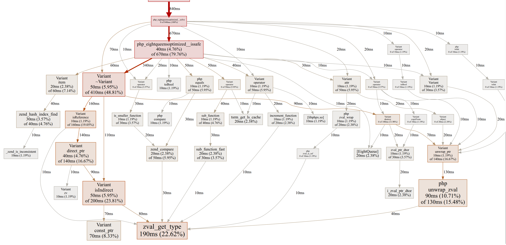

# 性能分析

AOT 编译器支持两种性能分析方式：编译器内建的 gperftools CPU Profiler，以及通用的 Linux `perf` 工具。

---

## gperftools CPU 分析（--profile）

编译器内建支持 Google [gperftools](https://github.com/gperftools/gperftools) 的 CPU Profiler。编译时通过 `--profile` 参数启用，运行二进制后生成分析数据文件，再用 `pprof` 生成火焰图或调用图。

### 前置条件

- **仅限 Linux**（macOS/Windows 不支持）
- 安装 gperftools：

```bash
# Ubuntu/Debian
sudo apt-get install google-perftools libgoogle-perftools-dev

# CentOS/RHEL
sudo yum install gperftools gperftools-devel
```

- 安装 `pprof`：

```bash
# pprof 随 google-perftools 安装（推荐），也可单独安装：
# go install github.com/google/pprof@latest
```

> `pprof --web` 模式直接在浏览器中渲染，无需 Graphviz。若要生成 PDF 或 SVG 文件（`--pdf` / `--svg`），才需安装 Graphviz：`sudo apt-get install graphviz`

### 使用方法

**1. 编译时启用 profiler**

```bash
php bin/compiler.php app.php --profile
```

`--profile` 自动完成三项操作：
- 追加 `-DPPROF_ON=1` 编译宏，启用 main 函数中的 `ProfilerStart`/`ProfilerStop` 调用
- 自动链接 `-lprofiler`，无需手动配置 ldflags
- 强制重编译 `main.cc`，确保 profiler 代码生效

**2. 运行程序**

```bash
./app
# 程序正常退出后，生成 app.prof 数据文件
```

输出文件名规则：`{target}.prof`（与 `--output` 指定的名称或项目名一致）。

**3. 分析数据**

编译器内置了 `pprof` 分析入口，直接对 `.prof` 文件运行编译器即可：

```bash
# 默认 web 模式，自动打开浏览器展示火焰图
php bin/compiler.php app.prof
```

web 模式提供交互式火焰图（Flame Graph），支持缩放、搜索、聚焦，是推荐的查看方式。



也支持手动调用 pprof：

```bash
# web 火焰图（无需 Graphviz）
pprof --web ./app app.prof

# pdf 调用图（需安装 Graphviz: sudo apt-get install graphviz）
pprof --pdf ./app app.prof > profile.pdf

# 文本 top 列表
pprof --text ./app app.prof

# 交互式命令行
pprof ./app app.prof
```

### 数据文件

| 名称 | 说明 |
|------|------|
| `app.prof` | gperftools 采样数据（二进制格式） |
| `pprof` | Google 性能分析可视化工具（命令行） |

### 工作流程


### 注意事项

- **不要在调试模式下使用** — `--debug` 会设置 `-O0`，而 profiler 应在优化构建（`-O2`）下使用以获得真实性能数据
- **信号控制** — gperftools 支持 `SIGUSR1`/`SIGUSR2` 手动控制采样的起止，参见 gperftools 文档
- **采样频率** — 默认每秒 100 次采样，可通过 `CPUPROFILE_FREQUENCY` 环境变量调整
- **程序必须正常退出** — `ProfilerStop()` 在 `main()` 结束时调用，如果程序异常终止（crash/abort），不会生成 prof 文件

---

## perf 通用分析

Linux 内核自带的 `perf` 工具可用于分析任何二进制，无需重新编译。适合快速热点定位和事件计数。

### 安装

```bash
sudo apt-get install linux-tools-common linux-tools-generic
```

### 基本用法

```bash
# CPU 采样（生成 perf.data）
perf record -g ./app

# 交互式查看（按函数热度排序）
perf report --sort=symbol

# 统计硬件事件
perf stat -e cache-misses,cache-references,instructions,cycles ./app
```

### 火焰图

火焰图是最直观的性能分析可视化方式。

```bash
# 1. 采样
perf record -g -F 99 ./app       # -F 99: 每秒 99 次采样（推荐值，避免与时钟中断同步）

# 2. 生成火焰图（需从 GitHub 下载 FlameGraph 脚本）
git clone https://github.com/brendangregg/FlameGraph.git
perf script | FlameGraph/stackcollapse-perf.pl | FlameGraph/flamegraph.pl > flame.svg
```

在浏览器中打开 `flame.svg`：
- **宽度** = 函数占用的 CPU 时间比例
- **纵向** = 调用栈深度
- 点击函数名可放大查看细节

### 常用 perf 子命令

| 命令 | 说明 |
|------|------|
| `perf record -g <cmd>` | 采样并记录调用栈 |
| `perf report` | 交互式查看报告 |
| `perf stat <cmd>` | 统计性能计数器 |
| `perf top` | 实时查看系统热点 |
| `perf list` | 列出可用的事件类型 |
| `perf annotate` | 源码级反汇编分析 |

---

## gperftools vs perf 对比

| 维度 | gperftools (`--profile`) | `perf` |
|------|--------------------------|--------|
| 需要重新编译 | 是（需 `--profile`） | 否 |
| 平台支持 | Linux only | Linux only |
| 输出文件 | `app.prof`（按 target 命名） | `perf.data` |
| 可视化工具 | `pprof --web`（火焰图/call graph） | `perf report` + FlameGraph 脚本 |
| 开销 | 低（采样模式） | 极低（硬件 PMU） |
| 精度 | 函数级 | 函数级 / 指令级 |
| 使用复杂度 | 低（一条命令分析） | 中（需多个工具组合） |

### 推荐使用场景

- **日常开发** — 使用 `--profile`，编译→运行→`app.prof` 三条命令即可看到火焰图
- **CI/生产环境** — 使用 `perf`，无需重新编译即可分析，更低的开销
- **深度排查** — `perf annotate` 可精确到单条指令的热度

---

*本文档最后更新：2026-06-03*
