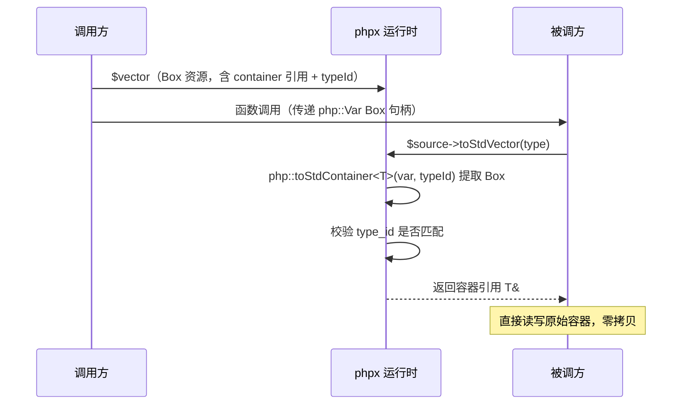

## Std 容器

TypePHP 编译器将 C++ 标准库容器封装为 Box 资源，通过 `php::Var` 持有，提供零开销的类型安全存储。容器本体位于 `StdContainerBox<T>` 内部，通过 `_ref` 引用访问，跨函数传递时 Box 资源保持引用语义——被调方修改会反映到原容器。

### 四种 Std 容器

| 容器 | C++ 类型 | PHP 表达式 | 说明 |
|------|---------|-----------|------|
| 定长数组 | `php::StdArray<T, N>` | `std::array(type, size)` | 编译期固定大小，通过 Box 堆上分配 |
| 动态数组 | `php::StdVector<T>` | `std::vector(type, [size])` | `std::vector` 包装，堆上分配 |
| 有序映射 | `php::StdOrderedMap<K, T>` | `std::ordered_map(ktype, vtype)` | `std::map`，字符串键使用 `zend_binary_strcmp` |
| 哈希映射 | `php::StdMap<K, T>` | `std::map(ktype, vtype)` | `std::unordered_map`，字符串键使用 `zend_string_hash_val` |

### 内部实现

每个 std 容器变量在 C++ 中展开为两条语句：

```cpp
php::Var v = php::Var(new php::StdContainerBox<php::StdVector<php::Int>>(typeId));
auto &v_ref = v.toBox<php::StdContainerBox<php::StdVector<php::Int>>>()->container;
```

- **`php::Var v`** — Box 资源句柄，拥有容器所有权，可跨函数传递
- **`auto &v_ref`** — 容器本体引用，所有读写操作通过此引用进行

### 值类型参数

容器值类型通过辅助类常量指定：

| 辅助类 | 可用常量 | 映射类型 | C++ 存储 |
|--------|---------|---------|----------|
| `native_types` | `type_int` | `php::Int` | `php::Int` |
| `native_types` | `type_float` | `php::Float` | `php::Float` |
| `native_types` | `type_bool` | `php::Bool` | `php::Bool` |
| `native_types` | `type_bigint` | `php::BigInt` | `php::Var` |
| `native_types` | `type_bigfloat` | `php::BigFloat` | `php::Var` |
| `native_types` | `type_decimal` | `php::Decimal` | `php::Var` |
| `complex_types` | `type_string` / `type_str` | `php::Str` | `php::Str` |
| `complex_types` | `type_array` | `php::Array` | `php::Array` |
| `complex_types` | `type_object` | `php::Object` | `php::Object` |
| `complex_types` | `type_any` / `type_var` | `php::Var` | `php::Var` |
| `complex_types` | `type_stream` | `php::Stream` | `php::Var` |
| — | `ClassName::class` | `php::Object`（带类信息） | `php::Object` |

> **注意**：`BigInt`、`BigFloat`、`Decimal`、`Stream` 底层存储使用 `php::Var`（Box 资源），写入时编译器自动通过 `php::newBigInt()`、`php::newBigFloat()` 等函数进行类型转换，读取后可直接调用对应的通用方法（如 `->toString()`）。

键类型仅支持 `native_types::type_int` 和 `complex_types::type_string`。

### 高精度类型与 Stream 示例

```php
declare(strict_types=1);
use native_types;

// BigInt vector —— 写入时 int 字面量自动转换为 BigInt
$bigVec = std::vector(native_types::type_bigint);
$bigVec[] = 99;
$bigVec[] = 12345678901234567890;
var_dump($bigVec[0]->toString());  // "99"

// BigFloat map —— key 为 int，value 为 BigFloat
$bigMap = std::ordered_map(native_types::type_int, native_types::type_bigfloat);
$bigMap[0] = 3.14;
$bigMap[1] = 2.71;
var_dump($bigMap[0]->toString());  // "3.1400000000000001"

// Decimal array —— 定长 Decimal 数组
$decArray = std::array(native_types::type_decimal, 3);
$decArray[0] = 0.1;
$decArray[1] = 0.2;
var_dump($decArray[0]->toString());  // "0.1"

// Stream vector —— 存放多个流资源
$streamVec = std::vector(complex_types::type_stream);
$fp = fopen("test.txt", "r");
$streamVec[] = $fp;
var_dump($streamVec[0]->read(1024));
```

生成的 C++ 代码使用 `StdVector<php::Var>` 等 Var 类型存储，写入时编译器自动插入类型转换：

```cpp
php::Var bigVec = php::Var(new php::StdContainerBox<php::StdVector<php::Var>>(1));
auto &bigVec_ref = bigVec.toBox<php::StdContainerBox<php::StdVector<php::Var>>>()->container;
bigVec_ref.push_back(php::newBigInt(99L));                         // int → BigInt
bigVec_ref.push_back(php::newBigInt(12345678901234567890L));       // int → BigInt
php::BigInt::toString(bigVec_ref.offsetGet(php::toInt(0L)));       // 调用通用方法
```

---

## 1. StdVector — 动态数组

基于 `std::vector<T>`，支持动态追加和随机访问。

```php
declare(strict_types=1);
use native_types;

function main(): void {
    // 创建空的 int 类型 vector
    $v = std::vector(native_types::type_int);

    // push_back 追加
    $v[] = 10;
    $v[] = 20;
    $v[] = 30;

    // 随机访问
    echo $v[0];  // 10
    echo $v[1];  // 20

    // 复合赋值
    $v[1] += 5;
    echo $v[1];  // 25

    // 获取大小
    echo count($v);  // 3

    // foreach 遍历
    foreach ($v as $val) {
        echo $val;
    }
}
```

生成的 C++ 代码：

```cpp
php::Var v = php::Var(new php::StdContainerBox<php::StdVector<php::Int>>(1));
auto &v_ref = v.toBox<php::StdContainerBox<php::StdVector<php::Int>>>()->container;
v_ref.push_back(php::toInt(10L));
v_ref.push_back(php::toInt(20L));
v_ref.push_back(php::toInt(30L));
php::echo(v_ref.offsetGet(php::toInt(0L)));
v_ref.offsetGet(php::toInt(1L)) += php::toInt(5L);
php::echo(php::toInt(v_ref.size()));
```

**指定初始大小**：

```php
$v = std::vector(native_types::type_int, 100);
```

生成的 C++ 代码：

```cpp
php::Var v = php::Var(new php::StdContainerBox<php::StdVector<php::Int>>(1, 100));
auto &v_ref = v.toBox<php::StdContainerBox<php::StdVector<php::Int>>>()->container;
```

### StdVector 方法速查

| 操作 | PHP | 生成的 C++ |
|------|-----|-----------|
| 追加 | `$v[] = $x` | `v_ref.push_back(x)` |
| 读取 | `$v[$i]` | `v_ref.offsetGet(i)` |
| 写入 | `$v[$i] = $x` | `v_ref.offsetSet(i, x)` |
| 复合赋值 | `$v[$i] += $x` | `v_ref.offsetGet(i) += x` |
| 大小 | `count($v)` | `v_ref.size()` |
| 遍历 | `foreach ($v as $val)` | `for (auto it = v_ref.begin(); ...)` |
| 删除 | `unset($v[$i])` | `v_ref.offsetUnset(i)` → 重置为 `T{}` |

> **注意**：`unset` 将元素重置为 `T{}`（零值），不会缩减数组大小。

---

## 2. StdArray — 定长数组

基于 `std::array<T, N>`，编译期确定大小，通过 `StdContainerBox` 在堆上分配，支持边界检查。

```php
declare(strict_types=1);
use native_types;

function main(): void {
    // 创建 int 类型、大小为 5 的定长数组
    $a = std::array(native_types::type_int, 5);

    // 索引写入
    $a[0] = 42;
    $a[1] = 100;
    $a[4] = 999;

    // 索引读取
    echo $a[0];  // 42

    // 越界访问：编译期常量索引在编译时检查，变量索引在运行时检查
    // $a[5] = 10;  // ❌ 编译错误：index out of bounds (0..4)

    // 填充
    std::fill($a, 7);  // 所有元素设为 7

    // foreach 遍历
    foreach ($a as $val) {
        echo $val;
    }
}
```

生成的 C++ 代码：

```cpp
php::Var a = php::Var(new php::StdContainerBox<php::StdArray<php::Int, 5>>(1));
auto &a_ref = a.toBox<php::StdContainerBox<php::StdArray<php::Int, 5>>>()->container;
a_ref[php::safeIndex(php::toInt(0L), 5)] = php::toInt(42L);
a_ref.offsetSet(php::toInt(1L), php::toInt(100L));
a_ref.offsetSet(php::toInt(4L), php::toInt(999L));
```

### 边界检查

- **编译期**：使用整数字面量作为索引时，编译器验证 `0 <= index < N`
- **运行时**：变量索引通过 `offsetGet`/`offsetSet` 调用 `safeIndex()`，越界抛出错误

### 嵌套 StdArray

支持多维定长数组：

```php
// 4×5 的二维 int 数组
$matrix = std::array(std::array(native_types::type_int, 5), 4);

// 访问: $matrix[row][col]
$matrix[0][0] = 1;
echo $matrix[2][3];

// 填充嵌套数组
std::fill($matrix[0], 0);
```

生成的 C++ 类型：

```cpp
php::Var matrix = php::Var(new php::StdContainerBox<php::StdArray<php::StdArray<php::Int, 5>, 4>>(1));
auto &matrix_ref = matrix.toBox<php::StdContainerBox<php::StdArray<php::StdArray<php::Int, 5>, 4>>>()->container;
matrix_ref[0L][0L] = php::toInt(1L);
```

### 内存分配

所有 std 容器（包括 StdArray）均通过 `php::StdContainerBox<T>` 封装，Box 对象在堆上分配。容器本体（`container` 成员）位于 Box 内部，随 Box 一起在堆上管理。访问始终通过 `name_ref` 引用，对 PHP 代码完全透明——用法不变。

### StdArray 方法速查

| 操作 | PHP | 生成的 C++ |
|------|-----|-----------|
| 读取 | `$a[$i]` | `a_ref.offsetGet(i)` （运行时边界检查） |
| 写入 | `$a[$i] = $x` | `a_ref.offsetSet(i, x)` |
| 字面量索引 | `$a[3]` | `a_ref[3L]` （编译期边界检查） |
| 大小 | `count($a)` | `a_ref.size()` |
| 遍历 | `foreach ($a as $val)` | `for (auto it = a_ref.begin(); ...)` |
| 填充 | `std::fill($a, $v)` | 循环赋值 |
| 删除 | `unset($a[$i])` | `a_ref.offsetUnset(i)` → 重置为 `T{}` |

---

## 3. StdOrderedMap — 有序映射

基于 `std::map<K, T>`，键有序存储。字符串键使用 `zend_binary_strcmp` 比较。

```php
declare(strict_types=1);
use native_types;

function main(): void {
    // 创建 string → int 的映射
    $m = std::ordered_map(complex_types::type_string, native_types::type_int);

    // 写入
    $m["alpha"] = 100;
    $m["beta"] = 200;

    // 读取
    echo $m["alpha"];  // 100

    // 复合赋值
    $m["alpha"] += 10;
    echo $m["alpha"];  // 110

    // 检查大小
    echo count($m);  // 2

    // foreach 遍历（按 key 顺序）
    foreach ($m as $key => $val) {
        echo $key . "=" . $val;
    }
    // 输出: alpha=110 beta=200

    // 删除
    unset($m["beta"]);
}
```

生成的 C++ 代码：

```cpp
php::Var m = php::Var(new php::StdContainerBox<php::StdOrderedMap<php::Str, php::Int>>(1));
auto &m_ref = m.toBox<php::StdContainerBox<php::StdOrderedMap<php::Str, php::Int>>>()->container;
m_ref.offsetSet(php::Str("alpha"), php::toInt(100L));
m_ref.offsetSet(php::Str("beta"), php::toInt(200L));
php::echo(m_ref.offsetGet(php::Str("alpha")));
m_ref.offsetGet(php::Str("alpha")) += php::toInt(10L);
```

### 读取行为差异

- **`$v = $map[$k]`（右值）**：使用 `std::map::at()`——若 key 不存在，抛出 `std::out_of_range`
- **`$map[$k] = $v`（左值）**：使用 `std::map::operator[]`——若 key 不存在，默认插入

### StdOrderedMap 方法速查

| 操作 | PHP | 生成的 C++ |
|------|-----|-----------|
| 写入 | `$m[$k] = $v` | `m_ref.offsetSet(k, v)` |
| 读取 | `$m[$k]` | `m_ref.offsetGet(k)` （不存在则抛异常） |
| 复合赋值 | `$m[$k] += $v` | `m_ref.offsetGet(k) += v` |
| 大小 | `count($m)` | `m_ref.size()` |
| 遍历 | `foreach ($m as $k => $v)` | `for (auto it = m_ref.begin(); ...)` |
| 删除 | `unset($m[$k])` | `m_ref.offsetUnset(k)` → 真正删除（`erase`） |

---

## 4. StdMap — 哈希映射

基于 `std::unordered_map<K, T>`，字符串键使用 `zend_string_hash_val` 哈希和 `zend_string_equals` 比较。接口与 `StdOrderedMap` 一致。

```php
declare(strict_types=1);
use native_types;

function main(): void {
    // 创建 int → User 的哈希映射
    $u = std::map(native_types::type_int, User::class);

    $u[1] = new User(1);
    $u[2] = new User(2);

    echo $u[1]->id;   // 1
    echo count($u);   // 2

    unset($u[2]);
}
```

生成的 C++ 代码：

```cpp
php::Var u = php::Var(new php::StdContainerBox<php::StdMap<php::Int, php::Object>>(1));
auto &u_ref = u.toBox<php::StdContainerBox<php::StdMap<php::Int, php::Object>>>()->container;
u_ref.offsetSet(php::toInt(1L), user1);
u_ref.offsetSet(php::toInt(2L), user2);
```

### StdOrderedMap vs StdMap

| 特性 | StdOrderedMap | StdMap |
|------|--------|-----------------|
| 底层 | `std::map`（红黑树） | `std::unordered_map`（哈希表） |
| 遍历顺序 | 按键排序 | 无顺序保证 |
| 查找性能 | O(log n) | O(1) 平均 |
| 字符串键比较 | `zend_binary_strcmp` | `zend_string_hash_val` + `zend_string_equals` |
| foreach 中删除 | ❌ 禁止 | ❌ 禁止 |

---

## 5. 跨函数引用传递与 toStd* 关键词方法

Std 容器以 `php::Var`（Box 资源）形式持有，作为函数参数传递时传递的是 Box 句柄。被调方可通过 `toStd*` 关键词方法（如 `toStdVector`、`toStdArray`）提取容器引用，修改会反映到调用方的原容器——**零拷贝，零分配**。

### 工作机制



1. **调用方**：将 std 容器变量传给被调方——编译器直接传递 `php::Var` Box 句柄
2. **被调方**：使用 `$source->toStd*(type)` 提取容器引用并做运行时类型校验
3. 校验通过后直接返回容器引用——**零拷贝，零分配**

### 使用示例

```php
declare(strict_types=1);
use native_types;

// 被调方：接收容器并修改
function vector_update($source): void
{
    $v = $source->toStdVector(native_types::type_int);
    // $v 现在是调用方 vector 的引用，修改会反映到原容器
    var_dump($v[1]);
    $v[2] = 9;
}

function main(): void {
    $vector = std::vector(native_types::type_int, 3);
    $vector[0] = 1;
    $vector[1] = 7;
    $vector[2] = 3;

    vector_update($vector);   // 传递 Box 句柄，内部引用原容器
    var_dump($vector[2]);     // 9 —— 修改已生效
}
```

输出：

```text
int(7)
int(9)
```

生成的 C++ 代码：

```cpp
// vector_update
void php_vector_update(php::Var source) {
    auto &v_ref = php::toStdContainer<php::StdVector<php::Int>>(source, 1);
    php::var_dump(v_ref.offsetGet(php::toInt(1L)));
    v_ref.offsetSet(php::toInt(2L), php::toInt(9L));
}

// main
php::Var vector = php::Var(new php::StdContainerBox<php::StdVector<php::Int>>(1, 3));
auto &vector_ref = vector.toBox<php::StdContainerBox<php::StdVector<php::Int>>>()->container;
vector_ref.offsetSet(php::toInt(0L), php::toInt(1L));
vector_ref.offsetSet(php::toInt(1L), php::toInt(7L));
vector_ref.offsetSet(php::toInt(2L), php::toInt(3L));
php_vector_update(vector);                                          // 传递 Box 句柄
php::var_dump(vector_ref.offsetGet(php::toInt(2L)));                // 9
```

### 运行时类型校验

类型 ID 在编译期分配，运行时校验。类型不匹配时抛出 `TypeError`：

```php
function process_float_array($source): void
{
    // 期望 float 数组
    $array = $source->toStdArray(native_types::type_float, 3);
}

function main(): void {
    $array = std::array(native_types::type_int, 3);  // 实际是 int 数组

    try {
        process_float_array($array);
    } catch (TypeError $e) {
        echo $e->getMessage();  // "std container type mismatch"
    }
}
```

---

## 6. 限制

1. **顶层作用域声明**：std 容器和 `toStd*` 转换方法只能在函数顶层作用域声明，不能在 `if`/`for`/`while` 等嵌套块中
2. **不可重新赋值**：变量一旦声明为某种 std 容器类型，不能重新赋值给不同类型的容器
3. **不支持嵌套访问（非 Array 类型）**：`$vec[a][b]` 仅 StdArray 支持嵌套；StdVector/StdOrderedMap/StdMap 不支持
4. **foreach 中不可删除**：StdOrderedMap/StdMap 处于 foreach 循环中时，不可 `unset` 其元素
5. **键类型限制**：map/ordered_map 键仅支持 `type_int` 和 `type_string`
6. **unset 语义差异**：StdVector/StdArray 对元素 `unset` 是重置为零值（`T{}`），不改变容器大小；StdOrderedMap/StdMap 对元素 `unset` 是真正删除（`erase`），会缩减容器大小，之后读取该键会抛出异常
7. **不可作为引用参数传递**：std 容器变量不可通过 `&$var` 引用方式传递
