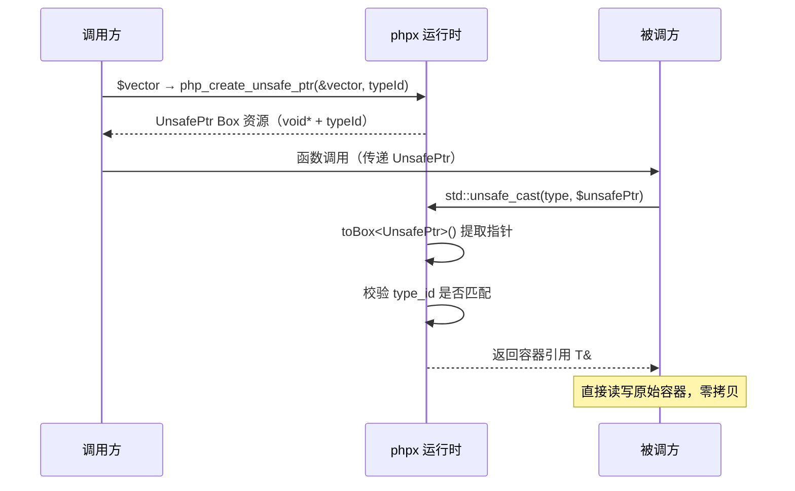

## Std 容器与 UnsafePtr

AOT 编译器将 C++ 标准库容器直接映射为 `php::` 类型，提供零开销的类型安全存储。此外，`UnsafePtr` 和 `std::unsafe_cast` 允许在函数边界传递容器的引用，避免拷贝。

### 四种 Std 容器

| 容器 | C++ 类型 | PHP 表达式 | 说明 |
|------|---------|-----------|------|
| 定长数组 | `php::StdArray<T, N>` | `std::array(type, size)` | 编译期固定大小，默认栈上分配 |
| 动态数组 | `php::StdVector<T>` | `std::vector(type, [size])` | `std::vector` 包装，堆上分配 |
| 有序映射 | `php::StdMap<K, T>` | `std::map(ktype, vtype)` | `std::map`，字符串键使用 `zend_binary_strcmp` |
| 哈希映射 | `php::StdUnorderedMap<K, T>` | `std::unordered_map(ktype, vtype)` | `std::unordered_map`，字符串键使用 `zend_string_hash_val` |

### 值类型参数

容器值类型通过辅助类常量指定：

| 辅助类 | 可用常量 | 映射类型 |
|--------|---------|---------|
| `native_types` | `type_int` | `php::Int` |
| `native_types` | `type_float` | `php::Float` |
| `native_types` | `type_bool` | `php::Bool` |
| `complex_types` | `type_string` / `type_str` | `php::Str` |
| `complex_types` | `type_array` | `php::Array` |
| `complex_types` | `type_object` | `php::Object` |
| `complex_types` | `type_any` / `type_var` | `php::Var` |
| — | `ClassName::class` | `php::Object`（带类信息） |

键类型仅支持 `native_types::type_int` 和 `complex_types::type_string`。

---

## 1. StdVector — 动态数组

基于 `std::vector<T>`，支持动态追加和随机访问。

```php
declare(strict_types=1);
use native_types;

function main(): void {
    // 创建空的 int 类型 vector
    $v = std::vector(native_types::type_int);

    // push_back 追加
    $v[] = 10;
    $v[] = 20;
    $v[] = 30;

    // 随机访问
    echo $v[0];  // 10
    echo $v[1];  // 20

    // 复合赋值
    $v[1] += 5;
    echo $v[1];  // 25

    // 获取大小
    echo count($v);  // 3

    // foreach 遍历
    foreach ($v as $val) {
        echo $val;
    }
}
```

生成的 C++ 代码：

```cpp
php::StdVector<php::Int> v{};
v.push_back(php::toInt(10L));
v.push_back(php::toInt(20L));
v.push_back(php::toInt(30L));
php::echo(v.offsetGet(php::toInt(0L)));
v.offsetGet(php::toInt(1L)) += php::toInt(5L);
php::echo(php::toInt(v.size()));
```

**指定初始大小**：

```php
$v = std::vector(native_types::type_int, 100);
// 等价于: php::StdVector<php::Int> v(100);
```

### StdVector 方法速查

| 操作 | PHP | 生成的 C++ |
|------|-----|-----------|
| 追加 | `$v[] = $x` | `v.push_back(x)` |
| 读取 | `$v[$i]` | `v.offsetGet(i)` |
| 写入 | `$v[$i] = $x` | `v.offsetSet(i, x)` |
| 复合赋值 | `$v[$i] += $x` | `v.offsetGet(i) += x` |
| 大小 | `count($v)` | `v.size()` |
| 遍历 | `foreach ($v as $val)` | `for (auto it = v.begin(); ...)` |
| 删除 | `unset($v[$i])` | `v.offsetUnset(i)` → 重置为 `T{}` |

> **注意**：`unset` 将元素重置为 `T{}`（零值），不会缩减数组大小。

---

## 2. StdArray — 定长数组

基于 `std::array<T, N>`，编译期确定大小，默认栈上分配，支持边界检查。

```php
declare(strict_types=1);
use native_types;

function main(): void {
    // 创建 int 类型、大小为 5 的定长数组
    $a = std::array(native_types::type_int, 5);

    // 索引写入
    $a[0] = 42;
    $a[1] = 100;
    $a[4] = 999;

    // 索引读取
    echo $a[0];  // 42

    // 越界访问：编译期常量索引在编译时检查，变量索引在运行时检查
    // $a[5] = 10;  // ❌ 编译错误：index out of bounds (0..4)

    // 填充
    std::fill($a, 7);  // 所有元素设为 7

    // foreach 遍历
    foreach ($a as $val) {
        echo $val;
    }
}
```

生成的 C++ 代码：

```cpp
php::StdArray<php::Int, 5> a{};  // 默认构造，零初始化
a[0L] = php::toInt(42L);
a.offsetSet(php::toInt(1L), php::toInt(100L));
a.offsetSet(php::toInt(4L), php::toInt(999L));
```

### 边界检查

- **编译期**：使用整数字面量作为索引时，编译器验证 `0 <= index < N`
- **运行时**：变量索引通过 `offsetGet`/`offsetSet` 调用 `safeIndex()`，越界抛出错误

### 嵌套 StdArray

支持多维定长数组：

```php
// 4×5 的二维 int 数组
$matrix = std::array(std::array(native_types::type_int, 5), 4);

// 访问: $matrix[row][col]
$matrix[0][0] = 1;
echo $matrix[2][3];

// 填充嵌套数组
std::fill($matrix[0], 0);
```

生成的 C++ 类型：

```cpp
php::StdArray<php::StdArray<php::Int, 5>, 4> matrix{};
matrix[0L][0L] = php::toInt(1L);
```

### 大数组堆分配

单个 StdArray 超过 `MAX_BYTES_IN_STACK`（65536 字节）时，编译器自动改为 `std::make_unique` 堆分配以避免栈溢出。

```cpp
// 小数组（≤ 65536 字节）——栈上分配
php::StdArray<php::Int, 100> small{};        // 100 × 8 = 800 字节 → 栈

// 大数组（> 65536 字节）——自动转为堆分配
php::StdArray<php::Int, 10000> large;        // 10000 × 8 = 80000 字节 → 堆
// 生成: auto large = std::make_unique<php::StdArray<php::Int, 10000>>();
// 访问: large->offsetGet(i) / large->offsetSet(i, v)
```

编译器在 `genScopeVarDecl()` 中根据元素类型大小 × 元素数量计算总字节数，超过阈值时自动切换为 `std::make_unique` 分配，访问语法从 `container.method()` 变为 `container->method()`。此过程对 PHP 代码完全透明——用法不变。

| 条件 | 分配方式 | 访问语法 |
|------|---------|---------|
| `sizeof(T) × N ≤ 65536` | 栈上 `T name{}` | `name.method()` |
| `sizeof(T) × N > 65536` | 堆上 `auto name = std::make_unique<T>()` | `name->method()` |

### StdArray 方法速查

| 操作 | PHP | 生成的 C++ |
|------|-----|-----------|
| 读取 | `$a[$i]` | `a.offsetGet(i)` （运行时边界检查） |
| 写入 | `$a[$i] = $x` | `a.offsetSet(i, x)` |
| 字面量索引 | `$a[3]` | `a[3L]` （编译期边界检查） |
| 大小 | `count($a)` | `a.size()` |
| 遍历 | `foreach ($a as $val)` | `for (auto it = a.begin(); ...)` |
| 填充 | `std::fill($a, $v)` | 循环赋值 |
| 删除 | `unset($a[$i])` | `a.offsetUnset(i)` → 重置为 `T{}` |

---

## 3. StdMap — 有序映射

基于 `std::map<K, T>`，键有序存储。字符串键使用 `zend_binary_strcmp` 比较。

```php
declare(strict_types=1);
use native_types;

function main(): void {
    // 创建 string → int 的映射
    $m = std::map(complex_types::type_string, native_types::type_int);

    // 写入
    $m["alpha"] = 100;
    $m["beta"] = 200;

    // 读取
    echo $m["alpha"];  // 100

    // 复合赋值
    $m["alpha"] += 10;
    echo $m["alpha"];  // 110

    // 检查大小
    echo count($m);  // 2

    // foreach 遍历（按 key 顺序）
    foreach ($m as $key => $val) {
        echo $key . "=" . $val;
    }
    // 输出: alpha=110 beta=200

    // 删除
    unset($m["beta"]);
}
```

生成的 C++ 代码：

```cpp
php::StdMap<php::Str, php::Int> m{};
m.offsetSet(php::Str("alpha"), php::toInt(100L));
m.offsetSet(php::Str("beta"), php::toInt(200L));
php::echo(m.offsetGet(php::Str("alpha")));
m.offsetGet(php::Str("alpha")) += php::toInt(10L);
```

### 读取行为差异

- **`$v = $map[$k]`（右值）**：使用 `std::map::at()`——若 key 不存在，抛出 `std::out_of_range`
- **`$map[$k] = $v`（左值）**：使用 `std::map::operator[]`——若 key 不存在，默认插入

### StdMap 方法速查

| 操作 | PHP | 生成的 C++ |
|------|-----|-----------|
| 写入 | `$m[$k] = $v` | `m.offsetSet(k, v)` |
| 读取 | `$m[$k]` | `m.offsetGet(k)` （不存在则抛异常） |
| 复合赋值 | `$m[$k] += $v` | `m.offsetGet(k) += v` |
| 大小 | `count($m)` | `m.size()` |
| 遍历 | `foreach ($m as $k => $v)` | `for (auto it = m.begin(); ...)` |
| 删除 | `unset($m[$k])` | `m.offsetUnset(k)` |

---

## 4. StdUnorderedMap — 哈希映射

基于 `std::unordered_map<K, T>`，字符串键使用 `zend_string_hash_val` 哈希和 `zend_string_equals` 比较。接口与 `StdMap` 一致。

```php
declare(strict_types=1);
use native_types;

function main(): void {
    // 创建 int → User 的哈希映射
    $u = std::unordered_map(native_types::type_int, User::class);

    $u[1] = new User(1);
    $u[2] = new User(2);

    echo $u[1]->id;   // 1
    echo count($u);   // 2

    unset($u[2]);
}
```

生成的 C++ 代码：

```cpp
php::StdUnorderedMap<php::Int, php::Object> u{};
u.offsetSet(php::toInt(1L), user1);
u.offsetSet(php::toInt(2L), user2);
```

### StdMap vs StdUnorderedMap

| 特性 | StdMap | StdUnorderedMap |
|------|--------|-----------------|
| 底层 | `std::map`（红黑树） | `std::unordered_map`（哈希表） |
| 遍历顺序 | 按键排序 | 无顺序保证 |
| 查找性能 | O(log n) | O(1) 平均 |
| 字符串键比较 | `zend_binary_strcmp` | `zend_string_hash_val` + `zend_string_equals` |
| foreach 中删除 | ❌ 禁止 | ❌ 禁止 |

---

## 5. UnsafePtr 与 std::unsafe_cast

当需要将 std 容器的**引用**传递给另一函数时，直接传递会产生拷贝。`UnsafePtr` 和 `std::unsafe_cast` 提供了零拷贝的引用传递机制。

### 工作机制



1. **调用方**：将 std 容器传给接受 `UnsafePtr` 的函数时，编译器生成 `php_create_unsafe_ptr(&container, typeId)`，将容器指针和类型 ID 封装为 Box 资源
2. **被调方**：使用 `std::unsafe_cast(type, $unsafePtr)` 提取指针并做运行时类型校验
3. 校验通过后直接返回容器引用——**零拷贝，零分配**

### 使用示例

```php
declare(strict_types=1);
use native_types;

// 接受 UnsafePtr 参数，通过 unsafe_cast 获取容器引用
function vector_update(UnsafePtr $unsafePtr): void
{
    $v = std::unsafe_cast(std::vector(native_types::type_int), $unsafePtr);
    // $v 现在是调用方 vector 的引用，修改会反映到原容器
    var_dump($v[1]);
    $v[2] = 9;
}

function main(): void {
    $vector = std::vector(native_types::type_int, 3);
    $vector[0] = 1;
    $vector[1] = 7;
    $vector[2] = 3;

    vector_update($vector);   // 传递引用，非拷贝
    var_dump($vector[2]);     // 9 —— 修改已生效
}
```

输出：

```text
int(7)
int(9)
```

生成的 C++ 代码：

```cpp
// vector_update
void php_vector_update(php::Var unsafePtr) {
    auto &v = php_unsafe_cast<php::StdVector<php::Int>>(unsafePtr, 1);
    php::var_dump(v.offsetGet(php::toInt(1L)));
    v.offsetSet(php::toInt(2L), php::toInt(9L));
}

// main
php::StdVector<php::Int> vector(3);
vector.offsetSet(php::toInt(0L), php::toInt(1L));
vector.offsetSet(php::toInt(1L), php::toInt(7L));
vector.offsetSet(php::toInt(2L), php::toInt(3L));
php_vector_update(php_create_unsafe_ptr(&vector, 1));
php::var_dump(vector.offsetGet(php::toInt(2L)));
```

### 运行时类型校验

类型 ID 在编译期分配，运行时校验。类型不匹配时抛出 `TypeError`：

```php
function process_float_array(UnsafePtr $unsafePtr): void
{
    // 期望 float 数组
    $array = std::unsafe_cast(std::array(native_types::type_float, 3), $unsafePtr);
}

function main(): void {
    $array = std::array(native_types::type_int, 3);  // 实际是 int 数组

    try {
        process_float_array($array);
    } catch (TypeError $e) {
        echo $e->getMessage();  // "std::unsafe_cast(): UnsafePtr type mismatch"
    }
}
```

### Polyfill

```php
class std {
    // 创建 UnsafePtr，传递容器引用
    public static function unsafe_ptr(mixed &$value): mixed { return null; }

    // 从 UnsafePtr 恢复容器引用，附带类型校验
    public static function unsafe_cast(mixed $type, mixed $ptr): mixed { return $ptr; }
}
```

---

## 6. 限制

1. **顶层作用域声明**：std 容器和 `std::unsafe_cast` 只能在函数顶层作用域声明，不能在 `if`/`for`/`while` 等嵌套块中
2. **不可重新赋值**：变量一旦声明为某种 std 容器类型，不能重新赋值给不同类型的容器
3. **不支持嵌套访问（非 Array 类型）**：`$vec[a][b]` 仅 StdArray 支持嵌套；StdVector/StdMap/StdUnorderedMap 不支持
4. **foreach 中不可删除**：StdMap/StdUnorderedMap 处于 foreach 循环中时，不可 `unset` 其元素
5. **键类型限制**：map/unordered_map 键仅支持 `type_int` 和 `type_string`
6. **UnsafePtr 参数不可重新赋值**：`UnsafePtr` 类型参数在函数内不可被重新赋值（含 `&$unsafePtr`）
7. **大 StdArray 强制堆分配**：超过 65536 字节自动转为 `std::make_unique`
8. **unset 语义**：对容器元素 `unset` 是重置为零值（`T{}`），不是真正的删除或缩容
